# WinCC OA WebUI Dashboard — Page Manual

A visual tour of the standalone pages shipped by this repository (the
`@visuelconcept/wui-*` modules), each running inside the WinCC OA WebUI dashboard
shell. For what each module is and how to deploy it, see the [README](../README.md);
for development, see [DEVELOPMENT.md](../DEVELOPMENT.md).

> **Screenshots** were captured live (logged in, against a running WinCC OA) with
> [`tools/screenshot-pages.mjs`](../tools/screenshot-pages.mjs) with `--demo`, which
> populates each page with its built-in **demonstration data** and drills into the
> detail/sub-pages. Re-generate them any time with that tool. The backend is
> configured with a **French** UI locale, so on-screen labels appear in French while
> this manual is written in English.

---

## Dashboard (home)

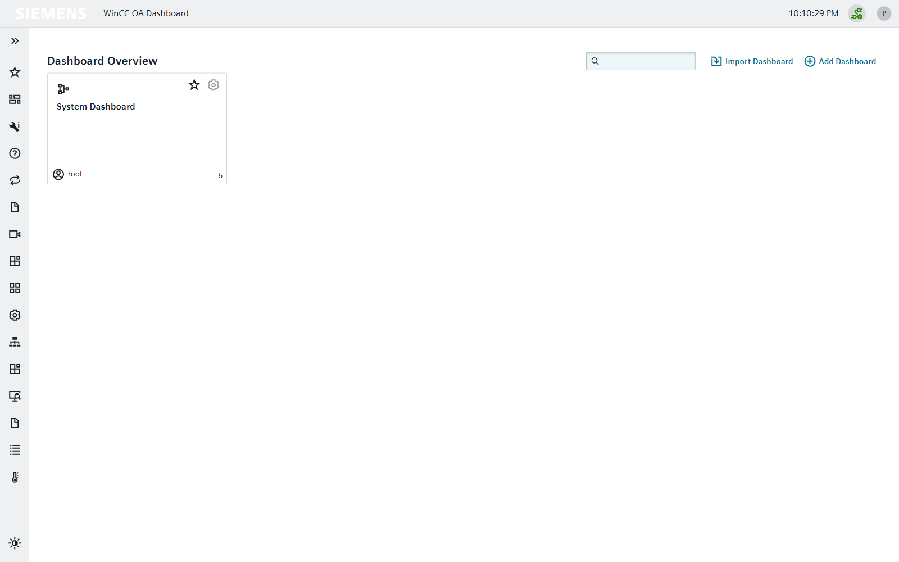

The landing page of the shell. It lists the available system dashboards as cards
(with owner and widget count), lets users mark favourites, and offers **Add
Dashboard** / **Import Dashboard**. This is the standard WinCC OA Dashboard overview;
the pages below are added around it by this repository.

---

## Machine Fleet 3D — `/fleet-3d`

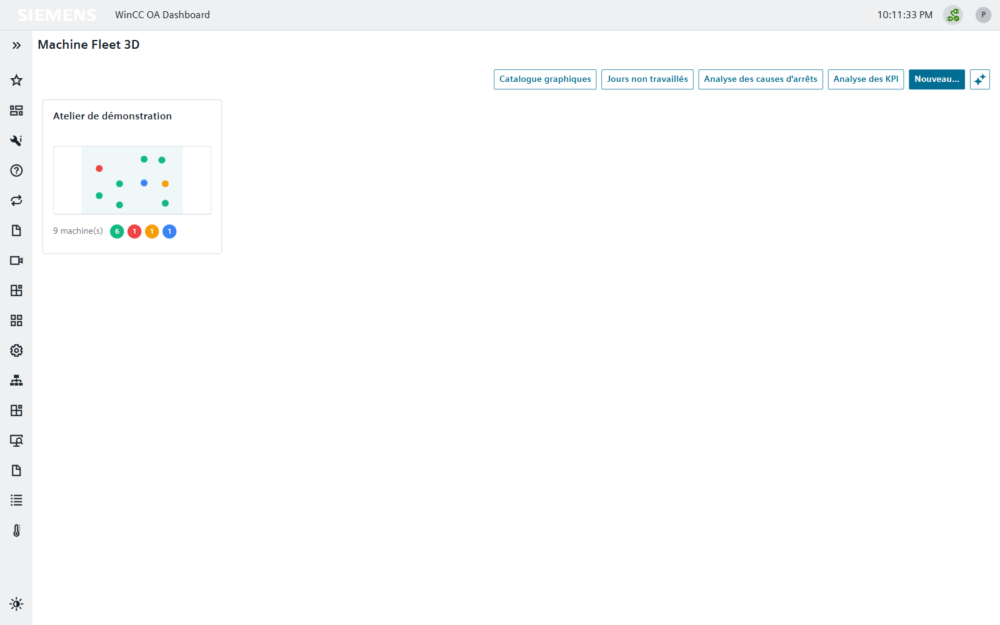

The fleet hub. Each *atelier* (workshop) is a card with a live mini-map of its
machines colour-coded by state (the demo atelier shows 9 machines: 6 running, 1
fault, 1 warning, 1 idle). Opening an atelier renders an interactive **Three.js 3D
scene** with per-machine state and KPI bubbles. The toolbar links to the graphics
catalog and to the contextual analyses below (non-working periods, stop-cause, KPI)
and an AI assistant. *Tier 3* — backed by the `machineSim`, `kpiCalc`, `aiAssistant`
and `mcpServer` managers.

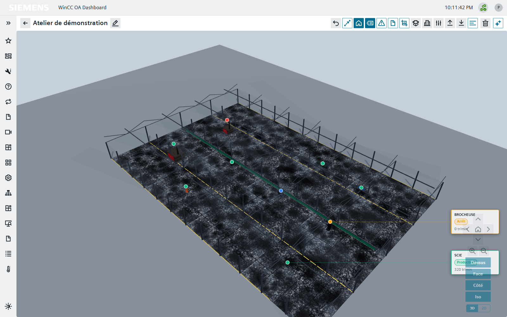

Opening an atelier renders the interactive **3D scene**: the workshop floor with each
machine placed in 3D and colour-coded by state, plus contextual KPI panels.

---

## KPI Analysis — `/fleet-kpi`

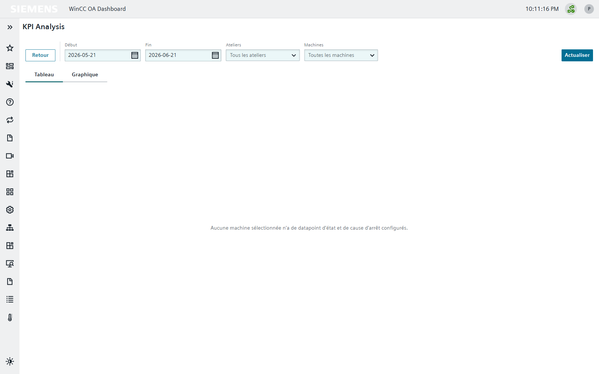

Per-machine **availability and TRS** (OEE) charted with ECharts. Values are computed
**server-side** by the `kpiCalc` manager over opening time minus the declared
non-working periods, archived for trending, and pushed live. Reached from the Machine
Fleet 3D toolbar.

---

## Stop-Cause Analysis — `/fleet-stops`

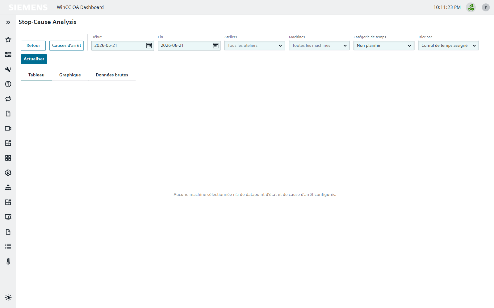

Decomposes machine downtime **per stop cause** and presents it as both a table and
ECharts views (Pareto / distribution), so the dominant causes of lost time are easy
to spot.

---

## Non-Working Periods — `/fleet-closures`

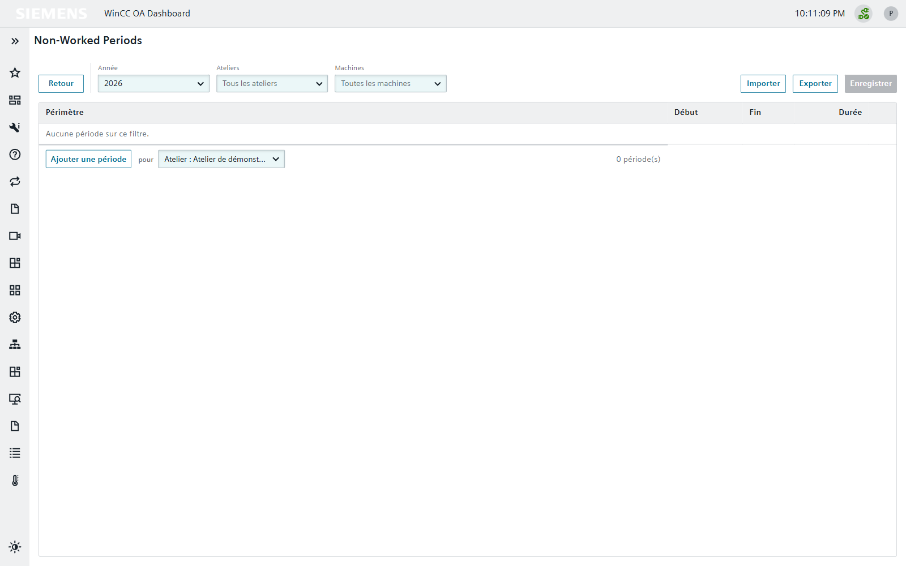

Manages the fleet's **non-working days** (holidays, planned shutdowns) with
year / atelier / machine filters, overlap handling, and JSON import-export. These
closures are what the KPI analysis subtracts from opening time.

---

## Production Orders — `/production-orders`

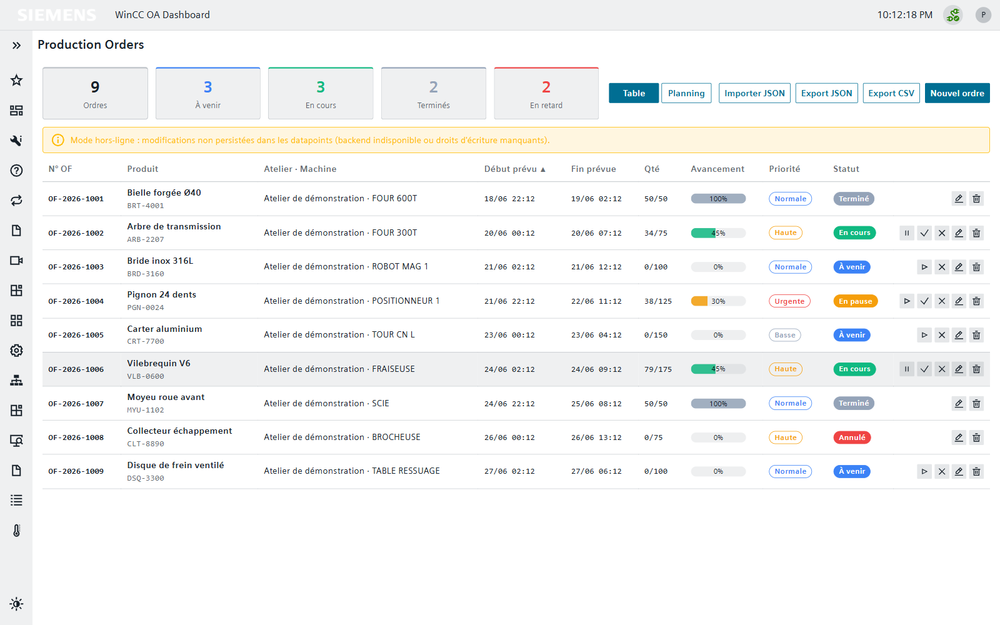

Manages production orders (*ordres de fabrication*) with full CRUD and a status
workflow. KPI cards summarise the order pipeline (total, upcoming, in progress, done,
late); a **Table** view and an ECharts **Planning** (Gantt) view are available, plus
JSON/CSV import-export. KPIs are computed by the `productionOrdersKpi` manager. A
*Generate demo orders* action seeds sample data. *Tier 3.*

---

## Thermal Treatment Reports — `/thermal-reports`

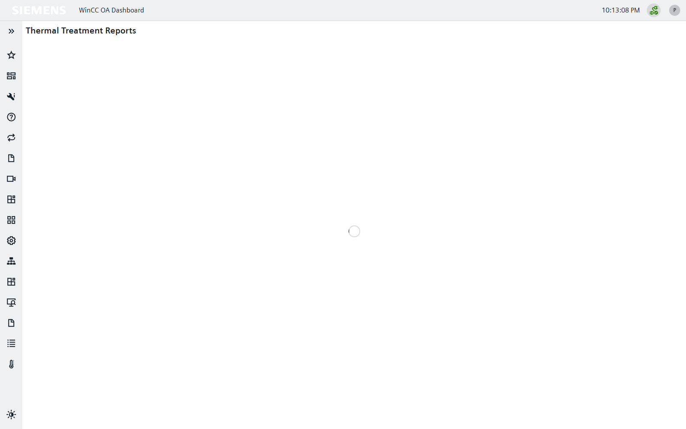

Per-charge **heat-treatment reports**: identity (load, work order, part, material),
the recipe as ordered setpoint stages (*paliers*) with tolerances, and the measured
furnace temperature curves charted against the tolerance bands.

---

## Reports — `/report-builder`

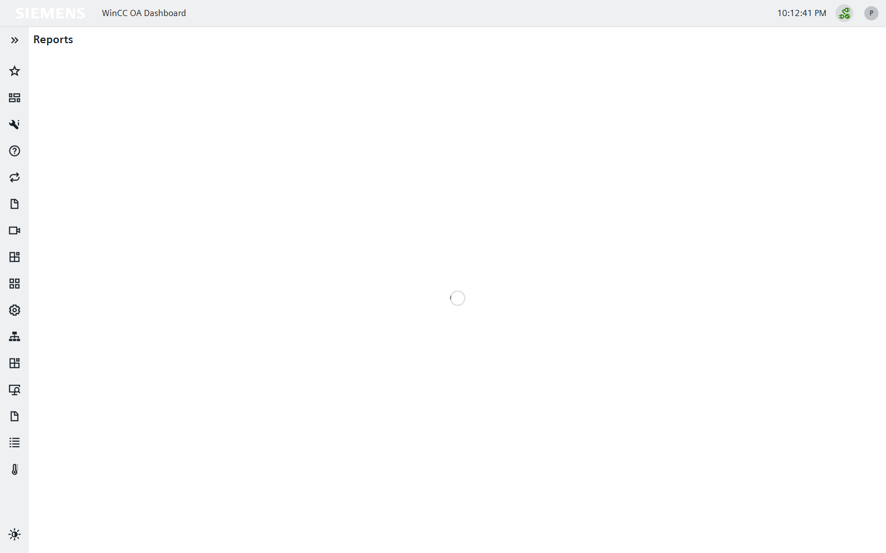

Builds **report instances** from templates: fills data sections, runs archive
aggregations over the report period, supports a multi-level signing workflow, and
prints. Works together with the report templates below.

---

## Report Templates — `/report-templates`

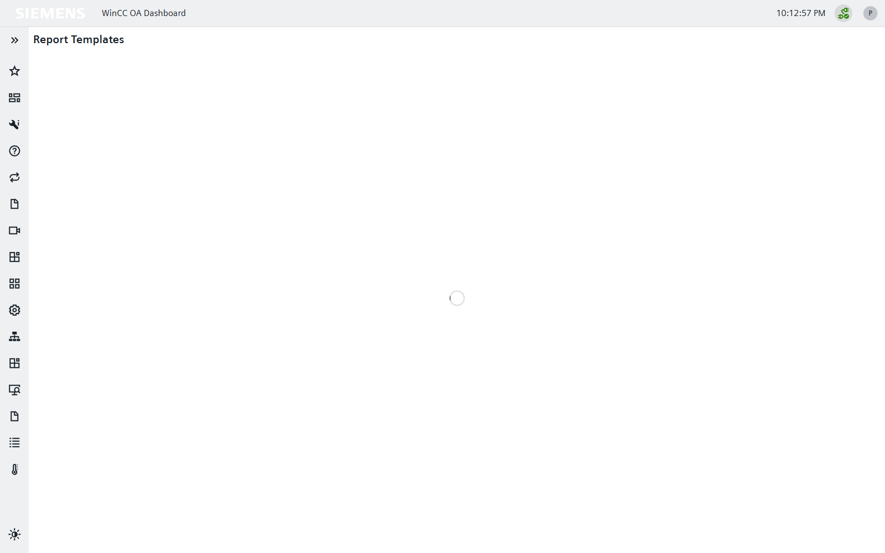

Authors the **configurable report templates** consumed by the Report Builder —
parameterised sections (text, tables, datasets/charts) and a multi-level signature
workflow definition.

---

## Audit Trail — `/audit-trail`

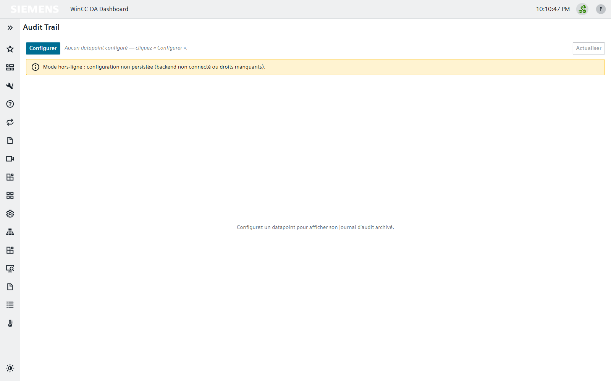

A **pivot table of a datapoint's value history** as stored by NGA archiving, with a
configurable period, columns and refresh interval — for reviewing how an element's
value evolved over time.

---

## Asset Lifecycle Intelligence — `/asset-lifecycle`

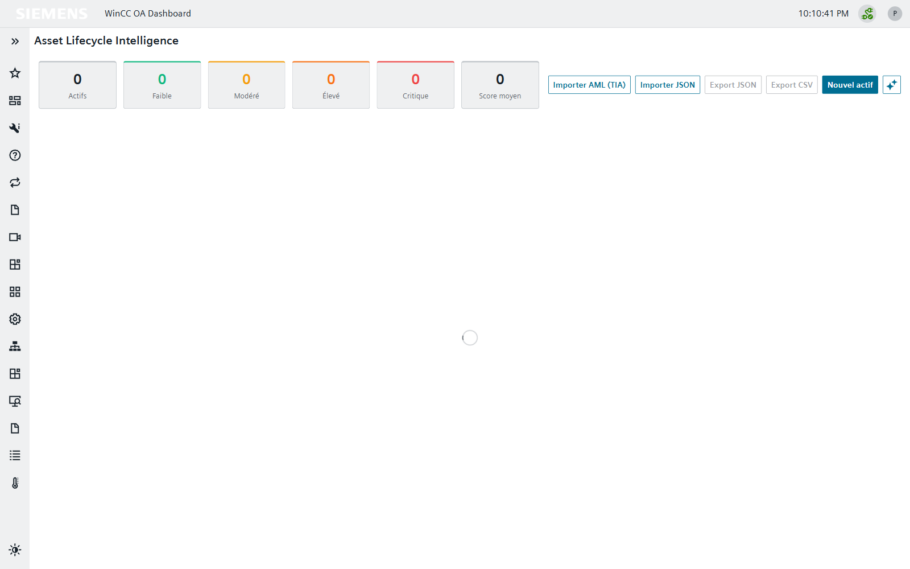

An asset domain model with a composite **risk-scoring** engine (criticality, supply,
vulnerability, age) and **product obsolescence / delivery** lookups via the Siemens
**Product Information Hub**. *Tier 3* — backed by the `productInfo` manager and
`/api/product-info`. The PIH key is provided on the target, never committed.

---

## Camera Streams — `/camera-streams`

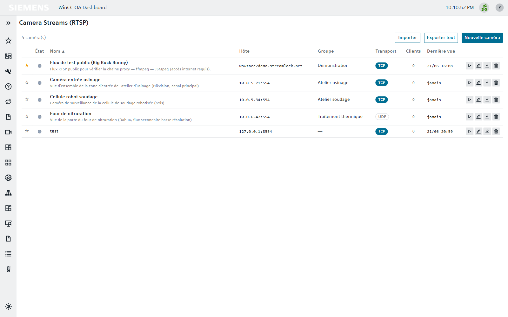

Views **RTSP IP cameras** in the browser with no plugin: the `rtspProxy` manager
transcodes each stream and relays it over a WebSocket (JSMpeg). The list page manages
the configured cameras; opening one shows the live video. *Tier 3* (`/api/rtsp`).

---

## Remote VNC — `/remote-vnc`

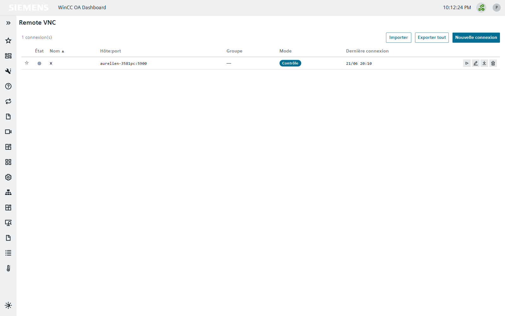

Manages **VNC connections** and opens them in the browser via bundled **noVNC** over
a WebSocket relay (`vncProxy` manager). *Tier 3* (`/api/vnc`). In a Mosaic tile a VNC
view is forced read-only.

---

## Mosaic — `/mosaic`

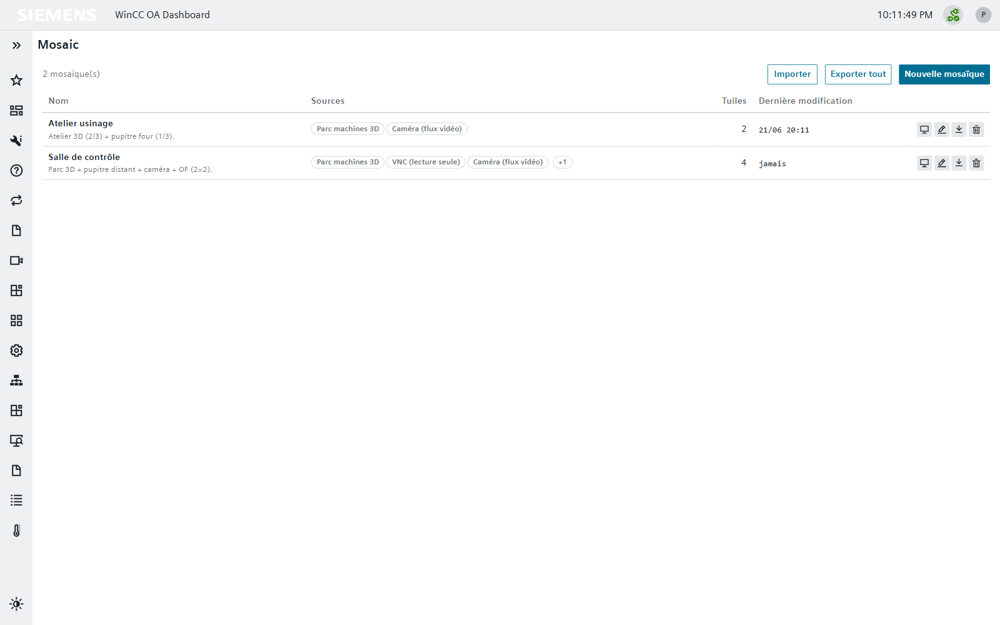

A free-layout **display wall**: a canvas of freely positioned, resizable tiles, each
embedding another dashboard view (a Fleet-3D atelier, a camera, a VNC session, or any
same-origin URL) as a **chromeless** iframe (loaded with `?embed=1`, so the embedded
view shows only its page content — no header or menu). Walls are saved as datapoints;
display mode is read-only, edit mode adds drag/resize.

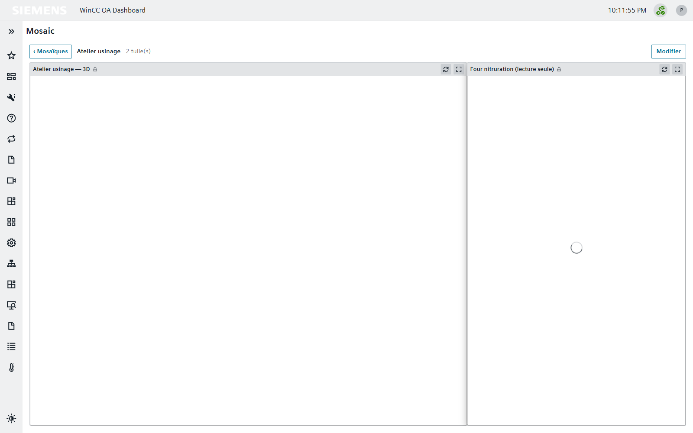

Opening a wall lays its tiles out side by side; each embeds another view chromelessly
(here a Fleet-3D atelier and a read-only VNC tile).

---

## Parametrization — `/para`

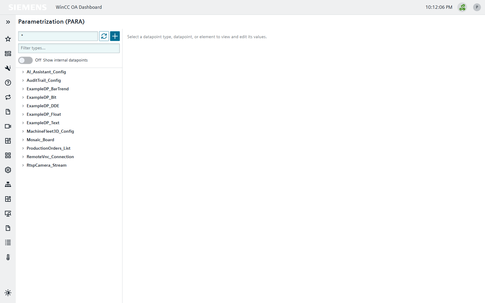

A datapoint **parametrization** page, backed by its own webserver module
(`/api/para`). Four tabs:

- **Modèle (Types)** — an ergonomic, nested tree editor to define datapoint
  **types**: add elements and sub-structures, rename, change element type, set a
  `Typeref` target, choose a **scalar or Struct root**, delete. Empty types
  (no instances) are listed too. New types are created and existing ones updated
  **in place** (`dptype/change`, which preserves the datapoints already created).
- **Instances & valeurs** — the master-detail browser: a Type→DP→element tree
  with live values and config attributes (inline edit), plus datapoint
  create/rename/delete.
- **Archivage** — per DP/DPE, enable NGA value archiving and pick an archive
  group (`_NGA_Group` instances).
- **Alarming** — per DP/DPE, configure `_alert_hdl`: binary alerts for BOOL
  elements, analog threshold alerts for numeric elements, with an alarm class
  chosen from the `_AlertClass` instances.

A header **AI assistant** helps model the data. It is *proposal-only* (it runs
with no MCP tools and never mutates the project): it suggests datapoint-type
models and can load a proposal straight into the model editor, where **you
review and save** it.

**DPL (ASCII) import/export.** From the *Instances & valeurs* tab you can tick
several DPs and/or DP-types and **export** them to a WinCC OA `.dpl` file, or
**import** a `.dpl`. The export/import is run server-side by the `dplAscii` MSA
manager (which drives `WCCOAasciiSQLite`).

---

## MSP — `/msp`

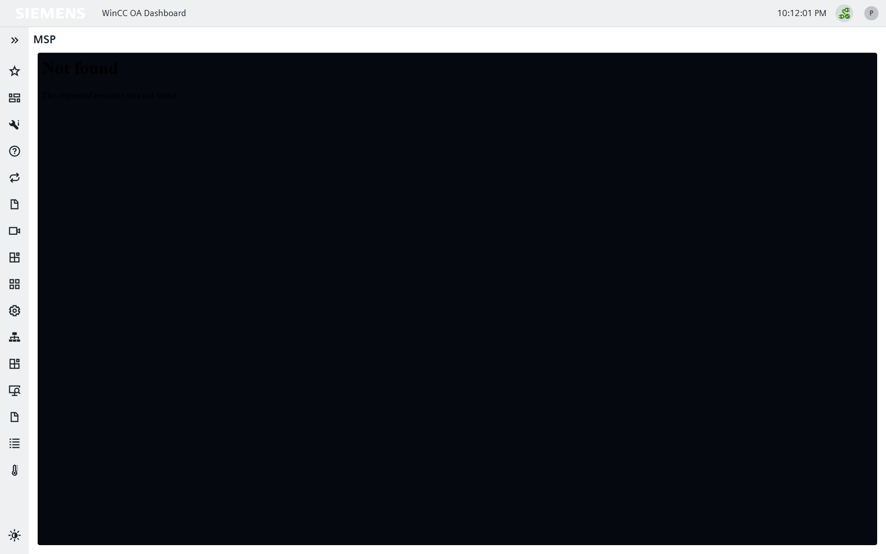

A frontend-only shell page — the scaffold to grow the MSP feature into. *Tier 1*
(no backend, no manager).

---

## System Status — `/status`

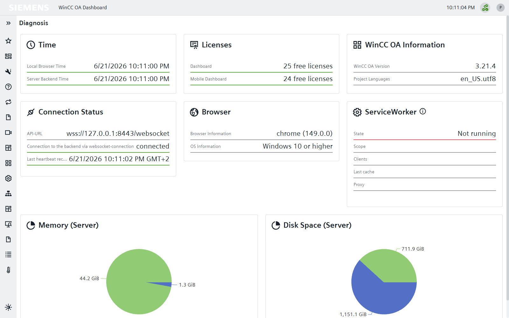

A diagnostics page (`wui-diagnosis`) showing system / connection status information.

---

## Regenerating this manual

```bash
WUI_USER=<user> WUI_PASS=<pass> BASE_URL=https://<oa-host>:<httpsPort> \
  node tools/screenshot-pages.mjs --demo
```

The tool discovers pages from each `libs/wui-*/menu.fragment.jsonc`, logs in through
the Vite dev server, populates each page with demo data (`--demo`), and writes one PNG
per page (plus `<id>-detail.png` for sub-pages) into `docs/images/manual/`. Add a new
page and it appears here automatically on the next run.
