# WinCC OA WebUI Dashboard — Page Manual

A visual tour of the standalone pages shipped by this repository (the
`@visuelconcept/wui-*` modules), each running inside the WinCC OA WebUI dashboard
shell. For what each module is and how to deploy it, see the [README](../README.md);
for development, see [DEVELOPMENT.md](../DEVELOPMENT.md).

> **Screenshots** were captured live (logged in, against a running WinCC OA) with
> [`tools/screenshot-pages.mjs`](../tools/screenshot-pages.mjs) with `--demo`, which
> populates each page with its built-in **demonstration data** and drills into the
> detail/sub-pages. Re-generate them any time with that tool. The backend is
> configured with a **French** UI locale, so on-screen labels appear in French while
> this manual is written in English.

---

## Dashboard (home)

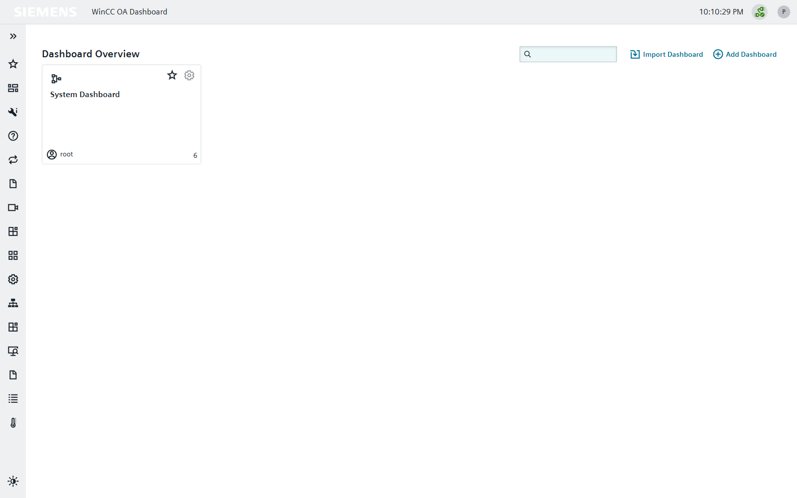

The landing page of the shell. It lists the available system dashboards as cards
(with owner and widget count), lets users mark favourites, and offers **Add
Dashboard** / **Import Dashboard**. This is the standard WinCC OA Dashboard overview;
the pages below are added around it by this repository.

---

## Machine Fleet 3D — `/fleet-3d`

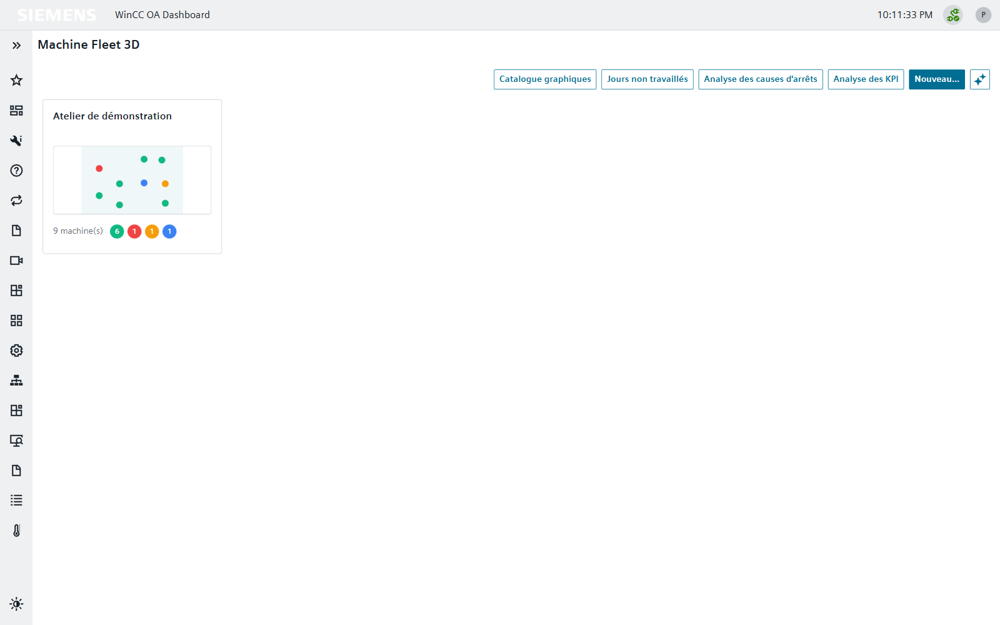

The fleet hub. Each *atelier* (workshop) is a card with a live mini-map of its
machines colour-coded by state (the demo atelier shows 9 machines: 6 running, 1
fault, 1 warning, 1 idle). Opening an atelier renders an interactive **Three.js 3D
scene** with per-machine state and KPI bubbles. The toolbar links to the graphics
catalog and to the contextual analyses below (non-working periods, stop-cause, KPI)
and an AI assistant. *Tier 3* — backed by the `machineSim`, `kpiCalc` and
`aiAssistant` managers (the assistant's MCP tools come from an optional external MCP server).

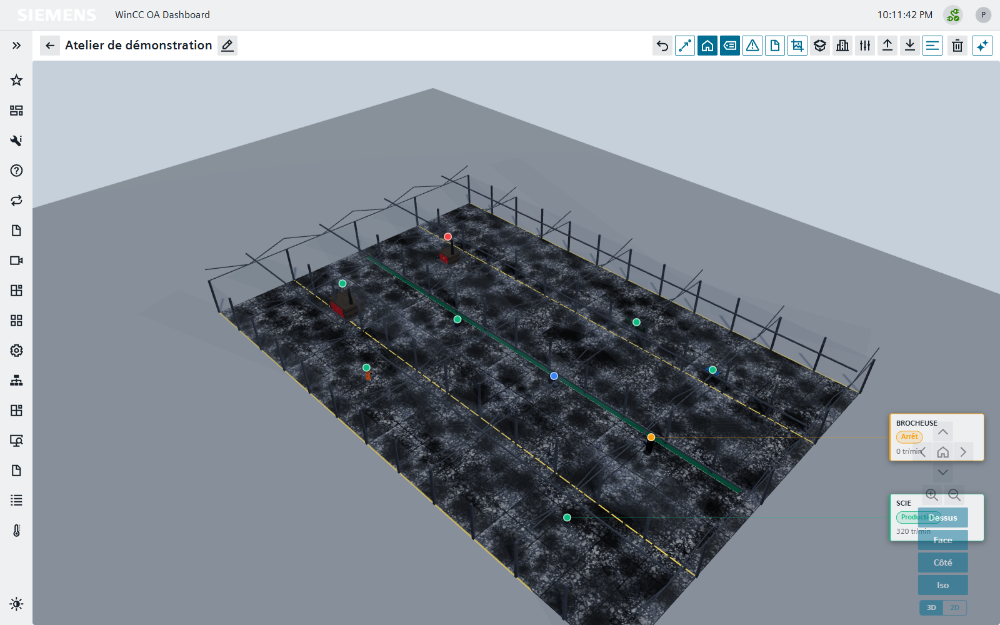

Opening an atelier renders the interactive **3D scene**: the workshop floor with each
machine placed in 3D and colour-coded by state, plus contextual KPI panels.

A machine's contextual dashboard fills the screen with four bands: a period bar, its
process parameters and computed KPIs as **cards with gauges**, the machine-state
**Gantt**, then its **alarms** next to the **stop-cause Pareto**, one half-width each.
The alarms are the shared view of the [Alarms](#alarms--alarms) page in panel form,
scoped to that machine's datapoints, standing or archived over the dashboard's period.

---

## KPI Analysis — `/fleet-kpi`

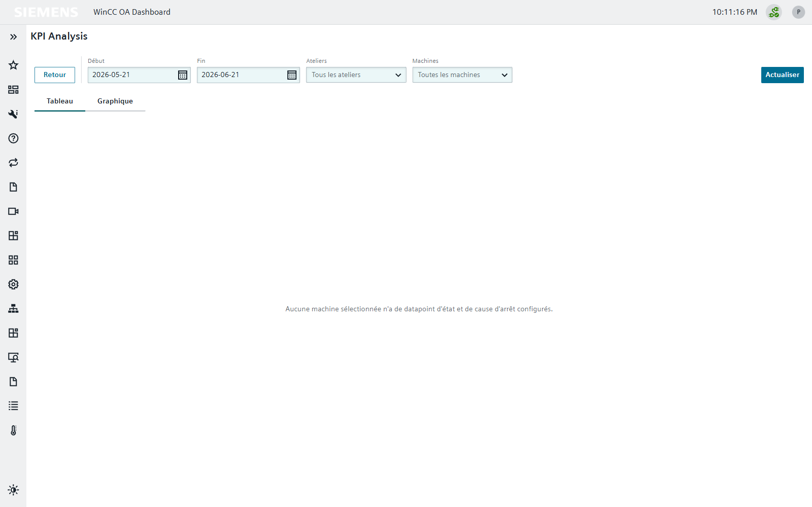

Per-machine **availability and TRS** (OEE) charted with ECharts. Values are computed
**server-side** by the `kpiCalc` manager over opening time minus the declared
non-working periods, archived for trending, and pushed live. Reached from the Machine
Fleet 3D toolbar.

---

## Stop-Cause Analysis — `/fleet-stops`

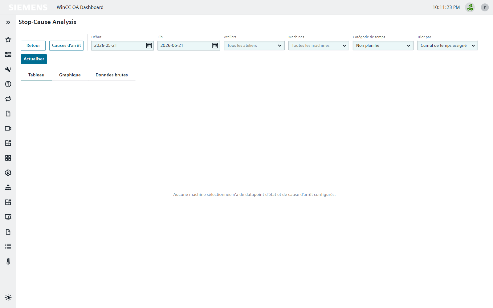

Decomposes machine downtime **per stop cause** and presents it as both a table and
ECharts views (Pareto / distribution), so the dominant causes of lost time are easy
to spot.

---

## Non-Working Periods — `/fleet-closures`

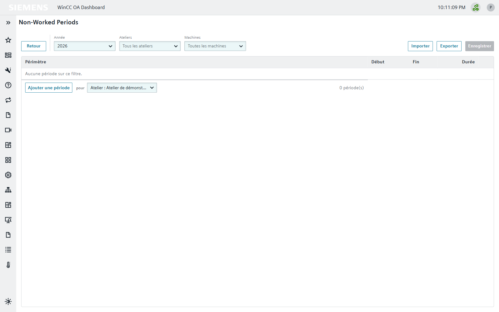

Manages the fleet's **non-working days** (holidays, planned shutdowns) with
year / atelier / machine filters, overlap handling, and JSON import-export. These
closures are what the KPI analysis subtracts from opening time.

---

## Production Orders — `/production-orders`

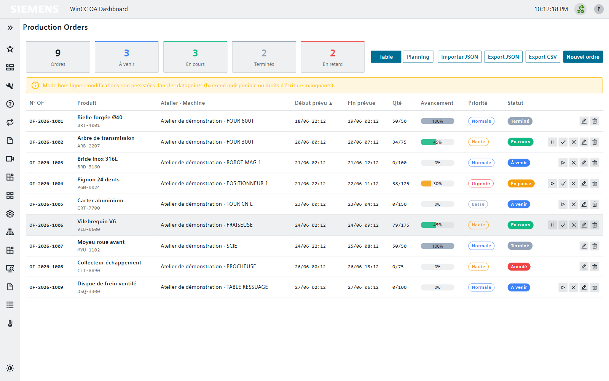

Manages production orders (*ordres de fabrication*) with full CRUD and a status
workflow. KPI cards summarise the order pipeline (total, upcoming, in progress, done,
late); a **Table** view and an ECharts **Planning** (Gantt) view are available, plus
JSON/CSV import-export. KPIs are computed by the `productionOrdersKpi` manager. A
*Generate demo orders* action seeds sample data. *Tier 3.*

---

## Thermal Treatment Reports — `/thermal-reports`

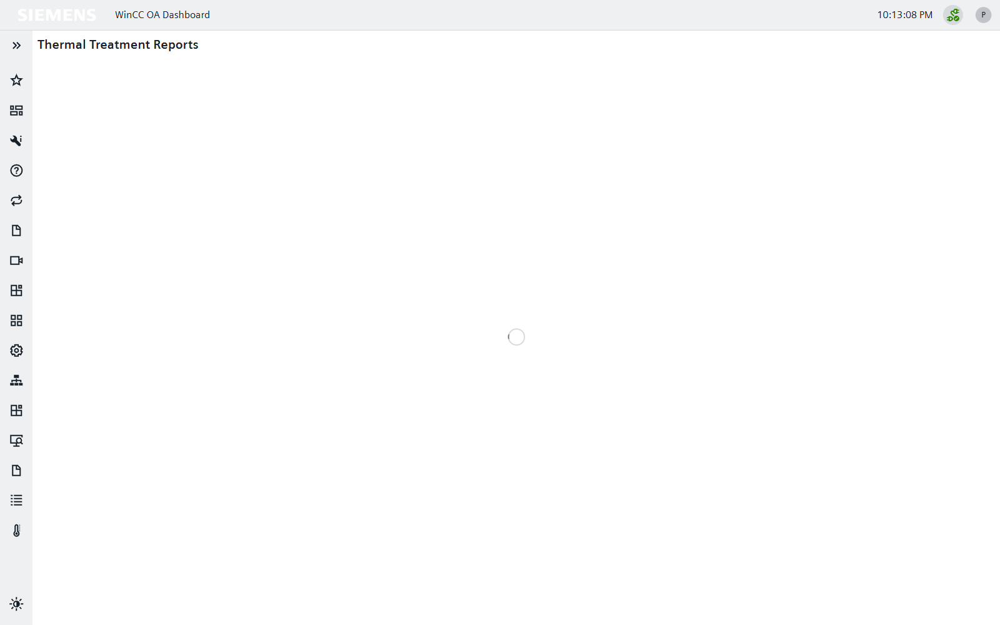

Per-charge **heat-treatment reports**: identity (load, work order, part, material),
the recipe as ordered setpoint stages (*paliers*) with tolerances, and the measured
furnace temperature curves charted against the tolerance bands.

---

## Reports — `/report-builder`

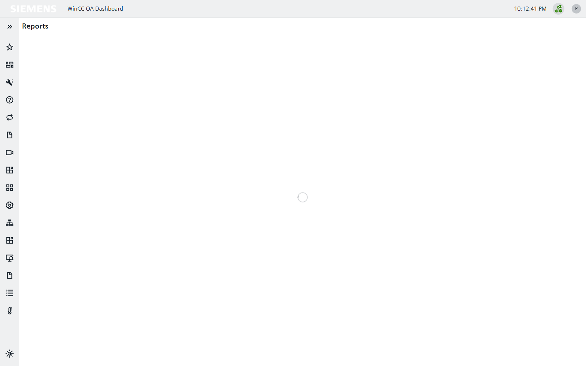

Builds **report instances** from templates: fills data sections, runs archive
aggregations over the report period, supports a multi-level signing workflow, and
prints. Works together with the report templates below.

---

## Report Templates — `/report-templates`

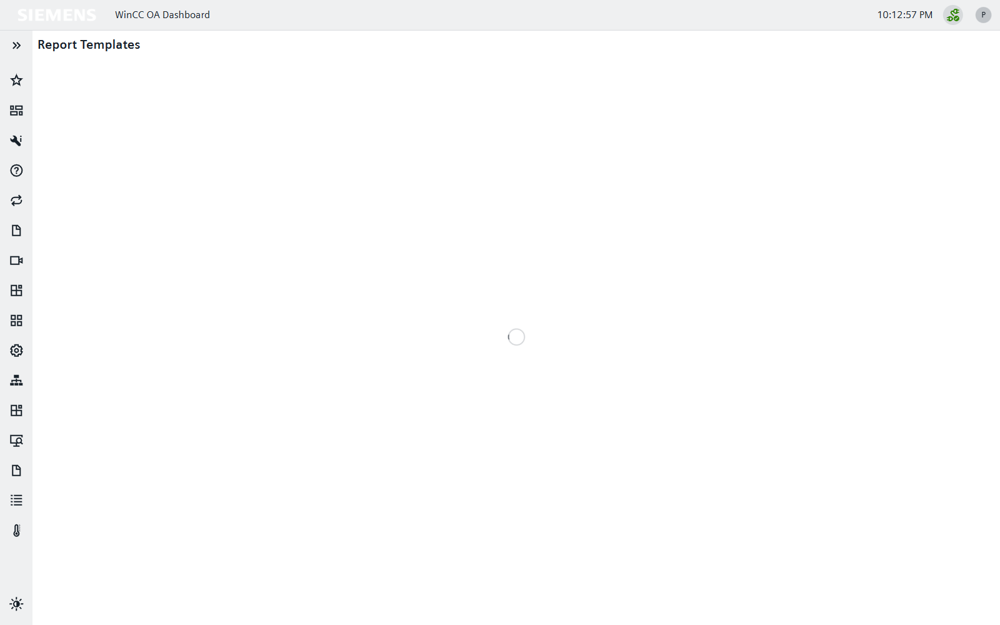

Authors the **configurable report templates** consumed by the Report Builder —
parameterised sections (text, tables, datasets/charts) and a multi-level signature
workflow definition.

---

## Alarms — `/alarms`


The plant's **alarm list**, in two tabs sharing one table: **Active** (the standing
alarms, live) and **History** (the alarm archive over a period — today, 24 h, 7 d,
30 d, current week/month or a custom range, with previous/next-period arrows). Around
the list: the **unacknowledged** counter, the **priority-range chips** (each reading
`total (n ack)`, click to filter — the ranges themselves, their abbreviation, colour
and threshold, are the project's own and are edited behind the cogwheel), the
**EEMUA-191 flood histogram** (ten alarms per
ten minutes is the operator-load ceiling) and the **recurring bad actors** (by alarm
text or by datapoint). Rows carry both readings — the configured range and the raw WinCC OA priority with
its alert class — and an alarm that went **without** being acknowledged stays in the
list until someone takes it over;
selecting rows **holds** the live updates so nothing moves under the cursor, then
**Acknowledge** writes the WinCC OA acknowledgement.

The whole view is one shared component, embedded elsewhere as a panel — the Machine
Fleet machine dashboard uses it for that machine's alarms.

---

## Audit Trail — `/audit-trail`

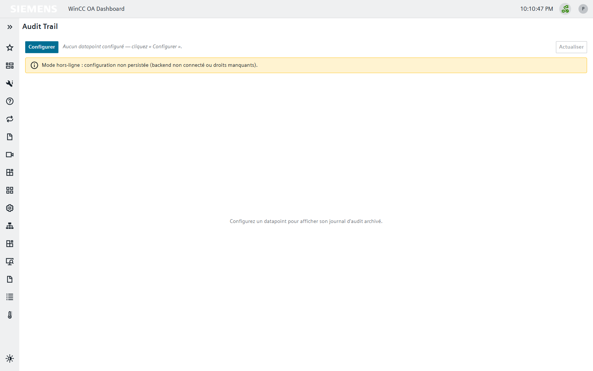

A **pivot table of a datapoint's value history** as stored by NGA archiving, with a
configurable period, columns and refresh interval — for reviewing how an element's
value evolved over time.

---

## Camera Streams — `/camera-streams`

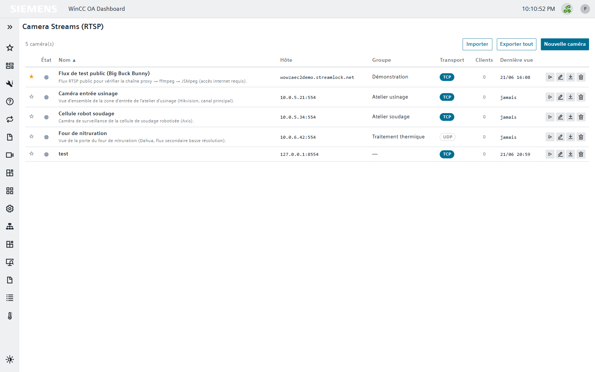

Views **RTSP IP cameras** in the browser with no plugin: the `rtspProxy` manager
transcodes each stream and relays it over a WebSocket (JSMpeg). The list page manages
the configured cameras; opening one shows the live video. *Tier 3* (`/api/rtsp`).

---

## Remote VNC — `/remote-vnc`

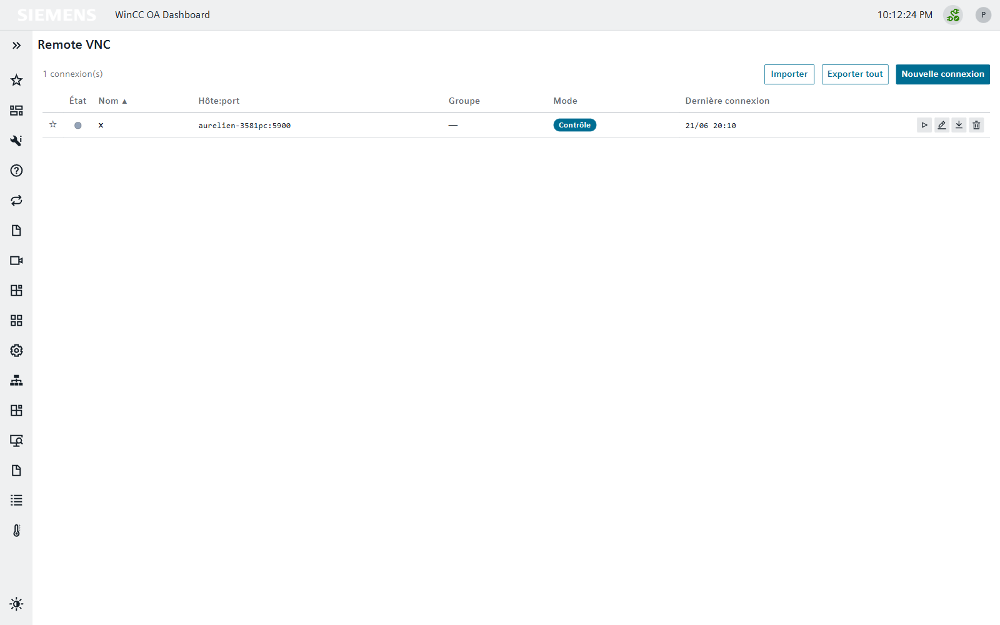

Manages **VNC connections** and opens them in the browser via bundled **noVNC** over
a WebSocket relay (`vncProxy` manager). *Tier 3* (`/api/vnc`). In a Mosaic tile a VNC
view is forced read-only.

---

## Mosaic — `/mosaic`

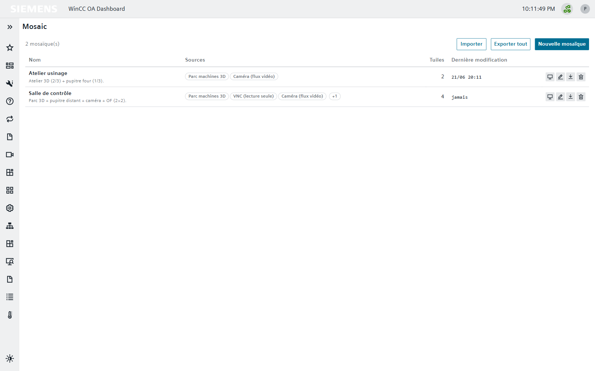

A free-layout **display wall**: a canvas of freely positioned, resizable tiles, each
embedding another dashboard view (a Fleet-3D atelier, a camera, a VNC session, or any
same-origin URL) as a **chromeless** iframe (loaded with `?embed=1`, so the embedded
view shows only its page content — no header or menu). Walls are saved as datapoints;
display mode is read-only, edit mode adds drag/resize.

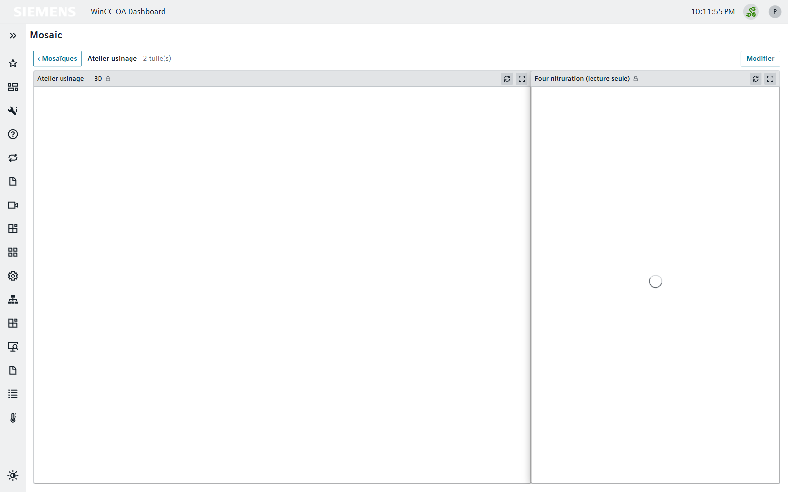

Opening a wall lays its tiles out side by side; each embeds another view chromelessly
(here a Fleet-3D atelier and a read-only VNC tile).

---

## GIS (map) — `/gis`, `/gis/:siteid`

_Screenshot pending — this page post-dates the last capture run (see
[Regenerating this manual](#regenerating-this-manual))._

**Map-based supervision** on MapLibre GL over OpenStreetMap. A **site** holds
geo-located **assets** bound to datapoints — the marker shows the live value and takes
the datapoint's own alarm colour, so the map and the [Alarms](#alarms--alarms) page
agree by construction — and **areas** (districts, sectors, catchments) drawn as
polygons that group them. An asset can belong to several areas; hovering an outline
names every zone under the cursor.

Zoomed out, markers **group** into one badge per area and then one badge for the whole
site. A badge shows only how many of its assets are **in alarm** and stays blank when
none are, so what stands out from far away is trouble rather than population; clicking
one zooms to exactly its members.

**Edit mode** (role `edit`) places and drags markers, draws and reshapes area
outlines — including *fit around the assets*, which redraws an outline hugging the
equipment it lists — and binds datapoints. An AI assistant can draft a whole site for
review on the map before saving, and never binds a datapoint itself. Sites import and
export as native JSON or as **GeoJSON** for QGIS/ArcGIS, which is how surveyed
coordinates come back in.

Drill-down is configuration, not code: each asset and area carries a route, so a click
can open a Fleet-3D atelier, an Ampère network, a Mosaic wall, or the Alarms page
scoped to that asset's datapoint.

---

## AGV Fleet — `/agv-fleet`

_Screenshot pending — see [Regenerating this manual](#regenerating-this-manual)._

Read-only supervision of an **automated-guided-vehicle fleet**: a KPI strip (fleet
size, moving, available, charging, faults, average battery, utilisation, missions), a
sortable status list with state chips and charge bars, a **warehouse floor plan**
showing each vehicle's live position and heading, and a detail card per vehicle. One
`AGV_Vehicle` datapoint per vehicle; the `agvSim` manager provides a demonstration
fleet.

---

## Ampère (electrical) — `/ampere`, `/ampere/:networkid`

_Screenshot pending — see [Regenerating this manual](#regenerating-this-manual)._

**Single-line (mono-filaire) diagrams** of an electrical distribution network —
switchboards, disconnectors, breakers, busbars, transformers — and of railway
electrification (catenary, track return, rectifier, sectioning switch,
autotransformer). An in-place edit mode with an **IEC 60617 symbol toolbox** draws the
network and binds each device to its datapoints; wires are **energised live** from the
state of the devices upstream, so the diagram shows where the power actually is.

---

## Parametrization — `/para`

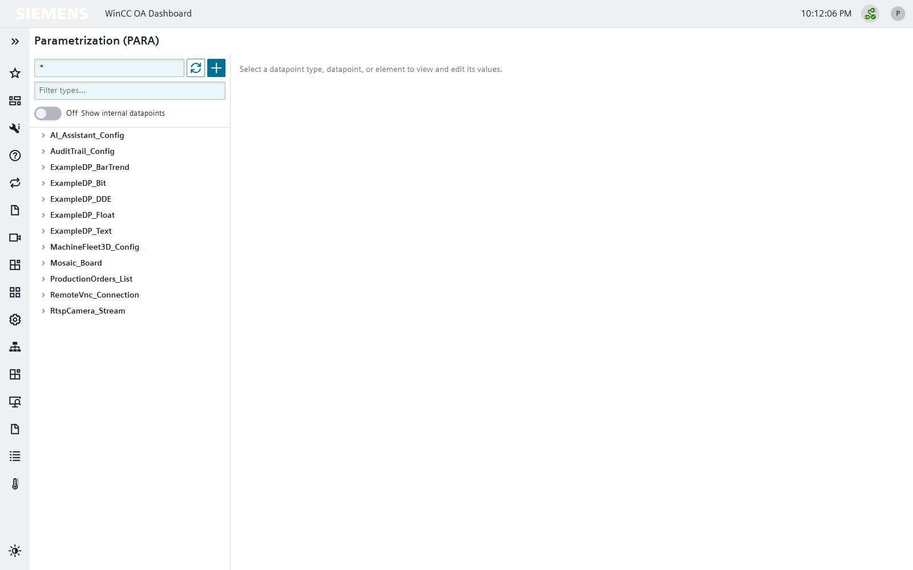

A datapoint **parametrization** page, backed by its own webserver module
(`/api/para`). Four tabs:

- **Modèle (Types)** — an ergonomic, nested tree editor to define datapoint
  **types**: add elements and sub-structures, rename, change element type, set a
  `Typeref` target, choose a **scalar or Struct root**, delete. Empty types
  (no instances) are listed too. New types are created and existing ones updated
  **in place** (`dptype/change`, which preserves the datapoints already created).
- **Instances & valeurs** — the master-detail browser: a Type→DP→element tree
  with live values and config attributes (inline edit), plus datapoint
  create/rename/delete.
- **Archivage** — per DP/DPE, enable NGA value archiving and pick an archive
  group (`_NGA_Group` instances).
- **Alarming** — per DP/DPE, configure `_alert_hdl`: binary alerts for BOOL
  elements, analog threshold alerts for numeric elements, with an alarm class
  chosen from the `_AlertClass` instances.

A header **AI assistant** helps model the data. It is *proposal-only*: its MCP tools
are read-only, so it can inspect the existing model but never changes anything. It
suggests datapoint-type models and can load a proposal straight into the model
editor, where **you review and save** it. Each answer shows which tools it used and
what they returned.

**DPL (ASCII) import/export.** From the *Instances & valeurs* tab you can tick
several DPs and/or DP-types and **export** them to a WinCC OA `.dpl` file, or
**import** a `.dpl`. The export/import is run server-side by the `dplAscii` MSA
manager (which drives `WCCOAasciiSQLite`).

---

## Engineering Studio — `/eng-studio`


Model **DP types, datapoints and their configs from the equipment that communicates**,
then check the result into the project in one transaction. Four tabs:

- **Equipments** — the device registry: protocol, connection, driver, and a **live
  connection lamp** read (never stored) from the connection's own `ConnState`, with
  the raw code beside it and a tooltip saying why a lamp is grey.
- **Catalogs** — address books built from a TIA/SimaticML export, a Control Expert CSV
  or XVM file, an OPC UA NodeSet2 file, or a **live browse** of a server you can watch
  and stop. Each signal is qualified with a role (measure, setpoint, command, state,
  alarm…) that the operator can override; signals can be hidden without deleting them,
  and re-reading the source keeps every manual override.
- **Model** — the DP type to generate, as an outline or as a **tree** in PARA's own
  grammar, each leaf carrying the signal it is bound to. Reusable models can be stored
  and applied to any equipment.
- **Control** — the diff between the working copy and the live project, item by item,
  applied transactionally — or **forgotten** from the working copy when a plan holds
  staged work nobody wants any more.


---

## Tag Importer — `/tag-importer`

_Screenshot pending — see [Regenerating this manual](#regenerating-this-manual)._

Import device tags into **datapoint types and datapoints** from an OPC UA **NodeSet2**
file, or by **browsing a live server** and picking the instance whose subtree becomes
the type. Repeated instances of one ObjectType are mutualised into a single DP type
(one datapoint per instance); a nested type shared by two parents or more becomes a
`DPT_TYPEREF` reference, while one-off nesting is flattened. Every write is preceded by
a **dry-run preview**, and an online import also writes the peripheral address configs.
The core is protocol-agnostic — OPC UA is the adapter that exists today.

---

## Application Security — `/app-security`

_Screenshot pending — see [Regenerating this manual](#regenerating-this-manual)._

Discover the **roles every page module declares** (each module writes them into its own
`AppSecurity_<module>` datapoint) and map each one to **WinCC OA user groups**. A role
with no group assigned stays **open to all connected users**, so declaring a role never
breaks a running deployment. Pages hide what the user may not do; the backend enforces
the same rules on its own routes, so the page is a convenience and not the security
boundary. Every assignment change is written to a GxP audit trail.

---

## Process Monitor — `/process-monitor`

_Screenshot pending — see [Regenerating this manual](#regenerating-this-manual)._

A **pmon console** with one tab per connected server: manager status, start / stop /
restart (and restart-all), and adding or removing pmon configuration entries, persisted
to `config/progs`. It also **uploads and deploys a project ZIP** across all servers —
optional folder purge, extraction into non-protected folders, optional restart — with
the session user traced in the audit trail. The sensitive actions are role-gated
server-side (`control`, `edit-managers`, `deploy`).

---

## System Status — `/status`

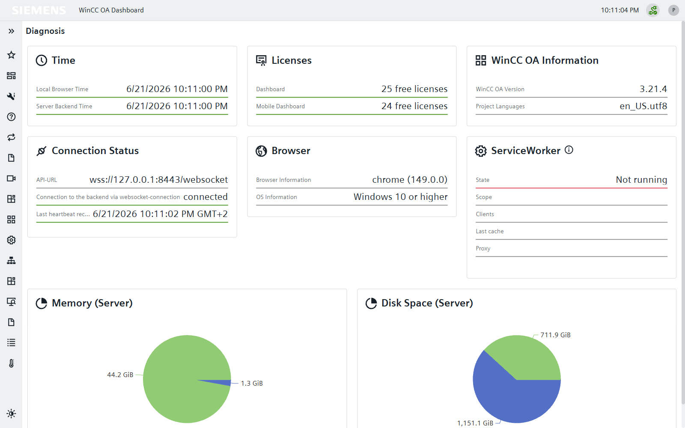

A diagnostics page (`wui-diagnosis`) showing system / connection status information.

---

## Regenerating this manual

```bash
WUI_USER=<user> WUI_PASS=<pass> BASE_URL=https://<oa-host>:<httpsPort> \
  node tools/screenshot-pages.mjs --demo
```

The tool discovers pages from each `libs/wui-*/menu.fragment.jsonc`, logs in through
the Vite dev server, populates each page with demo data (`--demo`), and writes one PNG
per page (plus `<id>-detail.png` for sub-pages) into `docs/images/manual/`. Add a new
page and it appears here automatically on the next run.
