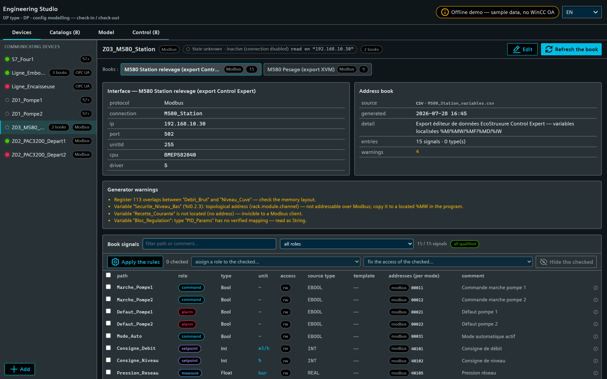
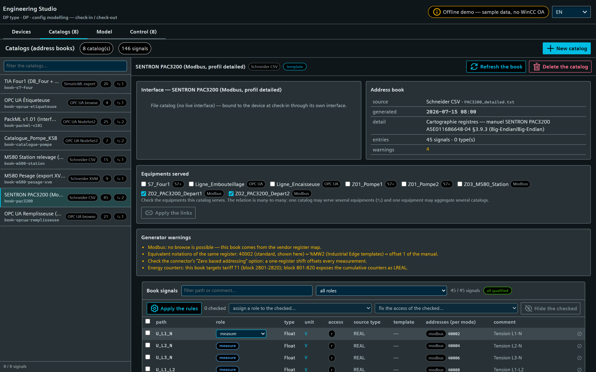
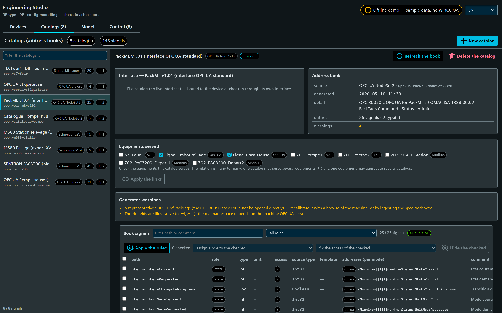
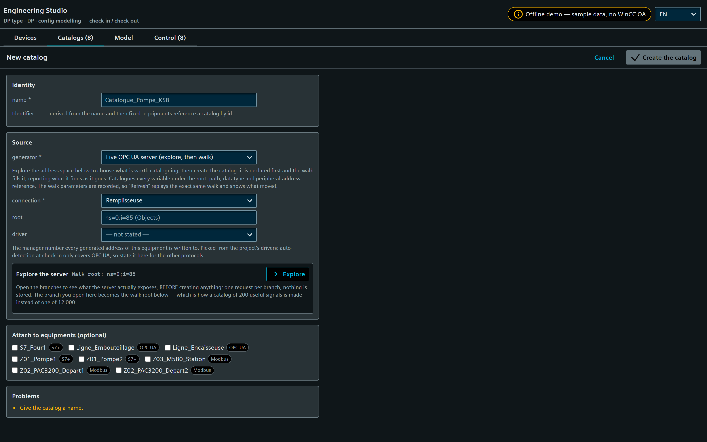
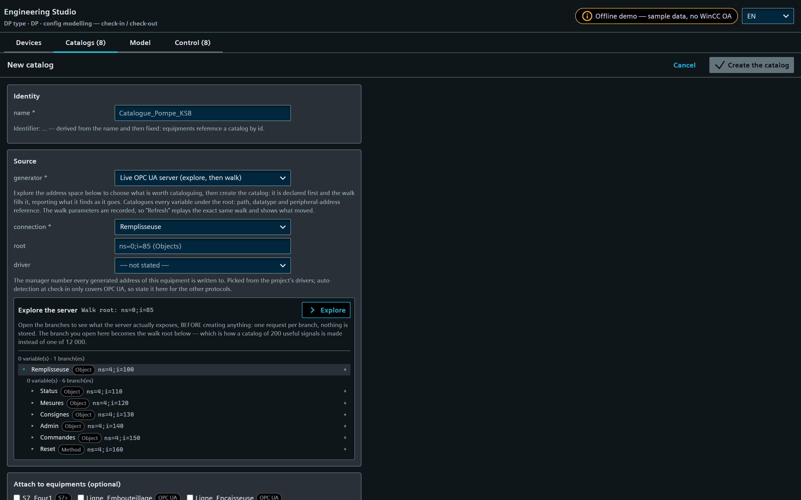
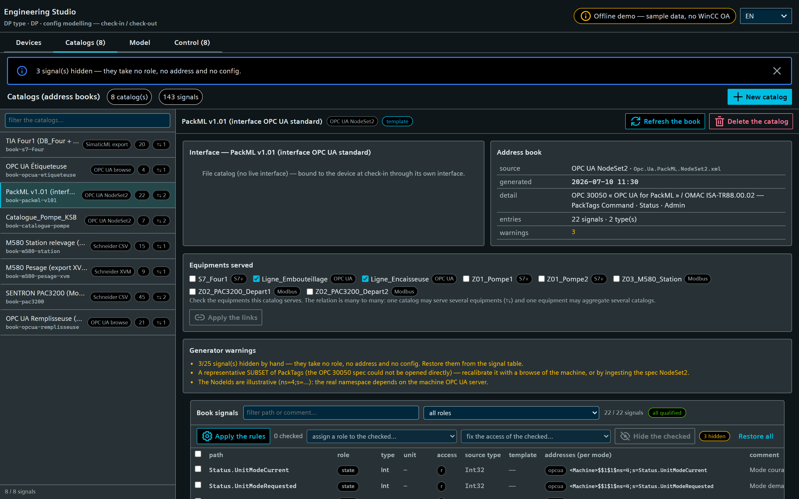
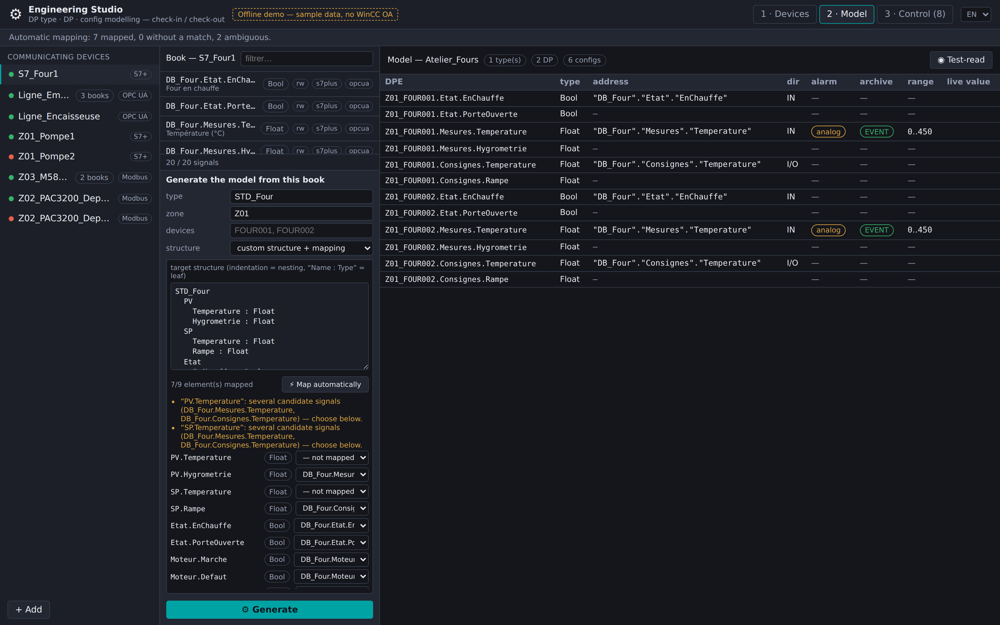
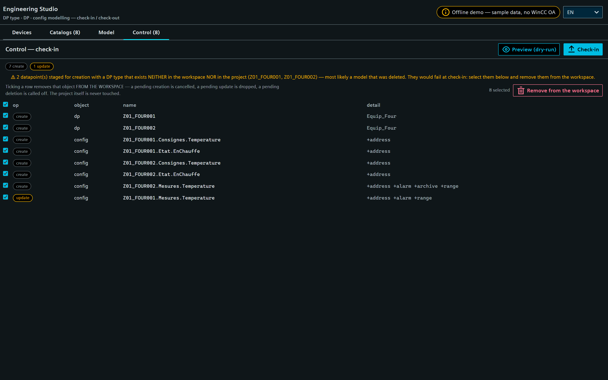

<!-- SPDX-FileCopyrightText: 2026 VISUEL CONCEPT -->
<!-- SPDX-License-Identifier: AGPL-3.0-only -->

# Engineering Studio (`wui-eng-studio`)

Standalone WinCC OA WebUI page (`/eng-studio`) to **model datapoint types, datapoints
and their configs** (peripheral address, alarm, archive, value range) from
**communicating equipment**, efficiently. It replaces the point-by-point,
attribute-by-attribute PARA workflow with a **device-first, check-in / check-out
studio**: you edit a *working copy* (types + DPs + configs) and **commit a diff** to
the live project — in bulk, previewed, transactional.

> **Status: v0.2 — workflow-complete on demo data, backend implemented.** The whole
> page runs end-to-end WITHOUT a WinCC OA runtime via an in-memory demo gateway (the
> source of the screenshots below). The pure engineering domain
> (`@visuelconcept/wui-eng-core`) is unit-tested (306 tests, no runtime) and the
> backend (`/api/eng`: file store, config read-back, check-out/plan/check-in,
> online OPC UA browse, fail-closed role gating) typechecks offline against those
> same sources. Still staged: the **watched-folder ingestion** and the
> **TIA Openness connector** — see [NOTES.md](./NOTES.md) "Staged for later" and
> [INTEGRATION.md](./INTEGRATION.md).

## Why (vs PARA)

PARA is *live + unitary + one attribute per write*, configs live only on the
*instance*, and the work is split across disjoint tabs. The Studio inverts this:

- **model → plan → apply**: edit a serializable workspace, preview the diff, apply
  atomically (one `dpSetWait` per config) — idempotent and reproducible;
- **address-book-first** (the iba idea): each device carries a persistent,
  refreshable **catalog** of addressable signals; you *pick* from it — datatype,
  transformation and address are resolved for you, never typed as magic numbers;
- **bulk by equipment**: one type + configs, declined over N datapoints;
- **generated names** following the VC referential `{Zone}_{Equipement}_{Signal}`.

## Look & feel — Siemens iX

The page renders with the **Siemens iX design system**, like every other page of the
suite: `IXCoreStyles` inlined into its shadow roots, and the shell's own
`wui-content-header`, `ix-tabs`, `ix-button`, `ix-input`, `ix-select`,
`ix-message-bar` and `ix-chip`. Colours, spacing and typography come from the iX
`--theme-*` tokens — the page states no colour of its own, so it follows the shell's
theme (light/dark) without a second definition of "primary".

Two deliberate exceptions, both inside the **dense grids**: the signal table and the
diff draw one row per DPE — thousands on a real project, each with two to four status
pills. That is tens of thousands of Stencil components on the page whose whole point
is bulk editing, so those pills and tables are iX-shaped CSS (the geometry is read
from iX's own `pill.css`) rather than `ix-chip` / `ix-table`. iX components are used
everywhere the count is bounded: chrome, forms, actions, cards, messages.

The offline demo registers the iX elements, icons and theme itself
(`demo/ix-bootstrap.ts`) — the part the app shell normally provides — so the page
still runs and is screenshotted with **no WinCC OA runtime**.

## Workflow (4 panels)

### 1 · Equipements — devices + address books

The communicating equipment, declared once (protocol + connection), each with its
**address book** (generated from a browse, a **SimaticML/TIA Openness** export, a
CSV, or an AI proposal — and refreshable). The book is the persistent catalog the
rest of the studio consumes.


#### Declaring an equipment

"+ Add" opens the declaration form in place of the device detail — so an empty
project starts here. The **connection fields are rendered from the protocol's
specification** (the core's `PROTOCOL_PARAMS`), not hand-written per protocol:
switching the protocol swaps the fields and drops the parameters of the previous
one. Validation is the core's too, running as you type and again on the server,
which is what makes the two agree:

- the **name must be a valid WinCC OA identifier** — datapoint names are built from
  it (`{Zone}_{Equipement}_{Signal}`), so an invalid one would fail at check-in, far
  from its cause. The form proposes the sanitised spelling;
- the **id is derived once** from the name and then fixed for good: books and
  address configs reference a device by id, so a rename must never re-parent
  catalogs;
- the **OPC UA server is picked from the project's own connections**
  (`GET /api/eng/connections`), not typed from memory. That name is what every
  `_address.._reference` of the equipment carries and what its connection state is read
  on, so a name that exists nowhere costs both: no state, and addresses that do not bind.
  A name the list does not carry is not refused — the connection may be created later —
  but it is *said*, with the project's actual connection names beside it. Same
  degradations as the driver picker: `editable`, a stored value kept as its own option,
  and a plain text field when the list is empty;
- the **driver is picked from the project's own drivers** (`GET /api/eng/drivers`:
  every `_Driver<n>` with its `DT` and whether it runs), not typed from memory. It
  matters because `driverNumber` is the manager number every `_address` write of the
  equipment lands on: a wrong one binds the datapoint to another driver, silently.
  Stopped drivers are offered too — an equipment is normally declared before its
  driver is started — and the state is shown rather than hidden. Three cases the
  picker keeps working: an empty list (no runtime, no permission) degrades to a plain
  number field so a declaration is never blocked by a diagnosis the page could not
  make; a stored value the list does not carry is offered as its own option, so
  editing never silently drops it; and the select is `editable`, so a number the list
  lacks can still be typed. A driver whose type contradicts the protocol is an
  *advisory* — only `OPCUAC` is verified, so this reports a suspicion, it does not
  refuse a save. A **missing driver number** outside OPC UA stays an advisory too,
  because auto-detection at check-in is only verified for OPC UA — see "Driver
  number" in [INTEGRATION.md](./INTEGRATION.md);
- **books are checked here**, with `⇆` showing the ones already shared with other
  equipments.


A separate card, **"declared on the WinCC OA side"**, holds the parameters the
studio only *records*: a Modbus **word order** and **zero-based addressing** are set
in the project `config` file / when the connection to the device is created — never
per address (the `_address` attribute set has no byte-order attribute at all). They
are worth writing down next to the equipment because they decide how every register
of its book is *interpreted*: a word swap turns a `REAL` into nonsense and a
one-register shift moves every measurement. Each is **three-state** — `big` /
`little` / *not stated* — because "we checked, it is not zero-based" and "nobody
said" are different claims.

Editing shows the same screen with the id pinned and the equipment's books checked.
Deleting asks twice, and only forgets the equipment: **its books are kept** (they may
be shared) and nothing already checked in is touched.

#### Connection state — a coloured LED and a word

Each equipment shows whether it is **communicating**: a LED in the rail, and a badge in
the panel head spelling out `Connecté` / `Déconnecté` / `État inconnu` with the
connection it was read on. Read, not declared — the backend probes
`<connection>.Common.State.ConnState`, the driver-agnostic element every WinCC OA
connection type carries (`_OPCUAServer`, `_S7_Conn`, `_S7PlusConnection`, `_Mod_Plc`, …),
so all four protocols the studio declares get a real state rather than OPC UA only.

The colours follow the **driver panel shipped with WinCC OA** (`setCommonConnStateShape`):
green from `256` up, red on `1` (not connected) and `5` (failure), and *neither* for the
rest — `3` means the connection is **inactive** (somebody disabled it), which para paints
yellow and the studio shows as a hollow, dashed lamp. An unknown state must not look like
an answer. The raw code is shown next to the word whenever it says more than the lamp
does, because "not connected", "inactive" and "failure" call for three different actions.

A LED is only as honest as its matching: the equipment is tied to its connection by
**name** for OPC UA (the `server` parameter — the same reference its addresses are bound
through), otherwise by its declared **address**. If *several* connections match, or none,
or the declaration carries nothing to match on, the state stays `unknown` and the badge's
tooltip says which of those it is. A driver being up is never borrowed as an answer: a
running manager says nothing about a given station being reachable.

The lamps are **live**: the page re-reads the states every 5 s through
`GET /api/eng/devices/state`, which answers the live fields only — a poll must never
carry the registry, or it would overwrite an equipment being edited with a copy that is
seconds old. It pauses while the tab is hidden (an engineering screen stays open for
days) and refreshes immediately when it comes back. If the refresh itself keeps failing,
the lamps go **grey** after three rounds instead of freezing: a green LED still claiming a
machine answers, long after the page stopped being able to ask, is worse than no LED.




**Books are first-class and the device↔book relation is many-to-many**, both
directions supported:

- **Aggregation** — one equipment groups **several interfaces**, each seen as an
  address book (e.g. a bottling line with a filler + a labeller OPC UA server):

  

- **Mutualisation** — one **catalog book is shared** across equipments (e.g. two
  identical pumps reuse a `Catalogue_Pompe_KSB` file catalog; a catalog has no
  live interface of its own and is bound to each equipment at check-in):

  

#### Two real-world catalogs in the demo

**SENTRON PAC3200 (Siemens) — Modbus register map.** Modbus has no browse, so the
book *is* the vendor register map: a **device-type catalog** mutualised across
every meter. Offsets come from the PAC3200 manual `A5E01168664B-04` §3.9.3 (via
the VC fiche `templates-import-tags-modbus-pac3200`): offset 1 → `40002` / `%MW2`,
`REAL`/`LREAL`/`UDINT`, Big-Endian/Big-Endian, T1 energy counters at 2801+. Units
(V, A, W, var, kWh…) ride along for the DPE unit config.


**PackML (OMAC / ISA-TR88.00.02) — standard OPC UA interface.** The archetype of a
mutualised book: one catalog describes the `Command` / `Status` / `Admin` PackTags
of *every* PackML-compliant machine, bound to each machine's own OPC UA server at
check-in. Here the bottling line and the case packer share it.


#### Online OPC UA browse (and re-browse)

For an OPC UA equipment the book is generated by **walking the live server**: pick
the connection, optionally a sub-tree root, and the studio catalogues every
variable it finds — path, datatype (through the verified tag-importer mapping) and
peripheral-address reference. The walk is one level per request (a browse response
carries no parent link, so the walker recurses itself to know each node's path),
sequential per connection, and **bounded** — depth, signal count and request count
are all capped, and hitting a cap raises a warning naming what was left out.

`AccessLevel` is read when the driver exposes it (the `Browse.*` element is
discovered by introspecting the connection's DP type, never guessed) and the address
direction then follows the real access. When it is not exposed, signals are catalogued
read-only with an **`assumed`** access — the book says so, the chip shows `r?`, and
the direction comes from the signal's *role* instead; a bulk "fix the access" action
turns an assumed access into evidence. An **array** variable is catalogued with its
scalar base type and flagged `unmapped` rather than given an unverified dynamic-DPE
address.


The browse parameters are recorded in the book's provenance, so **"Rafraîchir"
replays the exact same walk** — and shows what moved. That delta is the point: a
machine's program drifts, and a signal that vanished from the server may still be
referenced by your model.


> The screenshots above are produced by the **real core walker** against the demo's
> in-memory fake server (`data/demo-opcua-server.ts`) — same code path as a live
> browse, no WinCC OA and no PLC involved.

#### OPC UA NodeSet2 (offline sibling of the browse)

A `UANodeSet` file — a companion specification (PackML/OPC 30050, Euromap), a
vendor model, or a server export — is ingested as a book **without touching the
machine**. It reads `AccessLevel` (which a browse cannot), folds custom supertypes
into their subtypes (WinCC OA has no DPType inheritance), and catalogues each
`UAObjectType` as a `BookType`.

A NodeSet's namespace **indices are file-local** and a live server almost always
assigns different ones, so its addresses are *candidates*: every one is emitted with
a `<Connection>` placeholder, the book carries no interface (it is a **template
catalog**, bound per equipment at generation), and the caveat is the book's first
warning. Verify against the server — or re-browse it online — before check-in.

Only the **topmost** instances are walked. A NodeSet describes types *and* instances,
and an instance of a structured type contains sub-objects that are themselves typed
(`P01` → `AcquisitionConfig` → `SampleRate`): walking every typed object as a root
catalogued each sub-object twice — once under its machine and once on its own — so a
book came out with `AcquisitionConfig.SampleRate` repeated for as many machines as it
had. An instance reachable from another instance is therefore walked only through its
parent (`rootInstances`), and a duplicate path that reaches a book anyway is dropped
with a warning naming it (`dedupeEntries`) rather than silently collapsing: a book is
keyed by path everywhere — the refresh diff, the bindings, the generated DPE names —
so two signals sharing one path would become a single DPE.

**Schneider Modicon M580 — from a Control Expert variables export.** A *project*
book (it carries the PLC's own Modbus interface, unlike the PAC3200 template).
The generator turns located variables into Modbus references — `%MW100` → `40101`,
`%MF104` → `40105`, `%M10` → coil `00011`, `%IW200` → input register `30201`
(read-only) — and runs the checks that make a Modbus book trustworthy: register
**overlaps**, **unlocated** variables (invisible to any Modbus client),
**topological** addresses (`%I0.2.3`, not Modbus-addressable) and unmapped derived
types. All four are surfaced as book warnings:


> **Why an export and not the "extended Modbus"?** Schneider's symbolic access
> rides on **UMAS**, the vendor extension of Modbus on reserved function code
> **90 (0x5A)** used by Control Expert. It is undocumented by Schneider (publicly
> described only through reverse engineering, with published vulnerabilities), so
> the studio's default path is the offline variables export — same symbols, no
> proprietary traffic on the OT network. See [NOTES.md](./NOTES.md).

Two Schneider generators are available, and one equipment can hold both books —
here a CSV export of the pumping station plus an **XVM/XSY (XML)** export of its
weighing section. The XVM reader flattens structured variables to their members
(`Recette.Consigne` → `40421`), picks units from Unity-style
`<attribute name="unit" …/>` children, and states up front that the **XVM schema
is not vendor-verified**:


#### Qualifying the signals (roles) — what makes the rest automatic

A book says *what to read*; a **role** says *what it is for*. Roles are inferred by
a rule engine and drive both the model and the configs at check-in
(archive / alarm / range / direction). Eight roles: **mesure, consigne, commande,
état, alarme, compteur, paramètre**, and **à qualifier** — nothing ever takes a
silent default.

Three rule layers, most specific wins, and the matching rule is always shown as
the chip's tooltip:

1. **structural** — datatype + access + unit (a read-only `Float` in `bar` is a
   measure; a writable `Bool` is a command). Zero configuration, works on any
   source;
2. **source path** — `Command.*` / `Status.*` / `Admin.*` (PackML),
   `Mesures.*` / `Consignes.*` / `Etat.*` (S7 & catalog books);
3. **name & convention** — the VC referential prefixes (`AI_`, `AO_`, `DI_`,
   `DO_`, `CALC_`) plus business patterns (`*_Defaut` → alarme, `Marche*` →
   commande, `Compteur*`/`Nb_*` → compteur…).

Rules are **data** (serialisable, project-overridable), a **manual role always
wins**, and the whole set is re-runnable (*Appliquer les règles*) without losing
overrides. On the demo books this qualifies **100 % of the signals with no
configuration**: below, the M580 book — `Defaut_*` → alarme, `Marche_*` →
commande, `Consigne_*` → consigne, and `Pression_Reseau` → mesure *despite being
writable* (a quantity name outranks the structural rule, but not the
`Consignes.` branch):


Two escape hatches, because correcting a rule engine happens at two scales.

**In bulk**: filter (text or role), tick, assign one role to every checked row.

**One signal at a time**: click its role chip and pick. The role is what drives every
config at check-in, so needing to tick a box and reach for the bulk bar to fix a
single signal was friction in the wrong place.



It is a **click-to-edit**, not a dropdown per row, and that is deliberate: the chip
carries what a `<select>` cannot — the role's colour, readable down a column of
hundreds of rows, and as its tooltip *why* the signal has that role (the matching
rule, or the fact that a hand overrode it **and what the rules would have said
instead**). Swapping one for the other on demand keeps both, and keeps exactly one
live control in a table that draws thousands of rows.

The first option is **"— selon les règles —"**, which *clears* the override and hands
the signal back to the engine. That option is the reason the rest is safe to click: a
manual role outranks every rule, so without it a mis-click would pin a wrong role for
good and no amount of "Appliquer les règles" would shift it. The notice then reports
the role the signal actually ended up with — the rules' own answer, not the click.

And the subtle cases work — on the PAC3200, the **4 energy counters carry no
"counter" keyword at all**; their unit (`kWh`, `kvarh`, `kVAh`) qualifies them, while
`m³` or `h` stay measures because those units are ambiguous:


### 2 · Catalogues — the address books, without any equipment

The studio is device-first, but a **catalog is not**. A vendor register map (SENTRON
PAC3200), a standard interface (PackML), a machine-model catalog
(`Catalogue_Pompe_KSB`) exists *before* — and independently of — any equipment, and is
then bound to several of them. Requiring a device in order to create one had the
workflow backwards, so catalogs get a panel of their own.



Left, **every catalog of the project** with its generator, its signal count and its
users. The one indicator that only this view can give is `inutilisé` — a catalog that
serves *no* equipment: from a device form it is invisible, because a device only ever
shows the books it references.

Right, the selected catalog: its interface (or `gabarit` when it has none), its
provenance, the equipments it serves, its generator warnings, and the same **signal
table** as the Devices panel — with the same role qualification. That matters for a
mutualised catalog: PackML is qualified **once**, not once per machine.

Three actions, all of them what the device-side view could not do:

- **Rafraîchir** — re-read the source of any catalog, not just the selected device's;
- **Équipements servis** — tick the equipments and apply. The relation lives on the
  device (`Device.bookIds`), so this is N device upserts, one per equipment whose set
  actually changes; binding one shared catalog to six pumps stops being six trips
  through six device forms;
- **Supprimer** — asks twice, then forgets the catalog and **detaches it from every
  equipment** that used it. That asymmetry is deliberate: deleting a *device* keeps
  its books (they may be shared), but deleting a *book* must not leave `bookIds`
  pointing at a file that no longer exists. Nothing already checked in is touched —
  the addresses written from the catalog live in the project.

#### Creating a catalog

"Nouveau catalogue" asks four questions, in the order an engineer answers them:



1. **Identity** — the name, from which the id is derived once and then fixed
   (equipments reference a catalog by id, so a rename must never orphan them). A name
   whose id already exists says so: creating would *replace* that catalog, which is
   exactly what a re-browse does.
2. **Source** — one of the five generators, each with what it reads and what it is
   trustworthy for: a live **OPC UA server**, a **TIA/SimaticML** export bundle
   (select the DBs *with* the UDTs they reference), a **Control Expert CSV**, an
   **XVM/XSY** export, or an **OPC UA NodeSet2**. The file is read **in the browser**
   and only travels on "Créer", so a mis-picked file costs nothing; switching
   generator drops the files rather than handing them to a parser that cannot read
   them. The live path gets a screen of its own — see "Exploring, then walking" below.
3. **Contenu du fichier** — the picked files are parsed **as soon as they are picked**,
   and the card shows what the catalog will contain: how many signals and structured
   types, the generator's own warnings, and a filterable table of the entries (path,
   source type → OA type, access, comment). The parse runs in the browser through
   `buildBookFromIngest` — *the very function the server ingests with* — so the preview
   cannot disagree with what "Créer" stores. That is the only moment where a wrong file,
   a wrong generator, an export that yields no variable, or a NodeSet that yields 12 000
   signals instead of 200 costs nothing to discover. Long files are capped at 300 rows
   *displayed* (the count and the filter stay exact, and the cap says so), and a file the
   generator cannot read is reported inline, in place, without losing the form.
4. **Interface** — the template/project distinction the whole mutualisation story
   rests on. Left empty the catalog is a **gabarit**: it carries no interface of its
   own and is bound to each equipment's connection at generation. Filled in it is a
   **project** catalog addressing through its own connection — with the same driver
   picker as the device form. The card is hidden for the two generators where the
   question does not exist: a walk carries the connection it walked, and a NodeSet2 is
   *always* a template (its namespace indices are file-local).
5. **Attach** — optional and additive; the catalog can be bound later.

A refusal keeps the form as it is, fields and files included: re-picking a TIA bundle
because a name was rejected would be the wrong lesson to teach.

#### Exploring a live server, then walking it

A walk of a real OPC UA server catalogues thousands of variables and takes minutes.
One server-side call that answers when it is done — which is what `/books/browse`
does — gives an operator no way to look first, nothing to watch, and no way to stop.
So the online path is three separate things.

**Explore first.** The address space is browsable one level at a time: one request per
branch, nothing stored, the datatype of each variable and the node id of each branch
shown as they arrive. Any branch can be promoted to the **walk root** (`⌖`) — which is
the difference between a catalog of 200 useful signals and one of 12 000, and the only
honest answer to "what is actually on this machine?".



**Then declare, then walk.** "Créer le catalogue" commits the *identity* (id, name,
connection, driver) and the walk fills it afterwards. Two steps rather than one
because of what happens when a walk of a large server is slow: the operator is not
holding a form open, and a walk that is stopped or fails leaves a catalog to run
again rather than nothing at all. A catalog that has been declared but not yet walked
says so, and carries a "Parcourir dans ce catalogue" action — which is also how any
OPC UA catalog is re-walked later.

**With progress, and stoppable.** The walk runs from the page, level by level, over
the same **verified core walker** the backend uses (`opcua/browse.ts`) — the only
difference is where it is driven from. Every browse request reports back: signals so
far, requests so far, depth, and the branch it is waiting on.

Deliberately **no percentage bar**: the size of an address space is not known until it
has been walked, so a bar filling towards an invented total would be a lie. The counts
and the current branch are true, and they are what distinguishes "still working" from
"stuck on one branch". **Arrêter** cancels — the walker unwinds through its own
progress hook — and the stored catalog is left exactly as it was.

#### Hiding signals by hand

A generated catalog contains what the source exposes, which is not always what the
project wants: diagnostics counters, vendor scratch registers, a whole `Admin` branch.
Those can be **hidden** — one row at a time (`⊘`) or in bulk from the checked rows.



Hidden, not deleted, and that distinction is the whole design:

- a catalog is a *reading* of a source, and the source gets **re-read** (a re-walk, a
  re-ingest). If hiding rewrote the book, the next refresh would bring the signal
  straight back — the operator's judgement lost to a mechanical re-read. So the
  exclusion is stored **beside** the book, exactly like the role and access overrides
  (`books/<id>.excluded.json`), and survives every refresh;
- it is **reversible**: nothing is destroyed, and "Tout restaurer" brings every hidden
  signal back;
- and the catalog **says how many are hidden** — a count in the signal bar and a
  warning on the book itself. A catalog that quietly showed less than the machine has
  would have the next engineer model from an incomplete reading, which is precisely
  the failure this feature could otherwise introduce.

A hidden signal takes no role, no address and no config: it costs nothing downstream.

### 3 · Modèle — book browser + signal grid

**Two columns, and only two.** Left, *composing* the model: which **catalog** it reads
from, which saved **model** to reuse, the type name, the zone, the equipment names,
which **equipment to apply it to**, and the structure itself. Right, the **model it
produces**: the DPEs with their address, direction, alarm, archive and range, plus a
**test-read** of live values before any check-in.


> There used to be a third column — the equipment rail, a browser of the catalog's
> entries, and the grid — and it was what made this screen unusable: the three split
> the width, leaving the structure editor about 20 rem to draw a name, a type, a
> mapping and its actions in. The rail now belongs to the Devices panel only (no other
> screen is about picking an equipment), and the entries browser was redundant with the
> Catalogues panel, which shows that same table in full — with the roles, the access
> provenance and the candidate address per access mode.

Two things in this panel are deliberately **independent of any equipment**, because
that is what makes a model reusable:

- the **catalog** is any catalog of the project, not only the selected equipment's — a
  house-standard type is written against a catalog (PackML, a vendor register map),
  and which equipments it will serve is a later question;
- the **target equipment** is picked here, explicitly. It used to be implicitly
  whichever equipment was selected in the rail: invisible, and impossible to change
  without leaving the screen. Its connection, access mode and driver are what the
  generated addresses use, and its id is what the configs record.

#### Reusing a model

"Enregistrer le modèle" stores the type's **structure and its mappings** under its type
name; the picker above loads one back. What a model deliberately does **not** carry is
the target, the zone or the equipment names — those are exactly what differs between
two applications, and baking them in would make it single-use.

Loading a model against a **different** catalog is allowed, and checked rather than
guessed: its mappings are paths *into* a catalog, so the panel reports the coverage
first — how many resolve, how many point at a signal this catalog does not have, how
many are unmapped — and names the offending pairs. Without that, applying a model to
the wrong catalog would quietly produce a type full of DPEs with no address and no
config. The mapped count in the tree is measured the same way, against the catalog in
front of you, so the two can never contradict each other.

Only a **custom** structure is worth storing: a mirrored one is a reading of one
catalog's paths, so a "reusable" mirror would promise something it cannot keep —
applied elsewhere it would simply mirror that catalog instead.

#### Generating the model from the roles — the loop closes here

With the signals qualified, the Model panel generates everything: give a **type
name**, a **zone** and the **equipment list**, and the studio derives

- the **DPType structure** from the entries' dotted paths (nested `Struct`s, names
  sanitised, the fully-shared prefix stripped),
- **one datapoint per equipment**, named `{Zone}_{Equipement}`, with the source
  comments as DPE descriptions,
- and **every config from the role**: address (reference resolved for the device's
  access mode) + direction, archiving, binary alert on the alarms, range when the
  project profile states real bounds.


It refuses to invent, and says so: an unqualified signal gets its DPE but **no
config**; a template catalog with no bound connection yields no address; and a
source type the target driver has **no `_datatype` transformation** for gets **no
address at all** rather than a nearby-looking one (a classic S7 driver has no
64-bit float — reading an `LReal` as `FLOAT` would silently halve its precision).
All of it visible under the form above.

> The `_datatype` transformation constants of every driver used here (OPC UA
> 750–768, S7 700–722, S7Plus 1001–1027, Modbus 560–577) come from the WinCC OA
> `_address` appendix, recorded in
> [VENDOR-ADDRESS-TRANSFORMATIONS.md](./VENDOR-ADDRESS-TRANSFORMATIONS.md) and
> asserted code-by-code in the unit tests. **S7 and S7Plus are different drivers
> with disjoint tables** — the access mode, not the family, selects the code.

#### Authoring a HOUSE STANDARD type: the structure tree

The generation above mirrors the book's own paths, which is right when the source is
already shaped like the model. A **house standard** is the other case: one DP type
across machines whose PLCs name and nest things differently. So the structure can be
authored — and it is authored **as a tree**, in PARA's own grammar (an indented row
per element, its name, its element type, add/delete on the right), so an engineer who
knows one editor knows the other.



What the tree adds that PARA has no reason to: **each leaf carries the book signal it
is mapped to**, right in its row. "Associer automatiquement" fills what it can by name
and — importantly — flags what it could not decide rather than picking; both land on
the leaf itself, so what is still unbound is visible in place instead of in a second
flat list you had to read against the tree. Any mapping is then adjustable from the
same row.

Two views of the **same** structure, toggled: the tree, and the **outline** text
(indentation = nesting, `Name : Type` = leaf) that remains the storage format —
readable, diffable, pasteable between projects. They cannot disagree, because the text
is derived from the tree.

The edits are pure core functions, and each takes the bindings with it: **renaming a
group re-keys every mapping under it** (without that, renaming a group would leave its
leaves pointing at paths that no longer exist, and the type would generate with no
addresses), deleting a node prunes its own, leaving `Struct` drops the children and
theirs, and a rename that collides with a sibling is refused — two siblings with one
name make a binding key ambiguous. All unit-tested, the re-keying included.

The result lands in the workspace, so the **check-in diff is immediately there**
(49 creates / 2 updates here), each config item detailing what it writes:


### 4 · Contrôle — diff + check-in

The **diff** of the working copy against the live project: creates, updates and
(deliberate-only) deletes, each config change summarised at the family level
(`+address`, `~alarm`…), conflicts flagged when the live project drifted since
check-out. **Aperçu (dry-run)** previews the exact outcome; **Check-in** applies it
transactionally with a per-item report.


#### Housekeeping: taking things back OUT of the workspace

The studio could put objects into a workspace and never take them out, and that is not a
missing convenience — it is a trap. Delete a model from the library and its generated DP
type and datapoints stay staged: the panel keeps offering to create datapoints of a type
nobody wants, or (when the type went with it) of a type that **does not exist anywhere**,
which fails at check-in one `dpCreate` at a time.

So the plan says it and lets you fix it. Datapoints staged with a DP type that is neither
in the workspace nor in the project are named in a warning above the table, and every row
can be ticked and **removed from the workspace** — the counterpart of "generate":

- a pending **creation** is cancelled;
- a pending **update** is dropped, leaving the live object exactly as it is;
- a pending **deletion** is called off — that one is a *baseline* entry, so forgetting the
  object means dropping the baseline key. Removing it from the working copy while leaving
  its baseline would turn a pending creation into a pending deletion, the exact opposite
  of cleaning up (see the core's `forgetInWorkspace`).

Removing a **type** takes its datapoints and their configs with it, and the notice says
how many of each left — a cascade an operator must see, not discover in the next plan.
Nothing here touches the project: that is why it needs no confirmation step, and why the
message says so.



## Try the offline demo (no WinCC OA)

```bash
cd libs/wui-eng-studio/demo
npm install            # optional: the workspace-root install is used as a fallback
npm run dev            # http://127.0.0.1:4310  (?panel=devices|books|model|control)
```

The demo takes `lit` from its own install when it has one and from the workspace root
otherwise (one copy either way — two Lit instances would mean two `ReactiveElement`
registries). The iX design system and `@wincc-oa/wui-shared` always come from the
workspace root, so `npm install` at the repo root is enough to run it.

Regenerate the screenshots above (headless Chromium, no runtime):

```bash
node tools/screenshot-eng-studio.mjs             # → docs/images/eng-studio/*.png (English)
node tools/screenshot-eng-studio.mjs --lang fr   # the same set in another language
```

## Languages (EN / FR / DE)

The page is localised in **English, French and German**. Every string it renders
comes from `src/eng-studio/i18n.ts`, a **self-contained** module: the rest of the
suite localises through `@wincc-oa/wui-i18n-shared`, but this page has to render in
the offline demo and in the screenshot pipeline, where no i18n runtime exists — so it
ships its own `ml(en, fr, de)` table and resolver.

The language is resolved, first match wins: the element's `lang` attribute (what the
shell sets) → `?lang=` in the URL → `<html lang>` → `navigator.language` → English.
WinCC OA locale identifiers (`en_US.utf8`, `de_AT.utf8`…) are accepted alongside
plain BCP-47 tags. A picker in the top bar switches it live.

| | |
|---|---|
|  |  |

> The screenshots in this document are the **English** UI. The engineering core's
> diagnostics are localised too: it emits a stable `code` + an English template +
> params (`EngWarning`), and the page re-templates each code in FR/DE — so the
> generator warnings above read in the operator's language, while tests and logs keep
> one stable English meaning. An untranslated code falls back to its English message
> rather than disappearing. See [NOTES.md](./NOTES.md) "Localisation: structured
> warnings".

## Run the unit tests (no WinCC OA)

```bash
cd libs/wui-eng-core
npm install
npm test          # 306 tests: SimaticML parse + S7 offsets, Schneider CSV/XVM, OPC UA
                  # browse walk (+ progress & cancel) + NodeSet2 (root instances,
                  # duplicate paths), file-ingestion routing, connection-state mapping,
                  # roles, modelgen,
                  # structure outline + tree edits + auto-binding + model reuse, diff,
                  # config write builders + read-back, structured warnings,
                  # device declaration (id slug, per-protocol params, normalisation),
                  # S7 / S7Plus / Modbus _datatype transformations (code by code)
npm run typecheck

# and the backend routes, against the REAL core sources (webserver packages stubbed):
./node_modules/.bin/tsc -p ../../backend/tsconfig.typecheck.json
```

The translation tables have their own verification (no test runner needed — it
bundles the real modules with esbuild): every entry present in EN/FR/DE, the same
`{placeholders}` in all three, **every core warning code translated** (and no
translation matching a code nobody emits), **every connection parameter of the
device form labelled**, and the WinCC OA locale identifiers resolving:

```bash
node tools/check-eng-i18n.mjs
```

## Architecture

```
libs/wui-eng-core/        PURE domain (no WinCC OA import, unit-tested)
  model.ts                Device · AddressBook · Workspace · Plan (the IR)
  diff.ts                 check-in diff (create/update/delete, conflicts) + liveScopeOf
  apply.ts                plan applier over an injectable EngPort (the only runtime seam)
  configs/builders.ts     atomic config writes (_address/_alert_hdl/_archive/_pv_range)
  configs/read.ts         the read-back: raw dpGet → DpeConfigs, written-vs-provenance
  warnings.ts             EngWarning: stable code + English template + params (i18n)
  devices.ts              device declaration: per-protocol params, validation, normalisation
  structure.ts            authored type outline + auto-binding to the book's signals
  roles/                  rule engine (structural < path < name) + neutral profiles
  modelgen.ts             book + roles → type, DPs and configs (the generation)
  drivers/                address builders — opcua (verified), s7, modbus
  opcua/browse.ts         online browse WALK over an injectable OpcUaBrowsePort
  opcua/nodeset.ts        NodeSet2 (UANodeSet) reader → template catalog
  simaticml/              TIA Openness export parser + standard-block offset computation
  schneider/              Control Expert CSV + XVM readers, Modbus address mapping
  addressbook.ts          refresh diff, access + exclusion overrides, catalog id slug
  naming.ts               {Zone}_{Equipement}_{Signal}
libs/wui-eng-studio/      the page (Siemens iX + lit; renders with no runtime)
  src/eng-studio.ts       the 4-panel studio (chrome, device form, model, control)
  src/eng-studio/ui/      eng-books.ts       the Catalogues panel (list + detail)
                          eng-book-form.ts   the creation form + the server explorer
                          eng-driver-select.ts  the shared driver picker
  src/eng-studio/data/    EngGateway: HttpEngGateway (/api/eng) | DemoEngGateway (offline)
                          + walk.ts: the client-driven walk (progress + cancel), shared
                          + demo-opcua-server.ts: a FAKE OPC UA server (drifts, for the delta)
  demo/                   standalone demo harness (docs + screenshots)
                          + ix-bootstrap.ts: registers iX (elements, icons, theme)
backend/routes/           thin runtime seam, fail-closed
  engRoute.ts             the endpoint table + role gating
  engController.ts        EngPort over WsjServerGlobal.winccoa, read-back, handlers
  engStore.ts             JSON file store (devices · books · roles · workspaces)
  engOpcuaBrowse.ts       one browse level over _<conn>.Browse.GetBranch (ported, queued)
backend/tsconfig.typecheck.json   typecheck the routes offline (stubbed webserver pkgs)
```

See [INTEGRATION.md](./INTEGRATION.md) for deployment/roles and the **inputs still
needed** (real SimaticML exports), and [NOTES.md](./NOTES.md) for design decisions,
the decoupling contract and what is verified vs pending.
