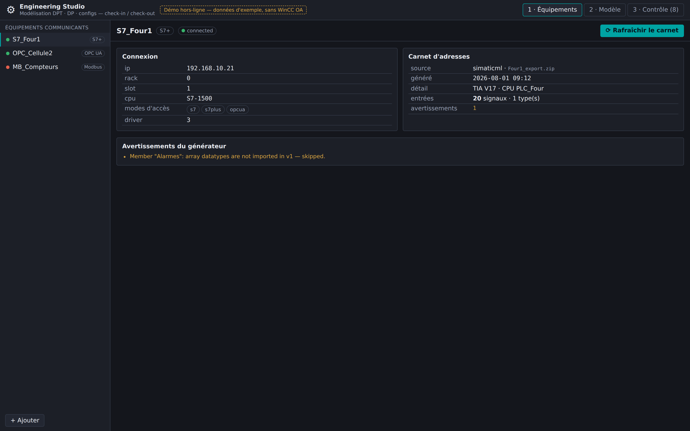
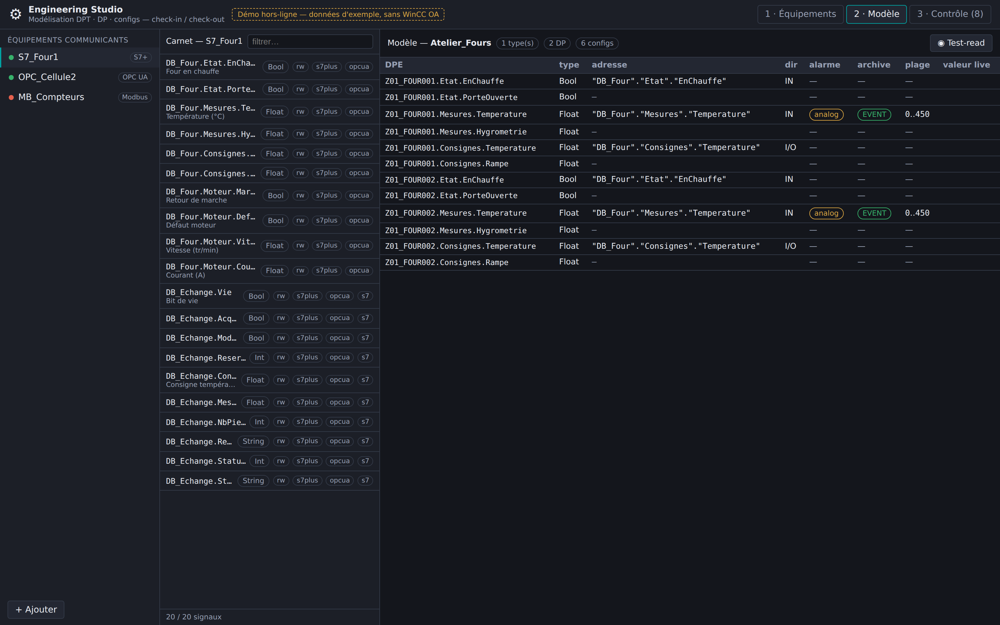
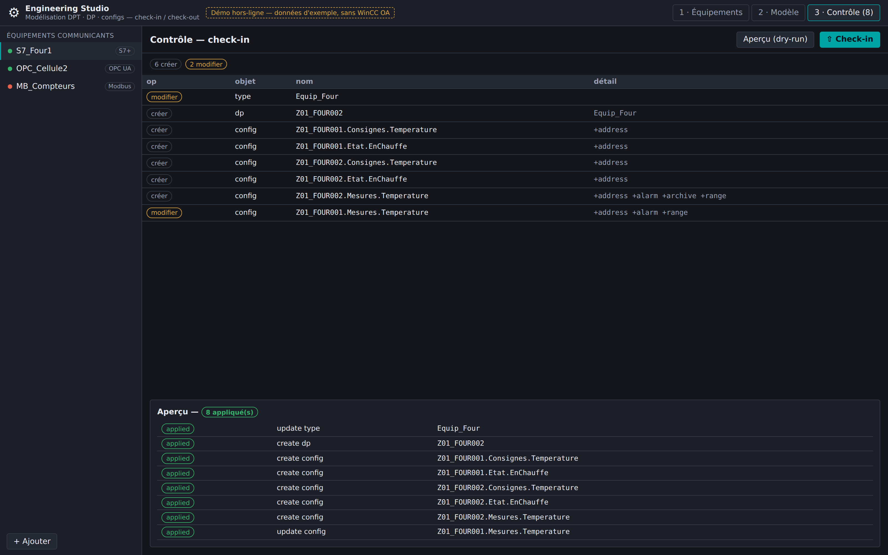

<!-- SPDX-FileCopyrightText: 2026 VISUEL CONCEPT -->
<!-- SPDX-License-Identifier: AGPL-3.0-only -->

# Engineering Studio (`wui-eng-studio`)

Standalone WinCC OA WebUI page (`/eng-studio`) to **model datapoint types, datapoints
and their configs** (peripheral address, alarm, archive, value range) from
**communicating equipment**, efficiently. It replaces the point-by-point,
attribute-by-attribute PARA workflow with a **device-first, check-in / check-out
studio**: you edit a *working copy* (types + DPs + configs) and **commit a diff** to
the live project — in bulk, previewed, transactional.

> **Status: v0.1 skeleton, workflow-complete on demo data.** The whole page runs
> end-to-end WITHOUT a WinCC OA runtime via an in-memory demo gateway (the source
> of the screenshots below). The pure engineering domain (`@visuelconcept/wui-eng-core`)
> is unit-tested (40 tests, no runtime). The backend (`/api/eng`) and the TIA
> Openness connector are deliberately staged for later increments (see
> [NOTES.md](./NOTES.md) and [INTEGRATION.md](./INTEGRATION.md)).

## Why (vs PARA)

PARA is *live + unitary + one attribute per write*, configs live only on the
*instance*, and the work is split across disjoint tabs. The Studio inverts this:

- **model → plan → apply**: edit a serializable workspace, preview the diff, apply
  atomically (one `dpSetWait` per config) — idempotent and reproducible;
- **address-book-first** (the iba idea): each device carries a persistent,
  refreshable **catalog** of addressable signals; you *pick* from it — datatype,
  transformation and address are resolved for you, never typed as magic numbers;
- **bulk by equipment**: one type + configs, declined over N datapoints;
- **generated names** following the VC referential `{Zone}_{Equipement}_{Signal}`.

## Workflow (3 panels)

### 1 · Equipements — devices + address books

The communicating equipment, declared once (protocol + connection), each with its
**address book** (generated from a browse, a **SimaticML/TIA Openness** export, a
CSV, or an AI proposal — and refreshable). The book is the persistent catalog the
rest of the studio consumes.



### 2 · Modèle — book browser + signal grid

Left, the **address-book browser** (filterable): each entry shows its WinCC OA leaf
type, access, and the **candidate address per access mode** — e.g. a *standard* S7
block exposes a classic operand (`s7`) **and** symbolic (`s7plus`/`opcua`), an
*optimized* block only symbolic. Right, the **signal grid**: the model's DPEs with
their address, direction, alarm, archive and range — the surface for mass editing
and a **test-read** of live values before any check-in.



### 3 · Contrôle — diff + check-in

The **diff** of the working copy against the live project: creates, updates and
(deliberate-only) deletes, each config change summarised at the family level
(`+address`, `~alarm`…), conflicts flagged when the live project drifted since
check-out. **Aperçu (dry-run)** previews the exact outcome; **Check-in** applies it
transactionally with a per-item report.



## Try the offline demo (no WinCC OA)

```bash
cd libs/wui-eng-studio/demo
npm install
npm run dev            # http://127.0.0.1:4310  (?panel=devices|model|control)
```

Regenerate the screenshots above (headless Chromium, no runtime):

```bash
node tools/screenshot-eng-studio.mjs      # → docs/images/eng-studio/*.png
```

## Run the unit tests (no WinCC OA)

```bash
cd libs/wui-eng-core
npm install
npm test          # 40 tests: SimaticML parse + S7 offsets, diff, apply, builders, naming
npm run typecheck
```

## Architecture

```
libs/wui-eng-core/        PURE domain (no WinCC OA import, unit-tested)
  model.ts                Device · AddressBook · Workspace · Plan (the IR)
  diff.ts                 check-in diff (create/update/delete, conflicts)
  apply.ts                plan applier over an injectable EngPort (the only runtime seam)
  configs/builders.ts     atomic config writes (_address/_alert_hdl/_archive/_pv_range)
  drivers/                address builders — opcua (verified), s7
  simaticml/              TIA Openness export parser + standard-block offset computation
  naming.ts               {Zone}_{Equipement}_{Signal}
libs/wui-eng-studio/      the page (lit only; no @wincc-oa/* → renders standalone)
  src/eng-studio.ts       the 3-panel studio
  src/eng-studio/data/    EngGateway: HttpEngGateway (/api/eng) | DemoEngGateway (offline)
  demo/                   standalone demo harness (docs + screenshots)
backend/routes/           engController.ts + engRoute.ts  (thin runtime seam, fail-closed)
```

See [INTEGRATION.md](./INTEGRATION.md) for deployment/roles and the **inputs still
needed** (real SimaticML exports), and [NOTES.md](./NOTES.md) for design decisions,
the decoupling contract and what is verified vs pending.
