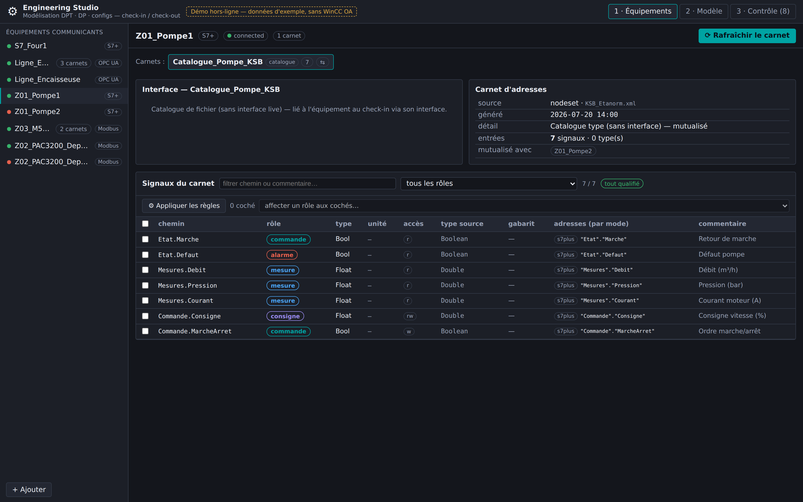
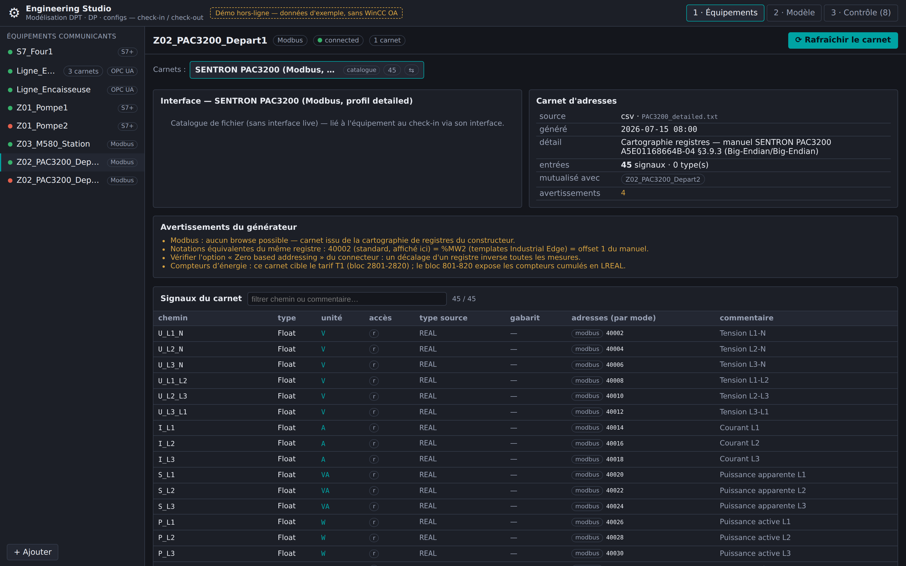
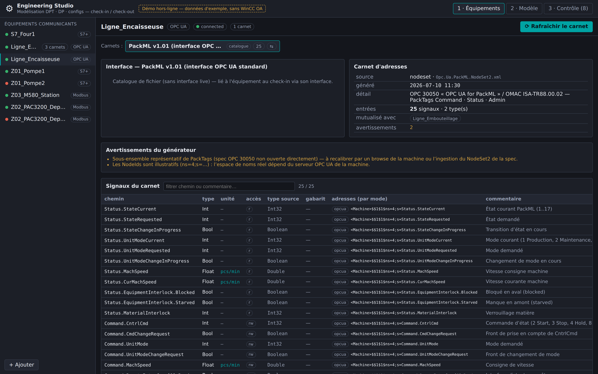
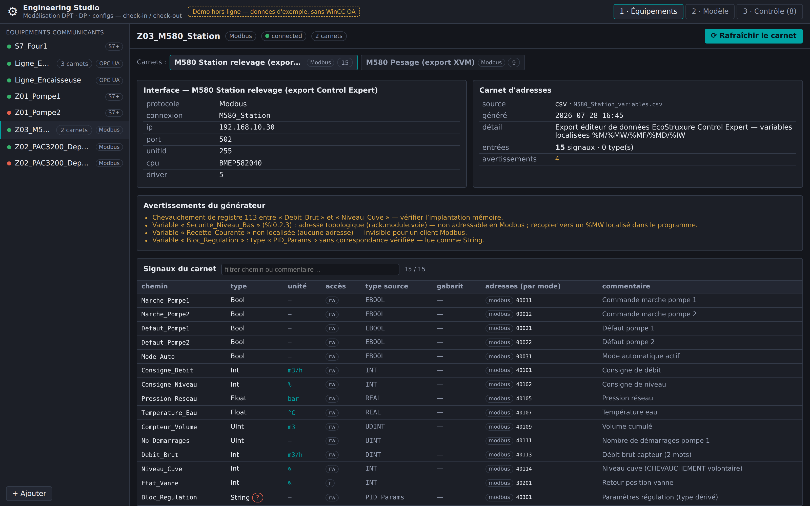
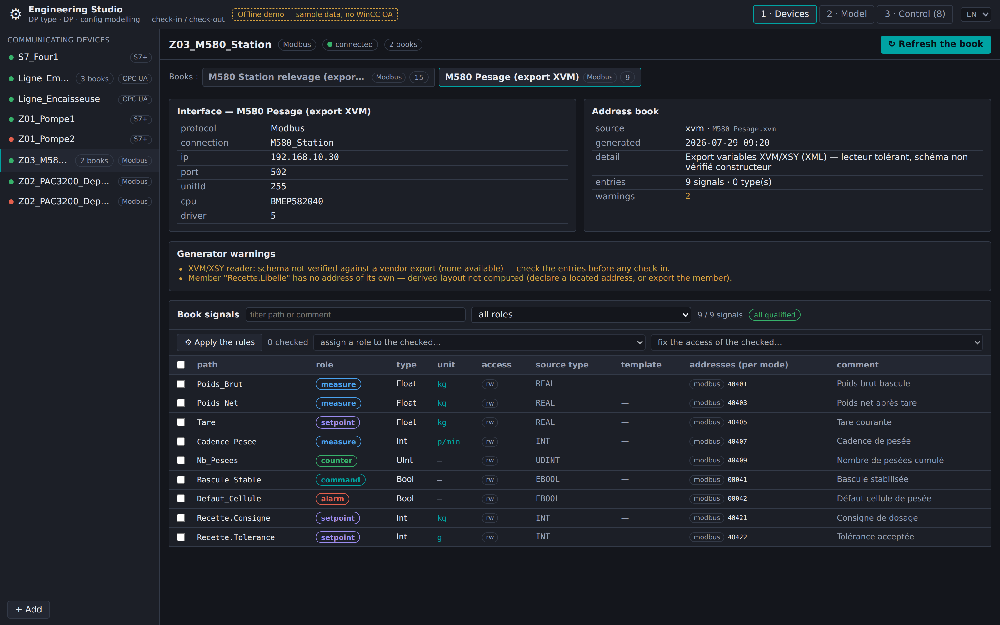
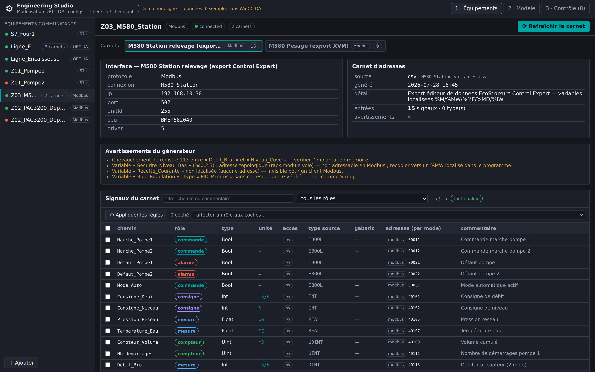
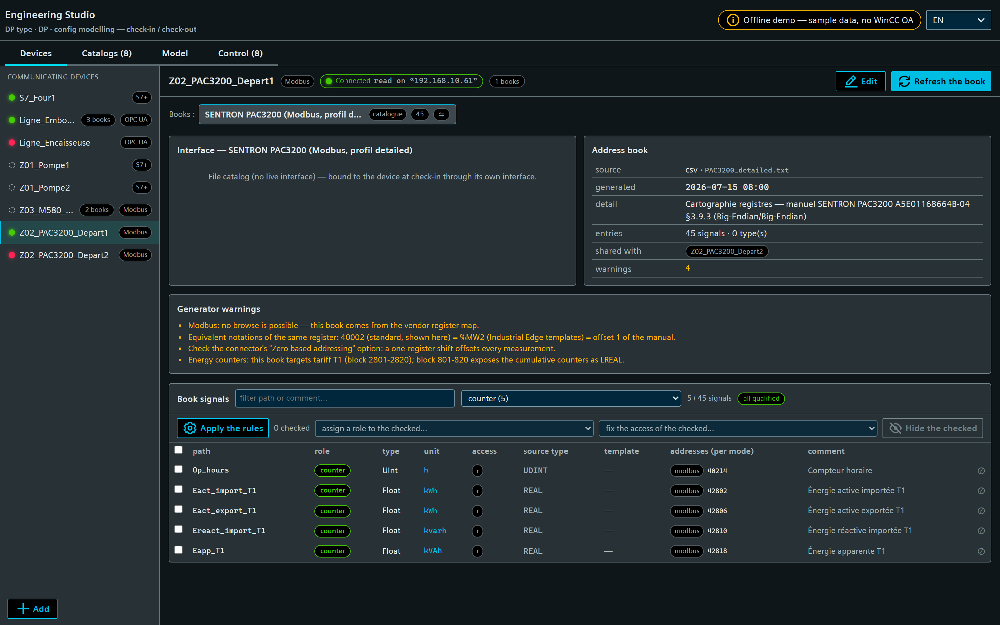
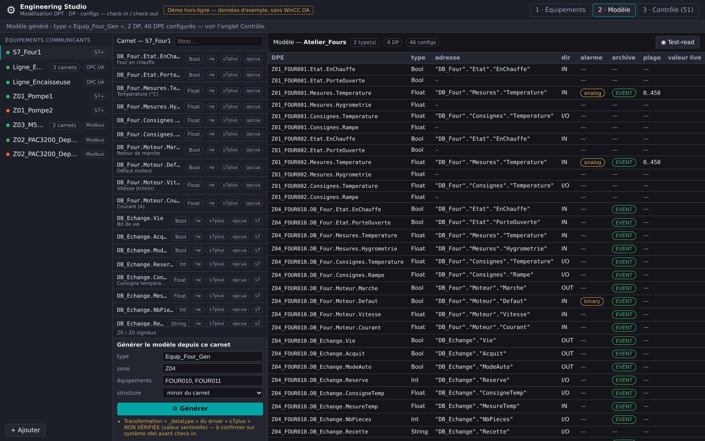
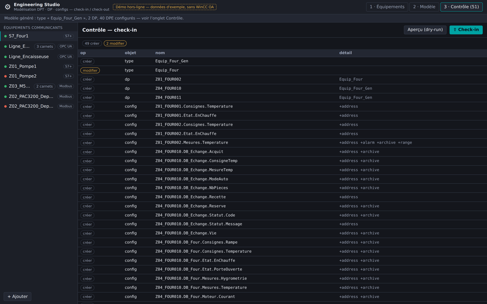

<!-- SPDX-FileCopyrightText: 2026 VISUEL CONCEPT -->
<!-- SPDX-License-Identifier: AGPL-3.0-only -->

# Engineering Studio (`wui-eng-studio`)

Standalone WinCC OA WebUI page (`/eng-studio`) to **model datapoint types, datapoints
and their configs** (peripheral address, alarm, archive, value range) from
**communicating equipment**, efficiently. It replaces the point-by-point,
attribute-by-attribute PARA workflow with a **device-first, check-in / check-out
studio**: you edit a *working copy* (types + DPs + configs) and **commit a diff** to
the live project — in bulk, previewed, transactional.

> **Status: v0.2 — workflow-complete on demo data, backend implemented.** The whole
> page runs end-to-end WITHOUT a WinCC OA runtime via an in-memory demo gateway (the
> source of the screenshots below). The pure engineering domain
> (`@visuelconcept/wui-eng-core`) is unit-tested (140 tests, no runtime) and the
> backend (`/api/eng`: file store, config read-back, check-out/plan/check-in,
> fail-closed role gating) typechecks offline against those same sources. Still
> staged: the **watched-folder ingestion**, re-**browsing** an online book, the
> device form, and the **TIA Openness connector** — see
> [NOTES.md](./NOTES.md) "Staged for later" and [INTEGRATION.md](./INTEGRATION.md).

## Why (vs PARA)

PARA is *live + unitary + one attribute per write*, configs live only on the
*instance*, and the work is split across disjoint tabs. The Studio inverts this:

- **model → plan → apply**: edit a serializable workspace, preview the diff, apply
  atomically (one `dpSetWait` per config) — idempotent and reproducible;
- **address-book-first** (the iba idea): each device carries a persistent,
  refreshable **catalog** of addressable signals; you *pick* from it — datatype,
  transformation and address are resolved for you, never typed as magic numbers;
- **bulk by equipment**: one type + configs, declined over N datapoints;
- **generated names** following the VC referential `{Zone}_{Equipement}_{Signal}`.

## Workflow (3 panels)

### 1 · Equipements — devices + address books

The communicating equipment, declared once (protocol + connection), each with its
**address book** (generated from a browse, a **SimaticML/TIA Openness** export, a
CSV, or an AI proposal — and refreshable). The book is the persistent catalog the
rest of the studio consumes.


**Books are first-class and the device↔book relation is many-to-many**, both
directions supported:

- **Aggregation** — one equipment groups **several interfaces**, each seen as an
  address book (e.g. a bottling line with a filler + a labeller OPC UA server):

  

- **Mutualisation** — one **catalog book is shared** across equipments (e.g. two
  identical pumps reuse a `Catalogue_Pompe_KSB` file catalog; a catalog has no
  live interface of its own and is bound to each equipment at check-in):

  

#### Two real-world catalogs in the demo

**SENTRON PAC3200 (Siemens) — Modbus register map.** Modbus has no browse, so the
book *is* the vendor register map: a **device-type catalog** mutualised across
every meter. Offsets come from the PAC3200 manual `A5E01168664B-04` §3.9.3 (via
the VC fiche `templates-import-tags-modbus-pac3200`): offset 1 → `40002` / `%MW2`,
`REAL`/`LREAL`/`UDINT`, Big-Endian/Big-Endian, T1 energy counters at 2801+. Units
(V, A, W, var, kWh…) ride along for the DPE unit config.



**PackML (OMAC / ISA-TR88.00.02) — standard OPC UA interface.** The archetype of a
mutualised book: one catalog describes the `Command` / `Status` / `Admin` PackTags
of *every* PackML-compliant machine, bound to each machine's own OPC UA server at
check-in. Here the bottling line and the case packer share it.



**Schneider Modicon M580 — from a Control Expert variables export.** A *project*
book (it carries the PLC's own Modbus interface, unlike the PAC3200 template).
The generator turns located variables into Modbus references — `%MW100` → `40101`,
`%MF104` → `40105`, `%M10` → coil `00011`, `%IW200` → input register `30201`
(read-only) — and runs the checks that make a Modbus book trustworthy: register
**overlaps**, **unlocated** variables (invisible to any Modbus client),
**topological** addresses (`%I0.2.3`, not Modbus-addressable) and unmapped derived
types. All four are surfaced as book warnings:



> **Why an export and not the "extended Modbus"?** Schneider's symbolic access
> rides on **UMAS**, the vendor extension of Modbus on reserved function code
> **90 (0x5A)** used by Control Expert. It is undocumented by Schneider (publicly
> described only through reverse engineering, with published vulnerabilities), so
> the studio's default path is the offline variables export — same symbols, no
> proprietary traffic on the OT network. See [NOTES.md](./NOTES.md).

Two Schneider generators are available, and one equipment can hold both books —
here a CSV export of the pumping station plus an **XVM/XSY (XML)** export of its
weighing section. The XVM reader flattens structured variables to their members
(`Recette.Consigne` → `40421`), picks units from Unity-style
`<attribute name="unit" …/>` children, and states up front that the **XVM schema
is not vendor-verified**:



#### Qualifying the signals (roles) — what makes the rest automatic

A book says *what to read*; a **role** says *what it is for*. Roles are inferred by
a rule engine and drive both the model and the configs at check-in
(archive / alarm / range / direction). Eight roles: **mesure, consigne, commande,
état, alarme, compteur, paramètre**, and **à qualifier** — nothing ever takes a
silent default.

Three rule layers, most specific wins, and the matching rule is always shown as
the chip's tooltip:

1. **structural** — datatype + access + unit (a read-only `Float` in `bar` is a
   measure; a writable `Bool` is a command). Zero configuration, works on any
   source;
2. **source path** — `Command.*` / `Status.*` / `Admin.*` (PackML),
   `Mesures.*` / `Consignes.*` / `Etat.*` (S7 & catalog books);
3. **name & convention** — the VC referential prefixes (`AI_`, `AO_`, `DI_`,
   `DO_`, `CALC_`) plus business patterns (`*_Defaut` → alarme, `Marche*` →
   commande, `Compteur*`/`Nb_*` → compteur…).

Rules are **data** (serialisable, project-overridable), a **manual role always
wins**, and the whole set is re-runnable (*Appliquer les règles*) without losing
overrides. On the demo books this qualifies **100 % of the signals with no
configuration**: below, the M580 book — `Defaut_*` → alarme, `Marche_*` →
commande, `Consigne_*` → consigne, and `Pression_Reseau` → mesure *despite being
writable* (a quantity name outranks the structural rule, but not the
`Consignes.` branch):



Bulk assignment is the escape hatch: filter (text or role), tick, assign one role
to every checked row. And the subtle cases work — on the PAC3200, the **4 energy
counters carry no "counter" keyword at all**; their unit (`kWh`, `kvarh`, `kVAh`)
qualifies them, while `m³` or `h` stay measures because those units are ambiguous:



### 2 · Modèle — book browser + signal grid

Left, the **address-book browser** (filterable): each entry shows its WinCC OA leaf
type, access, and the **candidate address per access mode** — e.g. a *standard* S7
block exposes a classic operand (`s7`) **and** symbolic (`s7plus`/`opcua`), an
*optimized* block only symbolic. Right, the **signal grid**: the model's DPEs with
their address, direction, alarm, archive and range — the surface for mass editing
and a **test-read** of live values before any check-in.


#### Generating the model from the roles — the loop closes here

With the signals qualified, the Model panel generates everything: give a **type
name**, a **zone** and the **equipment list**, and the studio derives

- the **DPType structure** from the entries' dotted paths (nested `Struct`s, names
  sanitised, the fully-shared prefix stripped),
- **one datapoint per equipment**, named `{Zone}_{Equipement}`, with the source
  comments as DPE descriptions,
- and **every config from the role**: address (reference resolved for the device's
  access mode) + direction, archiving, binary alert on the alarms, range when the
  project profile states real bounds.



It refuses to invent, and says so: an unqualified signal gets its DPE but **no
config**; a template catalog with no bound connection yields no address; and an
unverified driver transformation (S7, Modbus `_datatype`) is flagged rather than
passed off as a value — visible under the form above.

The result lands in the workspace, so the **check-in diff is immediately there**
(49 creates / 2 updates here), each config item detailing what it writes:



### 3 · Contrôle — diff + check-in

The **diff** of the working copy against the live project: creates, updates and
(deliberate-only) deletes, each config change summarised at the family level
(`+address`, `~alarm`…), conflicts flagged when the live project drifted since
check-out. **Aperçu (dry-run)** previews the exact outcome; **Check-in** applies it
transactionally with a per-item report.


## Try the offline demo (no WinCC OA)

```bash
cd libs/wui-eng-studio/demo
npm install
npm run dev            # http://127.0.0.1:4310  (?panel=devices|model|control)
```

Regenerate the screenshots above (headless Chromium, no runtime):

```bash
node tools/screenshot-eng-studio.mjs      # → docs/images/eng-studio/*.png
```

## Run the unit tests (no WinCC OA)

```bash
cd libs/wui-eng-core
npm install
npm test          # 140 tests: SimaticML parse + S7 offsets, Schneider CSV/XVM, roles,
                  # modelgen, diff + live scope, apply, config write builders + read-back
npm run typecheck

# and the backend routes, against the REAL core sources (webserver packages stubbed):
./node_modules/.bin/tsc -p ../../backend/tsconfig.typecheck.json
```

## Architecture

```
libs/wui-eng-core/        PURE domain (no WinCC OA import, unit-tested)
  model.ts                Device · AddressBook · Workspace · Plan (the IR)
  diff.ts                 check-in diff (create/update/delete, conflicts) + liveScopeOf
  apply.ts                plan applier over an injectable EngPort (the only runtime seam)
  configs/builders.ts     atomic config writes (_address/_alert_hdl/_archive/_pv_range)
  configs/read.ts         the read-back: raw dpGet → DpeConfigs, written-vs-provenance
  roles/                  rule engine (structural < path < name) + neutral profiles
  modelgen.ts             book + roles → type, DPs and configs (the generation)
  drivers/                address builders — opcua (verified), s7, modbus
  simaticml/              TIA Openness export parser + standard-block offset computation
  schneider/              Control Expert CSV + XVM readers, Modbus address mapping
  naming.ts               {Zone}_{Equipement}_{Signal}
libs/wui-eng-studio/      the page (lit only; no @wincc-oa/* → renders standalone)
  src/eng-studio.ts       the 3-panel studio
  src/eng-studio/data/    EngGateway: HttpEngGateway (/api/eng) | DemoEngGateway (offline)
  demo/                   standalone demo harness (docs + screenshots)
backend/routes/           thin runtime seam, fail-closed
  engRoute.ts             the endpoint table + role gating
  engController.ts        EngPort over WsjServerGlobal.winccoa, read-back, handlers
  engStore.ts             JSON file store (devices · books · roles · workspaces)
backend/tsconfig.typecheck.json   typecheck the routes offline (stubbed webserver pkgs)
```

See [INTEGRATION.md](./INTEGRATION.md) for deployment/roles and the **inputs still
needed** (real SimaticML exports), and [NOTES.md](./NOTES.md) for design decisions,
the decoupling contract and what is verified vs pending.
