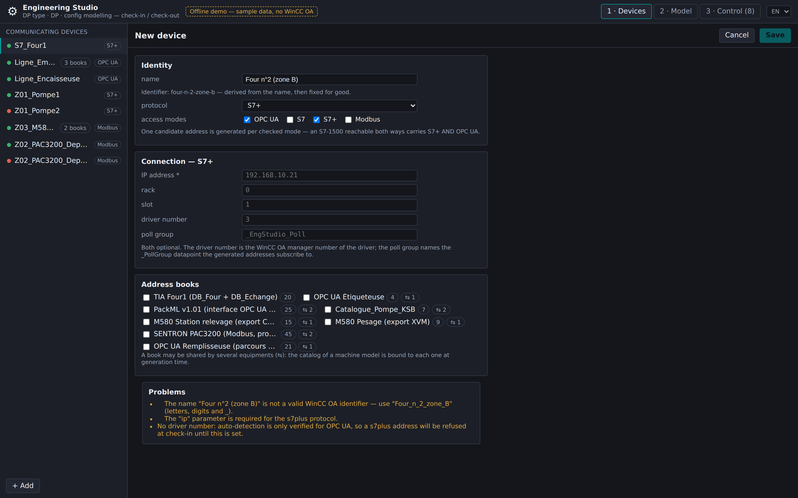
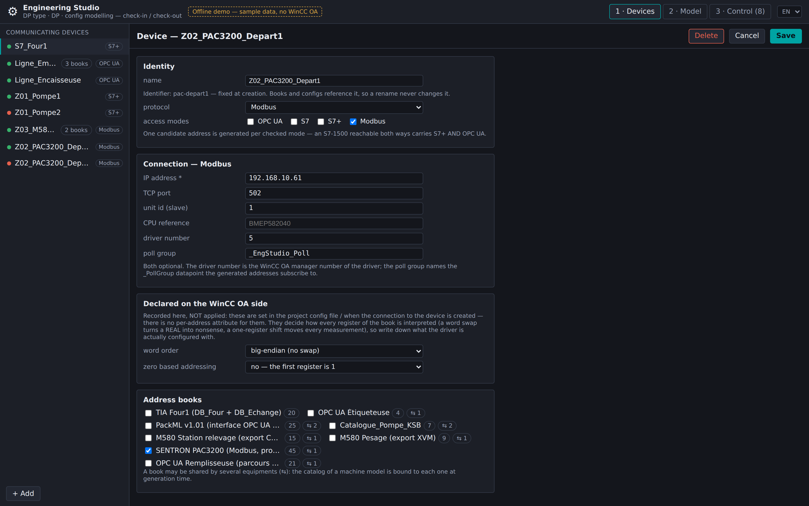
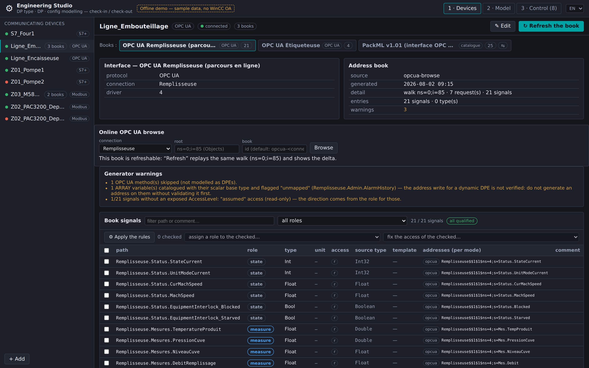
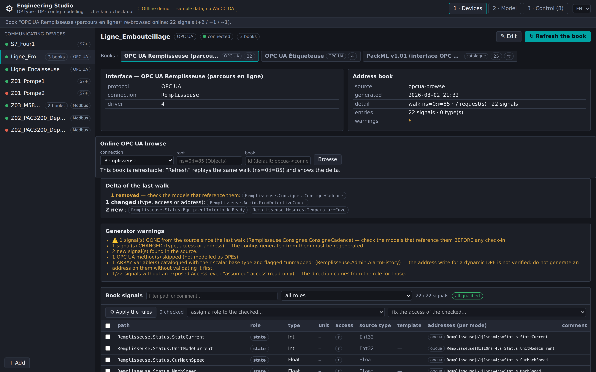
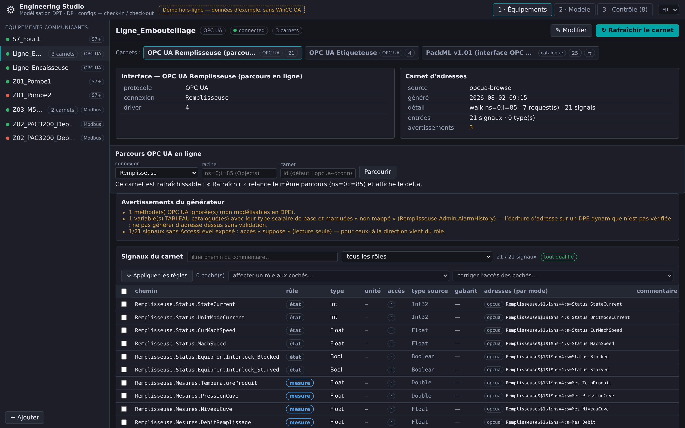
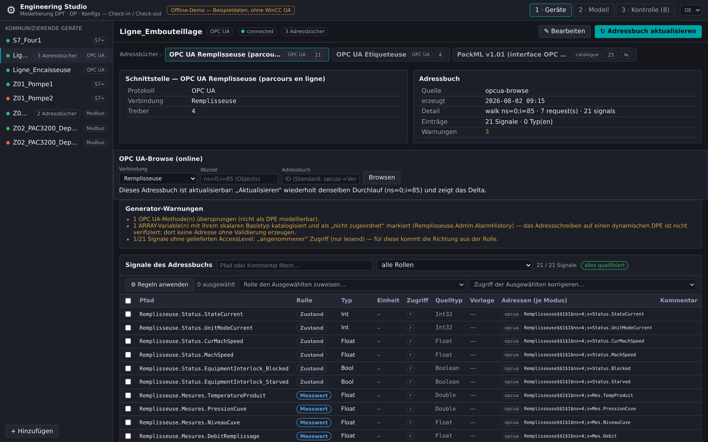

<!-- SPDX-FileCopyrightText: 2026 VISUEL CONCEPT -->
<!-- SPDX-License-Identifier: AGPL-3.0-only -->

# Engineering Studio (`wui-eng-studio`)

Standalone WinCC OA WebUI page (`/eng-studio`) to **model datapoint types, datapoints
and their configs** (peripheral address, alarm, archive, value range) from
**communicating equipment**, efficiently. It replaces the point-by-point,
attribute-by-attribute PARA workflow with a **device-first, check-in / check-out
studio**: you edit a *working copy* (types + DPs + configs) and **commit a diff** to
the live project — in bulk, previewed, transactional.

> **Status: v0.2 — workflow-complete on demo data, backend implemented.** The whole
> page runs end-to-end WITHOUT a WinCC OA runtime via an in-memory demo gateway (the
> source of the screenshots below). The pure engineering domain
> (`@visuelconcept/wui-eng-core`) is unit-tested (264 tests, no runtime) and the
> backend (`/api/eng`: file store, config read-back, check-out/plan/check-in,
> online OPC UA browse, fail-closed role gating) typechecks offline against those
> same sources. Still staged: the **watched-folder ingestion** and the
> **TIA Openness connector** — see [NOTES.md](./NOTES.md) "Staged for later" and
> [INTEGRATION.md](./INTEGRATION.md).

## Why (vs PARA)

PARA is *live + unitary + one attribute per write*, configs live only on the
*instance*, and the work is split across disjoint tabs. The Studio inverts this:

- **model → plan → apply**: edit a serializable workspace, preview the diff, apply
  atomically (one `dpSetWait` per config) — idempotent and reproducible;
- **address-book-first** (the iba idea): each device carries a persistent,
  refreshable **catalog** of addressable signals; you *pick* from it — datatype,
  transformation and address are resolved for you, never typed as magic numbers;
- **bulk by equipment**: one type + configs, declined over N datapoints;
- **generated names** following the VC referential `{Zone}_{Equipement}_{Signal}`.

## Workflow (3 panels)

### 1 · Equipements — devices + address books

The communicating equipment, declared once (protocol + connection), each with its
**address book** (generated from a browse, a **SimaticML/TIA Openness** export, a
CSV, or an AI proposal — and refreshable). The book is the persistent catalog the
rest of the studio consumes.


#### Declaring an equipment

"+ Add" opens the declaration form in place of the device detail — so an empty
project starts here. The **connection fields are rendered from the protocol's
specification** (the core's `PROTOCOL_PARAMS`), not hand-written per protocol:
switching the protocol swaps the fields and drops the parameters of the previous
one. Validation is the core's too, running as you type and again on the server,
which is what makes the two agree:

- the **name must be a valid WinCC OA identifier** — datapoint names are built from
  it (`{Zone}_{Equipement}_{Signal}`), so an invalid one would fail at check-in, far
  from its cause. The form proposes the sanitised spelling;
- the **id is derived once** from the name and then fixed for good: books and
  address configs reference a device by id, so a rename must never re-parent
  catalogs;
- a **missing driver number** outside OPC UA is reported as an *advisory* (it does
  not block the save) because auto-detection is only verified for OPC UA — see
  "Driver number" in [INTEGRATION.md](./INTEGRATION.md);
- **books are checked here**, with `⇆` showing the ones already shared with other
  equipments.



A separate card, **"declared on the WinCC OA side"**, holds the parameters the
studio only *records*: a Modbus **word order** and **zero-based addressing** are set
in the project `config` file / when the connection to the device is created — never
per address (the `_address` attribute set has no byte-order attribute at all). They
are worth writing down next to the equipment because they decide how every register
of its book is *interpreted*: a word swap turns a `REAL` into nonsense and a
one-register shift moves every measurement. Each is **three-state** — `big` /
`little` / *not stated* — because "we checked, it is not zero-based" and "nobody
said" are different claims.

Editing shows the same screen with the id pinned and the equipment's books checked.
Deleting asks twice, and only forgets the equipment: **its books are kept** (they may
be shared) and nothing already checked in is touched.



**Books are first-class and the device↔book relation is many-to-many**, both
directions supported:

- **Aggregation** — one equipment groups **several interfaces**, each seen as an
  address book (e.g. a bottling line with a filler + a labeller OPC UA server):

  

- **Mutualisation** — one **catalog book is shared** across equipments (e.g. two
  identical pumps reuse a `Catalogue_Pompe_KSB` file catalog; a catalog has no
  live interface of its own and is bound to each equipment at check-in):

  

#### Two real-world catalogs in the demo

**SENTRON PAC3200 (Siemens) — Modbus register map.** Modbus has no browse, so the
book *is* the vendor register map: a **device-type catalog** mutualised across
every meter. Offsets come from the PAC3200 manual `A5E01168664B-04` §3.9.3 (via
the VC fiche `templates-import-tags-modbus-pac3200`): offset 1 → `40002` / `%MW2`,
`REAL`/`LREAL`/`UDINT`, Big-Endian/Big-Endian, T1 energy counters at 2801+. Units
(V, A, W, var, kWh…) ride along for the DPE unit config.


**PackML (OMAC / ISA-TR88.00.02) — standard OPC UA interface.** The archetype of a
mutualised book: one catalog describes the `Command` / `Status` / `Admin` PackTags
of *every* PackML-compliant machine, bound to each machine's own OPC UA server at
check-in. Here the bottling line and the case packer share it.


#### Online OPC UA browse (and re-browse)

For an OPC UA equipment the book is generated by **walking the live server**: pick
the connection, optionally a sub-tree root, and the studio catalogues every
variable it finds — path, datatype (through the verified tag-importer mapping) and
peripheral-address reference. The walk is one level per request (a browse response
carries no parent link, so the walker recurses itself to know each node's path),
sequential per connection, and **bounded** — depth, signal count and request count
are all capped, and hitting a cap raises a warning naming what was left out.

`AccessLevel` is read when the driver exposes it (the `Browse.*` element is
discovered by introspecting the connection's DP type, never guessed) and the address
direction then follows the real access. When it is not exposed, signals are catalogued
read-only with an **`assumed`** access — the book says so, the chip shows `r?`, and
the direction comes from the signal's *role* instead; a bulk "fix the access" action
turns an assumed access into evidence. An **array** variable is catalogued with its
scalar base type and flagged `unmapped` rather than given an unverified dynamic-DPE
address.



The browse parameters are recorded in the book's provenance, so **"Rafraîchir"
replays the exact same walk** — and shows what moved. That delta is the point: a
machine's program drifts, and a signal that vanished from the server may still be
referenced by your model.



> The screenshots above are produced by the **real core walker** against the demo's
> in-memory fake server (`data/demo-opcua-server.ts`) — same code path as a live
> browse, no WinCC OA and no PLC involved.

#### OPC UA NodeSet2 (offline sibling of the browse)

A `UANodeSet` file — a companion specification (PackML/OPC 30050, Euromap), a
vendor model, or a server export — is ingested as a book **without touching the
machine**. It reads `AccessLevel` (which a browse cannot), folds custom supertypes
into their subtypes (WinCC OA has no DPType inheritance), and catalogues each
`UAObjectType` as a `BookType`.

A NodeSet's namespace **indices are file-local** and a live server almost always
assigns different ones, so its addresses are *candidates*: every one is emitted with
a `<Connection>` placeholder, the book carries no interface (it is a **template
catalog**, bound per equipment at generation), and the caveat is the book's first
warning. Verify against the server — or re-browse it online — before check-in.

**Schneider Modicon M580 — from a Control Expert variables export.** A *project*
book (it carries the PLC's own Modbus interface, unlike the PAC3200 template).
The generator turns located variables into Modbus references — `%MW100` → `40101`,
`%MF104` → `40105`, `%M10` → coil `00011`, `%IW200` → input register `30201`
(read-only) — and runs the checks that make a Modbus book trustworthy: register
**overlaps**, **unlocated** variables (invisible to any Modbus client),
**topological** addresses (`%I0.2.3`, not Modbus-addressable) and unmapped derived
types. All four are surfaced as book warnings:


> **Why an export and not the "extended Modbus"?** Schneider's symbolic access
> rides on **UMAS**, the vendor extension of Modbus on reserved function code
> **90 (0x5A)** used by Control Expert. It is undocumented by Schneider (publicly
> described only through reverse engineering, with published vulnerabilities), so
> the studio's default path is the offline variables export — same symbols, no
> proprietary traffic on the OT network. See [NOTES.md](./NOTES.md).

Two Schneider generators are available, and one equipment can hold both books —
here a CSV export of the pumping station plus an **XVM/XSY (XML)** export of its
weighing section. The XVM reader flattens structured variables to their members
(`Recette.Consigne` → `40421`), picks units from Unity-style
`<attribute name="unit" …/>` children, and states up front that the **XVM schema
is not vendor-verified**:


#### Qualifying the signals (roles) — what makes the rest automatic

A book says *what to read*; a **role** says *what it is for*. Roles are inferred by
a rule engine and drive both the model and the configs at check-in
(archive / alarm / range / direction). Eight roles: **mesure, consigne, commande,
état, alarme, compteur, paramètre**, and **à qualifier** — nothing ever takes a
silent default.

Three rule layers, most specific wins, and the matching rule is always shown as
the chip's tooltip:

1. **structural** — datatype + access + unit (a read-only `Float` in `bar` is a
   measure; a writable `Bool` is a command). Zero configuration, works on any
   source;
2. **source path** — `Command.*` / `Status.*` / `Admin.*` (PackML),
   `Mesures.*` / `Consignes.*` / `Etat.*` (S7 & catalog books);
3. **name & convention** — the VC referential prefixes (`AI_`, `AO_`, `DI_`,
   `DO_`, `CALC_`) plus business patterns (`*_Defaut` → alarme, `Marche*` →
   commande, `Compteur*`/`Nb_*` → compteur…).

Rules are **data** (serialisable, project-overridable), a **manual role always
wins**, and the whole set is re-runnable (*Appliquer les règles*) without losing
overrides. On the demo books this qualifies **100 % of the signals with no
configuration**: below, the M580 book — `Defaut_*` → alarme, `Marche_*` →
commande, `Consigne_*` → consigne, and `Pression_Reseau` → mesure *despite being
writable* (a quantity name outranks the structural rule, but not the
`Consignes.` branch):


Bulk assignment is the escape hatch: filter (text or role), tick, assign one role
to every checked row. And the subtle cases work — on the PAC3200, the **4 energy
counters carry no "counter" keyword at all**; their unit (`kWh`, `kvarh`, `kVAh`)
qualifies them, while `m³` or `h` stay measures because those units are ambiguous:


### 2 · Modèle — book browser + signal grid

Left, the **address-book browser** (filterable): each entry shows its WinCC OA leaf
type, access, and the **candidate address per access mode** — e.g. a *standard* S7
block exposes a classic operand (`s7`) **and** symbolic (`s7plus`/`opcua`), an
*optimized* block only symbolic. Right, the **signal grid**: the model's DPEs with
their address, direction, alarm, archive and range — the surface for mass editing
and a **test-read** of live values before any check-in.


#### Generating the model from the roles — the loop closes here

With the signals qualified, the Model panel generates everything: give a **type
name**, a **zone** and the **equipment list**, and the studio derives

- the **DPType structure** from the entries' dotted paths (nested `Struct`s, names
  sanitised, the fully-shared prefix stripped),
- **one datapoint per equipment**, named `{Zone}_{Equipement}`, with the source
  comments as DPE descriptions,
- and **every config from the role**: address (reference resolved for the device's
  access mode) + direction, archiving, binary alert on the alarms, range when the
  project profile states real bounds.


It refuses to invent, and says so: an unqualified signal gets its DPE but **no
config**; a template catalog with no bound connection yields no address; and a
source type the target driver has **no `_datatype` transformation** for gets **no
address at all** rather than a nearby-looking one (a classic S7 driver has no
64-bit float — reading an `LReal` as `FLOAT` would silently halve its precision).
All of it visible under the form above.

> The `_datatype` transformation constants of every driver used here (OPC UA
> 750–768, S7 700–722, S7Plus 1001–1027, Modbus 560–577) come from the WinCC OA
> `_address` appendix, recorded in
> [VENDOR-ADDRESS-TRANSFORMATIONS.md](./VENDOR-ADDRESS-TRANSFORMATIONS.md) and
> asserted code-by-code in the unit tests. **S7 and S7Plus are different drivers
> with disjoint tables** — the access mode, not the family, selects the code.

The result lands in the workspace, so the **check-in diff is immediately there**
(49 creates / 2 updates here), each config item detailing what it writes:


### 3 · Contrôle — diff + check-in

The **diff** of the working copy against the live project: creates, updates and
(deliberate-only) deletes, each config change summarised at the family level
(`+address`, `~alarm`…), conflicts flagged when the live project drifted since
check-out. **Aperçu (dry-run)** previews the exact outcome; **Check-in** applies it
transactionally with a per-item report.


## Try the offline demo (no WinCC OA)

```bash
cd libs/wui-eng-studio/demo
npm install
npm run dev            # http://127.0.0.1:4310  (?panel=devices|model|control)
```

Regenerate the screenshots above (headless Chromium, no runtime):

```bash
node tools/screenshot-eng-studio.mjs             # → docs/images/eng-studio/*.png (English)
node tools/screenshot-eng-studio.mjs --lang fr   # the same set in another language
```

## Languages (EN / FR / DE)

The page is localised in **English, French and German**. Every string it renders
comes from `src/eng-studio/i18n.ts`, a **self-contained** module: the rest of the
suite localises through `@wincc-oa/wui-i18n-shared`, but this page's contract is to
depend on `lit` only, so it ships its own `ml(en, fr, de)` table and resolver.

The language is resolved, first match wins: the element's `lang` attribute (what the
shell sets) → `?lang=` in the URL → `<html lang>` → `navigator.language` → English.
WinCC OA locale identifiers (`en_US.utf8`, `de_AT.utf8`…) are accepted alongside
plain BCP-47 tags. A picker in the top bar switches it live.

| | |
|---|---|
|  |  |

> The screenshots in this document are the **English** UI. The engineering core's
> diagnostics are localised too: it emits a stable `code` + an English template +
> params (`EngWarning`), and the page re-templates each code in FR/DE — so the
> generator warnings above read in the operator's language, while tests and logs keep
> one stable English meaning. An untranslated code falls back to its English message
> rather than disappearing. See [NOTES.md](./NOTES.md) "Localisation: structured
> warnings".

## Run the unit tests (no WinCC OA)

```bash
cd libs/wui-eng-core
npm install
npm test          # 264 tests: SimaticML parse + S7 offsets, Schneider CSV/XVM, OPC UA
                  # browse walk + NodeSet2, roles, modelgen (mirror + mapping),
                  # structure outline + auto-binding, diff + live scope, apply,
                  # config write builders + read-back, structured warnings,
                  # device declaration (id slug, per-protocol params, normalisation),
                  # S7 / S7Plus / Modbus _datatype transformations (code by code)
npm run typecheck

# and the backend routes, against the REAL core sources (webserver packages stubbed):
./node_modules/.bin/tsc -p ../../backend/tsconfig.typecheck.json
```

The translation tables have their own verification (no test runner needed — it
bundles the real modules with esbuild): every entry present in EN/FR/DE, the same
`{placeholders}` in all three, **every core warning code translated** (and no
translation matching a code nobody emits), **every connection parameter of the
device form labelled**, and the WinCC OA locale identifiers resolving:

```bash
node tools/check-eng-i18n.mjs
```

## Architecture

```
libs/wui-eng-core/        PURE domain (no WinCC OA import, unit-tested)
  model.ts                Device · AddressBook · Workspace · Plan (the IR)
  diff.ts                 check-in diff (create/update/delete, conflicts) + liveScopeOf
  apply.ts                plan applier over an injectable EngPort (the only runtime seam)
  configs/builders.ts     atomic config writes (_address/_alert_hdl/_archive/_pv_range)
  configs/read.ts         the read-back: raw dpGet → DpeConfigs, written-vs-provenance
  warnings.ts             EngWarning: stable code + English template + params (i18n)
  devices.ts              device declaration: per-protocol params, validation, normalisation
  structure.ts            authored type outline + auto-binding to the book's signals
  roles/                  rule engine (structural < path < name) + neutral profiles
  modelgen.ts             book + roles → type, DPs and configs (the generation)
  drivers/                address builders — opcua (verified), s7, modbus
  opcua/browse.ts         online browse WALK over an injectable OpcUaBrowsePort
  opcua/nodeset.ts        NodeSet2 (UANodeSet) reader → template catalog
  simaticml/              TIA Openness export parser + standard-block offset computation
  schneider/              Control Expert CSV + XVM readers, Modbus address mapping
  naming.ts               {Zone}_{Equipement}_{Signal}
libs/wui-eng-studio/      the page (lit only; no @wincc-oa/* → renders standalone)
  src/eng-studio.ts       the 3-panel studio
  src/eng-studio/data/    EngGateway: HttpEngGateway (/api/eng) | DemoEngGateway (offline)
                          + demo-opcua-server.ts: a FAKE OPC UA server (drifts, for the delta)
  demo/                   standalone demo harness (docs + screenshots)
backend/routes/           thin runtime seam, fail-closed
  engRoute.ts             the endpoint table + role gating
  engController.ts        EngPort over WsjServerGlobal.winccoa, read-back, handlers
  engStore.ts             JSON file store (devices · books · roles · workspaces)
  engOpcuaBrowse.ts       one browse level over _<conn>.Browse.GetBranch (ported, queued)
backend/tsconfig.typecheck.json   typecheck the routes offline (stubbed webserver pkgs)
```

See [INTEGRATION.md](./INTEGRATION.md) for deployment/roles and the **inputs still
needed** (real SimaticML exports), and [NOTES.md](./NOTES.md) for design decisions,
the decoupling contract and what is verified vs pending.
