<!-- SPDX-FileCopyrightText: 2026 VISUEL CONCEPT -->
<!-- SPDX-License-Identifier: AGPL-3.0-only -->

# Engineering Studio (`wui-eng-studio`)

Standalone WinCC OA WebUI page (`/eng-studio`) to **model datapoint types, datapoints
and their configs** (peripheral address, alarm, archive, value range) from
**communicating equipment**, efficiently. It replaces the point-by-point,
attribute-by-attribute PARA workflow with a **device-first, check-in / check-out
studio**: you edit a *working copy* (types + DPs + configs) and **commit a diff** to
the live project — in bulk, previewed, transactional.

> **Status: v0.2 — workflow-complete on demo data, backend implemented.** The whole
> page runs end-to-end WITHOUT a WinCC OA runtime via an in-memory demo gateway (the
> source of the screenshots below). The pure engineering domain
> (`@visuelconcept-winccoa/wui-eng-core`) is unit-tested (no runtime) and the
> backend (`/api/eng`: file store, config read-back, check-out/plan/check-in,
> online OPC UA browse, **online S7+ symbolic browse** through its own
> `s7plusBrowse` manager, fail-closed role gating) typechecks offline against those
> same sources. Still staged: the **watched-folder ingestion** and the
> **TIA Openness connector** — see [NOTES.md](./NOTES.md) "Staged for later" and
> [INTEGRATION.md](./INTEGRATION.md).

## Why (vs PARA)

PARA is *live + unitary + one attribute per write*, configs live only on the
*instance*, and the work is split across disjoint tabs. The Studio inverts this:

- **model → plan → apply**: edit a serializable workspace, preview the diff, apply
  atomically (one `dpSetWait` per config) — idempotent and reproducible;
- **address-book-first** (the iba idea): each device carries a persistent,
  refreshable **catalog** of addressable signals; you *pick* from it — datatype,
  transformation and address are resolved for you, never typed as magic numbers;
- **bulk by equipment**: one type + configs, declined over N datapoints;
- **generated names** following the VC referential (`{Equipement}_{Signal}` —
  the core still accepts an optional zone prefix for callers that want one).

## Look & feel — Siemens iX

The page renders with the **Siemens iX design system**, like every other page of the
suite: `IXCoreStyles` inlined into its shadow roots, and the shell's own
`wui-content-header`, `ix-tabs`, `ix-button`, `ix-input`, `ix-select`,
`ix-message-bar` and `ix-chip`. Colours, spacing and typography come from the iX
`--theme-*` tokens — the page states no colour of its own, so it follows the shell's
theme (light/dark) without a second definition of "primary".

Two deliberate exceptions, both inside the **dense grids**: the signal table and the
diff draw one row per DPE — thousands on a real project, each with two to four status
pills. That is tens of thousands of Stencil components on the page whose whole point
is bulk editing, so those pills and tables are iX-shaped CSS (the geometry is read
from iX's own `pill.css`) rather than `ix-chip` / `ix-table`. iX components are used
everywhere the count is bounded: chrome, forms, actions, cards, messages.

The offline demo registers the iX elements, icons and theme itself
(`demo/ix-bootstrap.ts`) — the part the app shell normally provides — so the page
still runs and is screenshotted with **no WinCC OA runtime**.

## Workflow (4 panels)

### 1 · Equipements — devices + address books

The communicating equipment, declared once (protocol + connection). The device
screen is about the **equipment itself**: its connection state, the **model
datapoints** bound to it, and **links to the catalogs it reads** — the book work
(signal table, qualification, browse, refresh) lives in the **Catalogues** panel,
one click away. It used to be embedded here too; showing the same table and browse
form in two screens cost width and let the two drift, so the device side was
reduced to what only it can say.

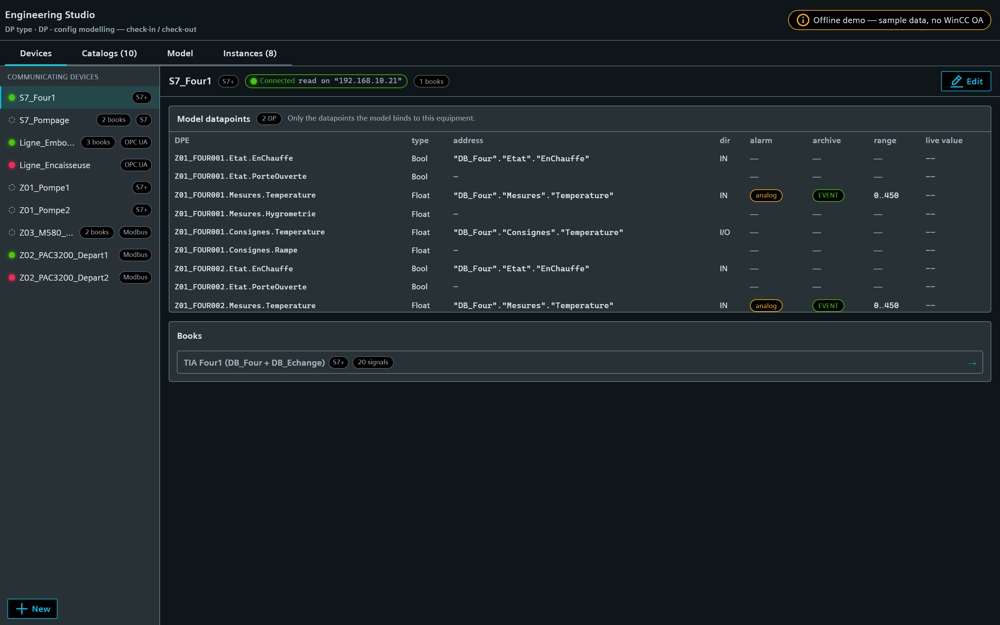

#### The equipment's own model datapoints

The detail opens with **"Datapoints du modèle"** — the workspace datapoints the
model binds to *this* equipment, and only those (the Model panel's grid shows the
whole workspace; this is the per-machine cut). The link is exact, not a name
heuristic: every generated address records its target equipment
(`AddressConfig.deviceId`), and a datapoint is listed whole as soon as one of its
DPEs is bound here — its config-less leaves are information too. The card stays
compact (it scrolls within its own frame); an equipment the model binds nothing to
says so and points at the Model panel.

#### The catalogs, as links

Below the datapoints, one **link per catalog** the equipment references — name,
protocol (or `catalogue` for a file template), signal count, and `⇆` when the book
is shared with other equipments. Clicking a link opens the **Catalogues panel on
that book**, where the signal table, the qualification, the browse and the refresh
all live. Aggregation and mutualisation read directly off this card: several links
on one equipment, or one shared book linked from several.

#### Declaring an equipment

"+ Add" opens the declaration form in place of the device detail — so an empty
project starts here. The **connection fields are rendered from the protocol's
specification** (the core's `PROTOCOL_PARAMS`), not hand-written per protocol:
switching the protocol swaps the fields and drops the parameters of the previous
one. Validation is the core's too, running as you type and again on the server,
which is what makes the two agree:

- the **name must be a valid WinCC OA identifier** — datapoint names are built from
  it (`{Equipement}_{Signal}`), so an invalid one would fail at check-in, far
  from its cause. The form proposes the sanitised spelling;
- the **id is derived once** from the name and then fixed for good: books and
  address configs reference a device by id, so a rename must never re-parent
  catalogs;
- the **OPC UA server is picked from the project's own connections**
  (`GET /api/eng/connections`), not typed from memory. That name is what every
  `_address.._reference` of the equipment carries and what its connection state is read
  on, so a name that exists nowhere costs both: no state, and addresses that do not bind.
  A name the list does not carry is **a request for a new connection**: the form says
  so (with the project's actual connection names beside it), and **saving the
  equipment creates the `_OPCUAServer` datapoint** — `ConnInfo` from the declared
  endpoint, no security, registered with the equipment's OPC UA driver (its
  `driverNumber`, else the first running one; no driver yet downgrades to a warning,
  never to a refused save). Same degradations as the driver picker: `editable`, a
  stored value kept as its own option, and a plain text field when the list is empty;
- the **driver is picked from the project's own drivers** (`GET /api/eng/drivers`:
  every `_Driver<n>` with its `DT` and whether it runs), not typed from memory. It
  matters because `driverNumber` is the manager number every `_address` write of the
  equipment lands on: a wrong one binds the datapoint to another driver, silently.
  Stopped drivers are offered too — an equipment is normally declared before its
  driver is started — and the state is shown rather than hidden. The list is
  **filtered to the drivers that can serve the declared protocol**, and the
  **simulation driver (`DT = SIM`) is never offered** whatever the protocol: the
  vendor's own library treats it as matching every driver type, so it would pass any
  filter, and an address bound to the simulator reads invented values that look
  perfectly plausible. Filtering excludes on PROOF rather than including on a guess —
  only `OPCUAC` (OPC UA) and `S7PLUS` are verified `DT` values, so for the classic S7
  and Modbus drivers (whose `DT` string could not be verified) the picker drops the
  drivers proven to belong to another protocol and keeps everything else, and a driver
  whose type could not be read at all stays offerable. Three cases the picker keeps
  working: an empty list (no runtime, no permission) degrades to a plain number field
  so a declaration is never blocked by a diagnosis the page could not make; a stored
  value the list does not carry is offered as its own option, so editing never
  silently drops it; and the select is `editable`, so a number the list lacks can
  still be typed. When the project HAS drivers but none fits the protocol, the hint
  says exactly that instead of "no driver listed" — which would send an operator
  looking for a driver that is right there. A driver whose type contradicts the
  protocol is still an *advisory* on top, for the cases the filter cannot prove. A **missing driver number** outside OPC UA stays an advisory too,
  because auto-detection at check-in is only verified for OPC UA — see "Driver
  number" in [INTEGRATION.md](./INTEGRATION.md);
- **books are checked here**, with `⇆` showing the ones already shared with other
  equipments.

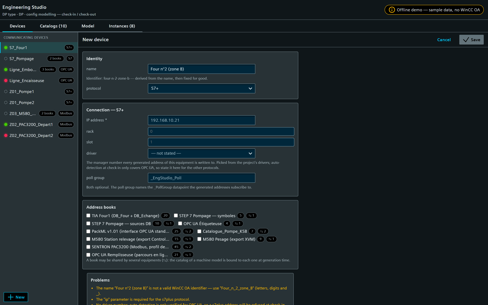

For an OPC UA equipment the form carries an **"OPC UA security"** card — the
standard connection panel's own settings, written to the **live** connection at
save time: user (empty = anonymous), **password** (encrypted by WinCC OA with the
project's driver certificate through the vendor's own library, **never stored by
the studio** — the field is always blank and a live indicator says whether the
connection carries one), security policy and message mode (validated as a pair,
like the panel forces), client certificate, and the **certificate checks to
relax** (`Config.Flags` bits — accept invalid/expired certificates, ignore
revocation, hostname, ApplicationUri, basic constraints, and "allow unsecured
servers" with the vendor's own caution). Fields left empty do not touch the
connection, so a connection also managed through the standard panel never gets
silently reset. The full analysis — verified against the installed 3.21 panel
library — is in [OPCUA-CONNECTION-SECURITY.md](./OPCUA-CONNECTION-SECURITY.md).

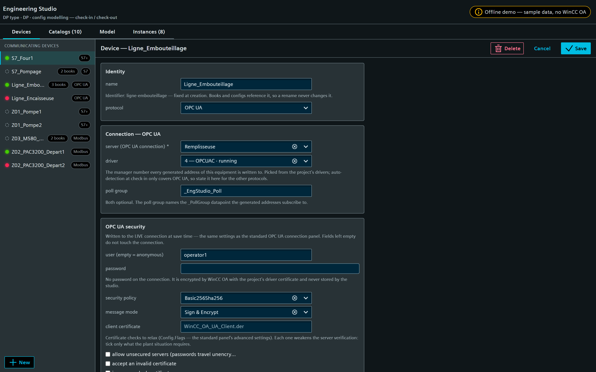

A separate card, **"declared on the WinCC OA side"**, holds the parameters the
studio only *records*: a Modbus **word order** and **zero-based addressing** are set
in the project `config` file / when the connection to the device is created — never
per address (the `_address` attribute set has no byte-order attribute at all). They
are worth writing down next to the equipment because they decide how every register
of its book is *interpreted*: a word swap turns a `REAL` into nonsense and a
one-register shift moves every measurement. Each is **three-state** — `big` /
`little` / *not stated* — because "we checked, it is not zero-based" and "nobody
said" are different claims.

Editing shows the same screen with the id pinned and the equipment's books checked.
Deleting asks twice, and only forgets the equipment: **its books are kept** (they may
be shared) and nothing already checked in is touched.

#### Connection state — a coloured LED and a word

Each equipment shows whether it is **communicating**: a LED in the rail, and a badge in
the panel head spelling out `Connecté` / `Déconnecté` / `État inconnu` with the
connection it was read on. Read, not declared — the backend probes
`<connection>.Common.State.ConnState`, the driver-agnostic element every WinCC OA
connection type carries (`_OPCUAServer`, `_S7_Conn`, `_S7PlusConnection`, `_Mod_Plc`, …),
so all four protocols the studio declares get a real state rather than OPC UA only.

The colours follow the **driver panel shipped with WinCC OA** (`setCommonConnStateShape`):
green from `256` up, red on `1` (not connected) and `5` (failure), and *neither* for the
rest — `3` means the connection is **inactive** (somebody disabled it), which para paints
yellow and the studio shows as a hollow, dashed lamp. An unknown state must not look like
an answer. The raw code is shown next to the word whenever it says more than the lamp
does, because "not connected", "inactive" and "failure" call for three different actions.

A LED is only as honest as its matching: the equipment is tied to its connection by
**name** for OPC UA (the `server` parameter — the same reference its addresses are bound
through), otherwise by its declared **address**. If *several* connections match, or none,
or the declaration carries nothing to match on, the state stays `unknown` and the badge's
tooltip says which of those it is. A driver being up is never borrowed as an answer: a
running manager says nothing about a given station being reachable.

The lamps are **live**: the page re-reads the states every 5 s through
`GET /api/eng/devices/state`, which answers the live fields only — a poll must never
carry the registry, or it would overwrite an equipment being edited with a copy that is
seconds old. It pauses while the tab is hidden (an engineering screen stays open for
days) and refreshes immediately when it comes back. If the refresh itself keeps failing,
the lamps go **grey** after three rounds instead of freezing: a green LED still claiming a
machine answers, long after the page stopped being able to ask, is worse than no LED.

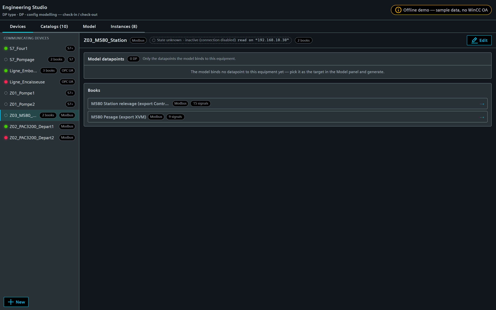

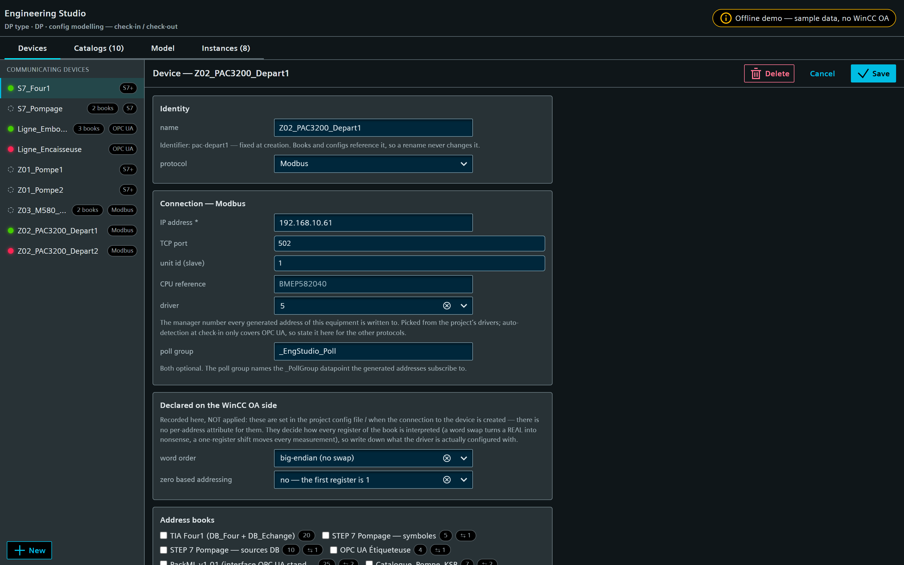

**Books are first-class and the device↔book relation is many-to-many**, both
directions supported:

- **Aggregation** — one equipment groups **several interfaces**, each seen as an
  address book (e.g. a bottling line with a filler + a labeller OPC UA server):

  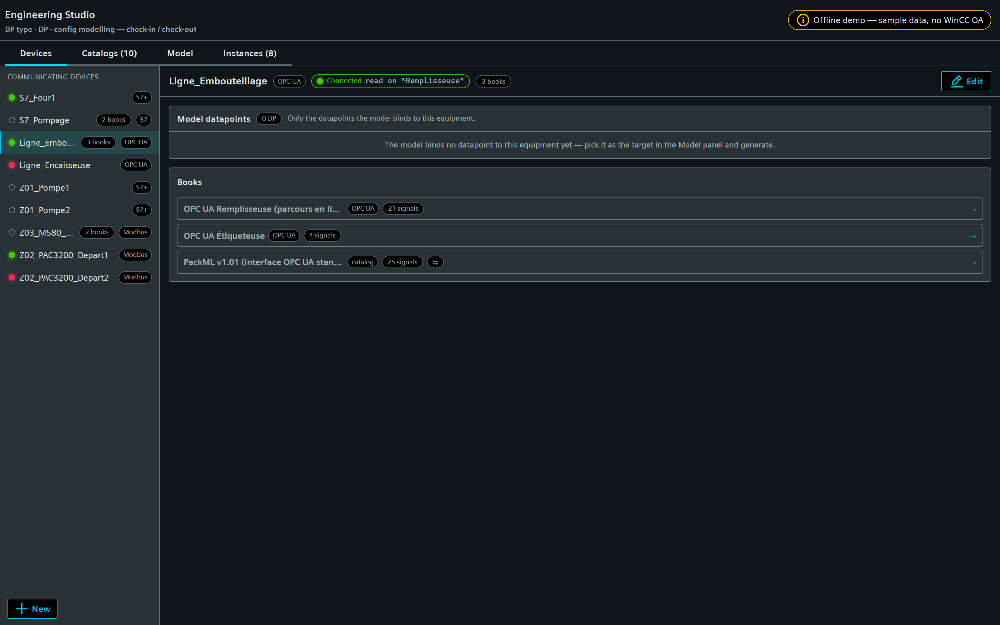

- **Mutualisation** — one **catalog book is shared** across equipments (e.g. two
  identical pumps reuse a `Catalogue_Pompe_KSB` file catalog; a catalog has no
  live interface of its own and is bound to each equipment at check-in):

  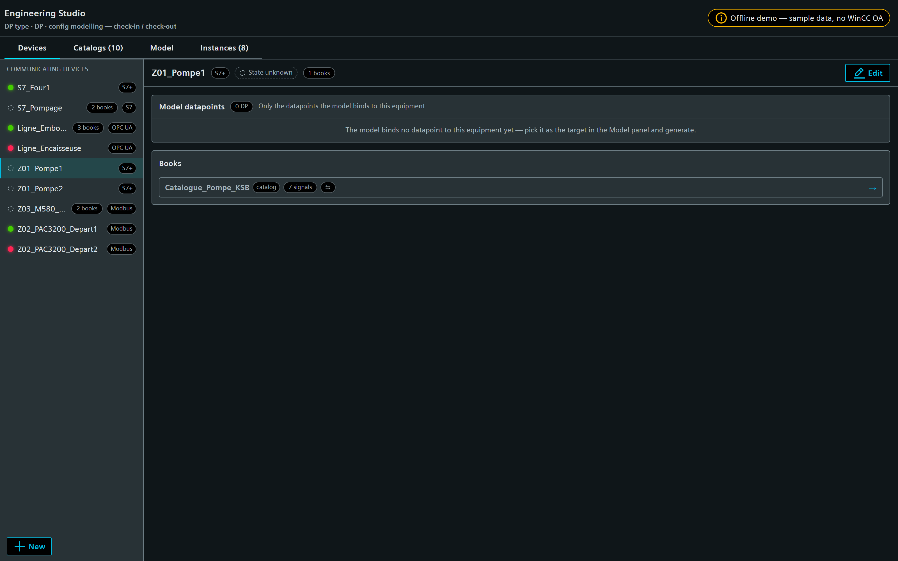

#### Two real-world catalogs in the demo

**SENTRON PAC3200 (Siemens) — Modbus register map.** Modbus has no browse, so the
book *is* the vendor register map: a **device-type catalog** mutualised across
every meter. Offsets come from the PAC3200 manual `A5E01168664B-04` §3.9.3 (via
the VC fiche `templates-import-tags-modbus-pac3200`): offset 1 → `40002` / `%MW2`,
`REAL`/`LREAL`/`UDINT`, Big-Endian/Big-Endian, T1 energy counters at 2801+. Units
(V, A, W, var, kWh…) ride along for the DPE unit config.


**PackML (OMAC / ISA-TR88.00.02) — standard OPC UA interface.** The archetype of a
mutualised book: one catalog describes the `Command` / `Status` / `Admin` PackTags
of *every* PackML-compliant machine, bound to each machine's own OPC UA server at
check-in. Here the bottling line and the case packer share it.


#### Online OPC UA browse (and re-browse)

For an OPC UA equipment the book is generated by **walking the live server** —
from the **Catalogues panel** (the creation form's online source, and "Parcourir
dans ce catalogue" for a re-walk): pick the connection, optionally a sub-tree
root, and the studio catalogues every variable it finds — path, datatype (through
the verified tag-importer mapping) and peripheral-address reference. The walk is one level per request (a browse response
carries no parent link, so the walker recurses itself to know each node's path),
sequential per connection, and **bounded** — depth, signal count and request count
are all capped, and hitting a cap raises a warning naming what was left out.

`AccessLevel` is read when the driver exposes it (the `Browse.*` element is
discovered by introspecting the connection's DP type, never guessed) and the address
direction then follows the real access. When it is not exposed, signals are catalogued
read-only with an **`assumed`** access — the book says so, the chip shows `r?`, and
the direction comes from the signal's *role* instead; a bulk "fix the access" action
turns an assumed access into evidence. An **array** variable is catalogued with its
scalar base type and flagged `unmapped` rather than given an unverified dynamic-DPE
address.

The same `AccessLevel` also says whether the **server keeps a history** of the
signal (`HistoryRead`/`HistoryWrite`; a NodeSet states it directly with the
`Historizing` attribute), so the catalog shows it in its own **`historique`**
column beside the access: **`H`** the source archives it, **`—` in a chip** it
states it does not, and a **plain dash** nothing was said (a register map, a CSV
export, a browse whose driver exposes no `AccessLevel`) — unknown is not "no",
the same honesty as the `r?` access chip. It changes no binding: it is what
decides whether *WinCC OA* should archive the signal too, and finding that out
after a check-in costs a second pass over the model.

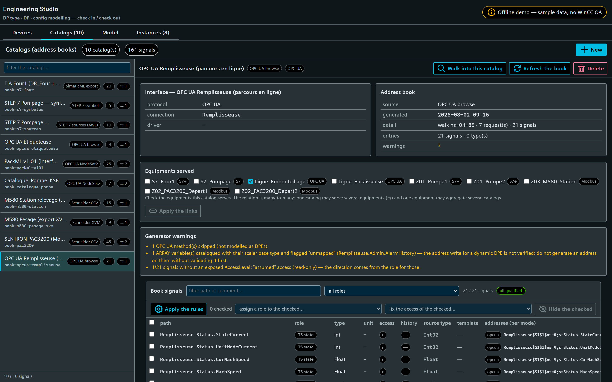

The browse parameters are recorded in the book's provenance, so **"Rafraîchir"
replays the exact same walk** — and shows what moved. That delta is the point: a
machine's program drifts, and a signal that vanished from the server may still be
referenced by your model.

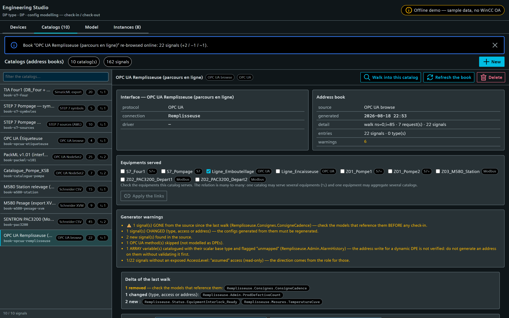

> The screenshots above are produced by the **real core walker** against the demo's
> in-memory fake server (`data/demo-opcua-server.ts`) — same code path as a live
> browse, no WinCC OA and no PLC involved.

#### Online S7+ browse — an S7-1200/1500 read symbolically

For an **S7Plus** equipment the book is generated the same way, from the same panel,
over the driver's own **symbolic browse**: pick the connection, pick the TIA
**source**, optionally a sub-tree, and the studio catalogues every member it finds —
symbolic path, TIA datatype, member comment, and the peripheral-address reference the
driver resolves at runtime (`DB_Echange.Consignes.Temperature`, with a string's
length riding along as `:80`).

The source is the part that has no OPC UA equivalent, and it is a claim about
reality, so the form asks it explicitly:

- **En ligne — l'automate** reads the **PLC currently running**. The catalog is the
  program that is loaded, and the book is bound to that connection;
- **a TIA export** (`Projet|Station`, from an archive placed under the project's
  `data/TIA_Projects`) reads the program **as engineered**, without contacting the
  machine — so it produces a **template catalog** with no interface, bound per
  equipment at generation, exactly like a NodeSet2. The book says which of the two it
  was, because "what the machine runs" and "what the archive says" are not the same
  statement.

Two things the S7Plus browse does *not* say, and the studio refuses to invent:

- **no access rights at all.** Every signal is catalogued read-only with an
  **`assumed`** access (chip `r?`), the direction then comes from the signal's
  **role**, and the bulk "fix the access" action turns an assumption into evidence —
  the same honesty as an OPC UA browse whose driver exposes no `AccessLevel`;
- **no history flag**: the `historique` column stays a plain dash. Unknown is not
  "no".

The driver's own **"Visible in HMI Engineering"** filter is offered as a toggle (on
by default, as in the standard panel): with it on, an element the program does not
expose is simply absent from the catalog — which the book states, so nobody hunts for
a signal that was filtered out.

An **array** is catalogued element by element (`Zones[0]`, `Zones[1]`, …), because
that is how WinCC OA addresses an S7Plus array member; a very large one is bounded
and the truncation is named. A TIA datatype the S7Plus transformation table has no
entry for is catalogued and flagged `unmapped` — no address is generated on it.

Like the OPC UA walk, the parameters are recorded in the provenance, so
**"Rafraîchir" replays exactly the same walk** and shows the delta — which matters
more here than anywhere else: a PLC program is edited daily, and a member that
vanished may still be referenced by your model.

Two prerequisites, both reported rather than guessed: the **S7Plus driver must be
running** (it is what answers the browse) and, for an online walk, the **connection
must be up**. The browse itself is performed by a **dedicated JavaScript manager**
(`s7plusBrowse`) rather than by the webserver — the driver's browse slot is one
element per connection, so a single owner has to serialise a walk's requests. The
whole protocol analysis, the architecture and what is still unverified are in
[S7PLUS-BROWSE.md](./S7PLUS-BROWSE.md).

> The S7+ walk shown in the demo runs the **real core walker** against an in-memory
> fake S7-1500 (`data/demo-s7plus-station.ts`) — same code path as a live browse, no
> WinCC OA, no driver and no PLC involved.

#### Classic S7 (S7-300/400) — the symbol table, the sources, and the CPU

An S7-1200/1500 can be browsed. An **S7-300/400 cannot**, and not because the
studio lacks a feature: the classic S7 protocol carries **no symbols and no
layout**. A CPU answers which blocks exist and how big they are; it has no idea
that byte 4 of DB10 is called `Consigne_Vitesse`. That information lives in the
STEP 7 project and travels only in its exports.

So the catalog is built from those exports, in two complementary halves:

- the **symbol table** (`.asc` / `.sdf` / `.seq` / `.csv`) names everything in the
  memory areas — inputs, outputs, flags, peripheral words — plus the project's
  **block directory** (`Echange` = `DB10`);
- the **AWL/STL sources** (*Generate source* on the data blocks) supply what a
  symbol table by construction cannot: the members of each DB, in declaration
  order. Their byte offsets are computed with the classic standard layout — the
  same unit-tested code the TIA/SimaticML generator uses, reused rather than
  rewritten, because two implementations of one layout rule drift and a drift
  moves every address by a byte.

**Several files, and several blocks per file.** *Generate source* produces one
`.awl` per block as readily as one file for a whole program, so both shapes are
read: a single source declaring a UDT and three DBs is catalogued whole, and a
UDT referenced by a block **declared later in the same file** resolves. The
picker takes as many files as you have and **accumulates them across successive
selections** — a browser file input replaces its selection on every pick, which
would silently drop the files chosen first and produce a catalog missing the very
UDT you supplied. Each loaded file shows as a chip you can remove, and re-picking
a file replaces its own content (what a re-export means), nothing else.

Load them together and a member is pathed `Echange.Consigne_Vitesse` rather than
`DB10.Consigne_Vitesse`; the addresses are identical either way. A symbol table
ingested alone yields a catalog with no DB member in it — which is not a failure
and must not look like one, so it is the catalog's own first warning, naming the
data blocks whose contents nobody supplied.

Three things are **read rather than configured**, because asking the operator
would be asking them to know which export they happen to have:

- the **dialect** — quoted CSV, tabs, semicolons or fixed-width columns, decided
  per line;
- the **column order** — Siemens documents both `Symbol, Address, …` and
  `Address, Symbol, …`, and picking wrong swaps every name with its address, so
  whichever column actually parses as an S7 operand wins. A file where neither
  does is refused rather than read at random;
- the **mnemonic language** — `E`/`A`/`Z` and `I`/`Q`/`C` read into the same area,
  so a German export and an English one of the same PLC address identically.

The **access is evidence, not a default**: an S7 process image is read-only to a
driver by construction, so an `E`/`PE` signal is `r`, an `A`/`PA` signal is `w`,
and flags and DB members are `rw` — all `declared`, never `assumed`.

##### Checking the catalog against the running CPU

The online side is not a generator — it cannot be — but it is the only thing that
can answer *"is this export still true?"*. **"Vérifier sur la CPU"** reads the
CPU's block directory through the dedicated `s7Browse` manager and reports four
distinct findings, distinct because each calls for a different action:

- a **data block the catalog addresses that the PLC does not hold** — every signal
  built from it will fail to bind. This is the one that becomes a broken-sensor
  ticket three weeks after a check-in;
- a block the catalog **reads past the end of** — it was shortened since the export.
  The addresses below the cut still work, which is exactly what makes it hard to
  notice;
- a block the CPU **would not describe** (protected) — reported as "not asked",
  never as "not there";
- blocks **present in the CPU that the catalog ignores** — not an error, and the
  only way to discover that an export left something behind.

The result is a **table, one row per data block**, and not a paragraph: the four
findings call for four different actions, and prose makes an operator re-read
every sentence to find the two blocks that matter. Each row carries both readings
side by side — the block's project name and number, how many catalogue signals
bind to it and how far into it they read, against the size, compilation date and
author the CPU reports — and its state pill says in one word what to do, with the
reason as its tooltip. A block the CPU holds and the catalogue ignores keeps its
row too, with **empty** catalogue figures rather than zeros: absent and zero are
different claims.

Nothing is written: not to the catalog, which is a reading of the project, and not
to the PLC. The manager's protocol client implements the block-directory subset
only — no read, **no write**, no upload, no run/stop — so this feature cannot
disturb a production machine however it is called. Without the manager deployed
the action is simply hidden: the S7 catalogs are complete without it, so its
absence is a missing extra rather than a broken page.

The whole protocol reference (every telegram, with its source), the export
dialects and the verification status are in
[S7-BROWSING.md](./S7-BROWSING.md).

#### OPC UA NodeSet2 (offline sibling of the browse)

A `UANodeSet` file — a companion specification (PackML/OPC 30050, Euromap), a
vendor model, or a server export — is ingested as a book **without touching the
machine**. It reads `AccessLevel` (which a browse cannot), folds custom supertypes
into their subtypes (WinCC OA has no DPType inheritance), and catalogues each
`UAObjectType` as a `BookType`.

A NodeSet's namespace **indices are file-local** and a live server almost always
assigns different ones, so its addresses are *candidates*: every one is emitted with
a `<Connection>` placeholder, the book carries no interface (it is a **template
catalog**, bound per equipment at generation), and the caveat is the book's first
warning. Verify against the server — or re-browse it online — before check-in.

Only the **topmost** instances are walked. A NodeSet describes types *and* instances,
and an instance of a structured type contains sub-objects that are themselves typed
(`P01` → `AcquisitionConfig` → `SampleRate`): walking every typed object as a root
catalogued each sub-object twice — once under its machine and once on its own — so a
book came out with `AcquisitionConfig.SampleRate` repeated for as many machines as it
had. An instance reachable from another instance is therefore walked only through its
parent (`rootInstances`), and a duplicate path that reaches a book anyway is dropped
with a warning naming it (`dedupeEntries`) rather than silently collapsing: a book is
keyed by path everywhere — the refresh diff, the bindings, the generated DPE names —
so two signals sharing one path would become a single DPE.

**Schneider Modicon M580 — from a Control Expert variables export.** A *project*
book (it carries the PLC's own Modbus interface, unlike the PAC3200 template).
The generator turns located variables into Modbus references — `%MW100` → `40101`,
`%MF104` → `40105`, `%M10` → coil `00011`, `%IW200` → input register `30201`
(read-only) — and runs the checks that make a Modbus book trustworthy: register
**overlaps**, **unlocated** variables (invisible to any Modbus client),
**topological** addresses (`%I0.2.3`, not Modbus-addressable) and unmapped derived
types. All four are surfaced as book warnings:


> **Why an export and not the "extended Modbus"?** Schneider's symbolic access
> rides on **UMAS**, the vendor extension of Modbus on reserved function code
> **90 (0x5A)** used by Control Expert. It is undocumented by Schneider (publicly
> described only through reverse engineering, with published vulnerabilities), so
> the studio's default path is the offline variables export — same symbols, no
> proprietary traffic on the OT network. See [NOTES.md](./NOTES.md).

Two Schneider generators are available, and one equipment can hold both books —
here a CSV export of the pumping station plus an **XVM/XSY (XML)** export of its
weighing section. The XVM reader flattens structured variables to their members
(`Recette.Consigne` → `40421`), picks units from Unity-style
`<attribute name="unit" …/>` children, and states up front that the **XVM schema
is not vendor-verified**:

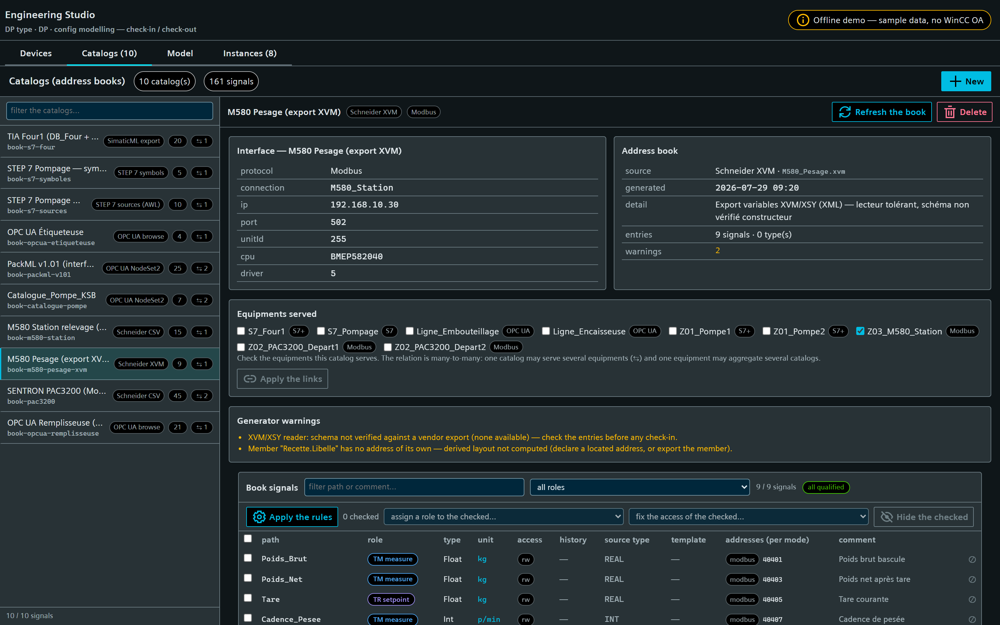

#### Qualifying the signals (roles) — what makes the rest automatic

A book says *what to read*; a **role** says *what it is for*. Roles are inferred by
a rule engine and drive both the model and the configs at check-in
(archive / alarm / range / direction). Eight roles: **mesure, consigne, commande,
état, alarme, compteur, paramètre**, and **à qualifier** — nothing ever takes a
silent default.

Each role carries its **telemetry code**, the designation an operator recognises
from a schematic or a signal list — and the same in every language, so the code
is not translated:

| code | role | | code | role |
|---|---|---|---|---|
| **TM** | mesure (measure) | | **TA** | alarme (alarm) |
| **TC** | commande (command) | | **TCP** | compteur (counter) |
| **TR** | consigne (setpoint) | | **TX** | paramètre (parameter) |
| **TS** | état (state) | | — | *à qualifier* — no code: an unqualified signal has no telemetry nature yet |

Three rule layers, most specific wins, and the matching rule is always shown as
the chip's tooltip:

1. **structural** — datatype + access + unit (a read-only `Float` in `bar` is a
   measure; a writable `Bool` is a command). Zero configuration, works on any
   source;
2. **source path** — `Command.*` / `Status.*` / `Admin.*` (PackML),
   `Mesures.*` / `Consignes.*` / `Etat.*` (S7 & catalog books);
3. **name & convention** — the VC referential prefixes (`AI_`, `AO_`, `DI_`,
   `DO_`, `CALC_`) plus business patterns (`*_Defaut` → alarme, `Marche*` →
   commande, `Compteur*`/`Nb_*` → compteur…).

Rules are **data** (serialisable, project-overridable), a **manual role always
wins**, and the whole set is re-runnable (*Appliquer les règles*) without losing
overrides. On the demo books this qualifies **100 % of the signals with no
configuration**: below, the M580 book — `Defaut_*` → alarme, `Marche_*` →
commande, `Consigne_*` → consigne, and `Pression_Reseau` → mesure *despite being
writable* (a quantity name outranks the structural rule, but not the
`Consignes.` branch):

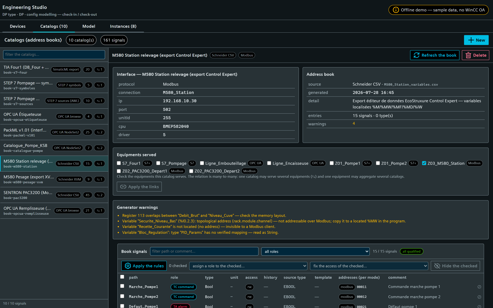

Two escape hatches, because correcting a rule engine happens at two scales.

**In bulk**: filter (text or role), tick, assign one role to every checked row.

**One signal at a time**: click its role chip and pick. The role is what drives every
config at check-in, so needing to tick a box and reach for the bulk bar to fix a
single signal was friction in the wrong place.

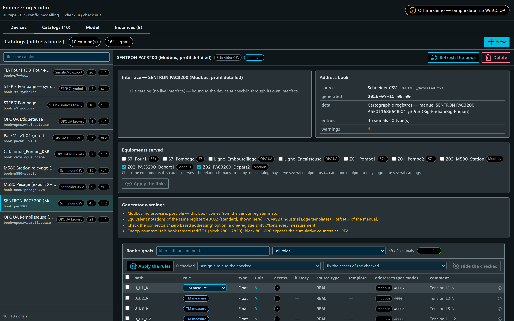

It is a **click-to-edit**, not a dropdown per row, and that is deliberate: the chip
carries what a `<select>` cannot — the role's colour, readable down a column of
hundreds of rows, and as its tooltip *why* the signal has that role (the matching
rule, or the fact that a hand overrode it **and what the rules would have said
instead**). Swapping one for the other on demand keeps both, and keeps exactly one
live control in a table that draws thousands of rows.

The first option is **"— selon les règles —"**, which *clears* the override and hands
the signal back to the engine. That option is the reason the rest is safe to click: a
manual role outranks every rule, so without it a mis-click would pin a wrong role for
good and no amount of "Appliquer les règles" would shift it. The notice then reports
the role the signal actually ended up with — the rules' own answer, not the click.

And the subtle cases work — on the PAC3200, the **4 energy counters carry no
"counter" keyword at all**; their unit (`kWh`, `kvarh`, `kVAh`) qualifies them, while
`m³` or `h` stay measures because those units are ambiguous:

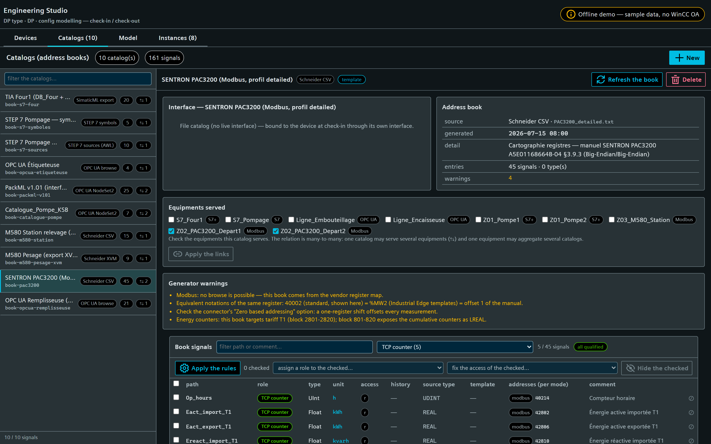

### 2 · Catalogues — the address books, without any equipment

The studio is device-first, but a **catalog is not**. A vendor register map (SENTRON
PAC3200), a standard interface (PackML), a machine-model catalog
(`Catalogue_Pompe_KSB`) exists *before* — and independently of — any equipment, and is
then bound to several of them. Requiring a device in order to create one had the
workflow backwards, so catalogs get a panel of their own.

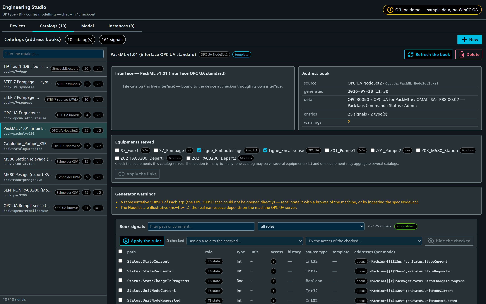

Left, **every catalog of the project** with its generator, its signal count and its
users. The one indicator that only this view can give is `inutilisé` — a catalog that
serves *no* equipment: from a device form it is invisible, because a device only ever
shows the books it references.

Right, the selected catalog: its interface (or `gabarit` when it has none), its
provenance, the equipments it serves, its generator warnings, and the **signal
table** with the role qualification. This panel is the ONLY place the book content
is shown — the Devices panel links here — which matters for a mutualised catalog:
PackML is qualified **once**, not once per machine.

Three actions:

- **Rafraîchir** — re-read the source of any catalog (the delta of the re-read is
  shown above the signal table);
- **Équipements servis** — tick the equipments and apply. The relation lives on the
  device (`Device.bookIds`), so this is N device upserts, one per equipment whose set
  actually changes; binding one shared catalog to six pumps stops being six trips
  through six device forms;
- **Supprimer** — asks twice, then forgets the catalog and **detaches it from every
  equipment** that used it. That asymmetry is deliberate: deleting a *device* keeps
  its books (they may be shared), but deleting a *book* must not leave `bookIds`
  pointing at a file that no longer exists. Nothing already checked in is touched —
  the addresses written from the catalog live in the project.

#### Creating a catalog

"Nouveau catalogue" asks four questions, in the order an engineer answers them:

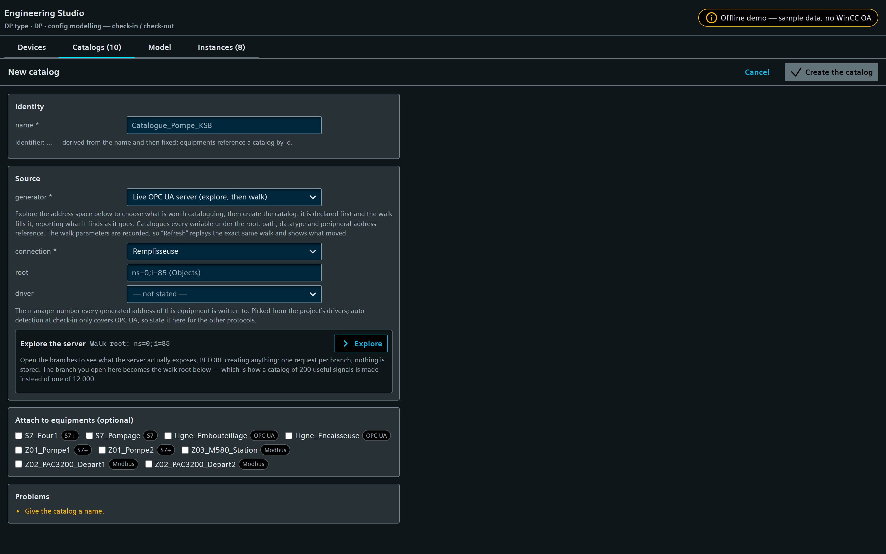

1. **Identity** — the name, from which the id is derived once and then fixed
   (equipments reference a catalog by id, so a rename must never orphan them). A name
   whose id already exists says so: creating would *replace* that catalog, which is
   exactly what a re-browse does.
2. **Source** — one of the five generators, each with what it reads and what it is
   trustworthy for: a live **OPC UA server**, a **TIA/SimaticML** export bundle
   (select the DBs *with* the UDTs they reference), a **Control Expert CSV**, an
   **XVM/XSY** export, or an **OPC UA NodeSet2**. The file is read **in the browser**
   and only travels on "Créer", so a mis-picked file costs nothing; switching
   generator drops the files rather than handing them to a parser that cannot read
   them. The live path gets a screen of its own — see "Exploring, then walking" below.
3. **Contenu du fichier** — the picked files are parsed **as soon as they are picked**,
   and the card shows what the catalog will contain: how many signals and structured
   types, the generator's own warnings, and a filterable table of the entries (path,
   source type → OA type, access, comment). The parse runs in the browser through
   `buildBookFromIngest` — *the very function the server ingests with* — so the preview
   cannot disagree with what "Créer" stores. That is the only moment where a wrong file,
   a wrong generator, an export that yields no variable, or a NodeSet that yields 12 000
   signals instead of 200 costs nothing to discover. Long files are capped at 300 rows
   *displayed* (the count and the filter stay exact, and the cap says so), and a file the
   generator cannot read is reported inline, in place, without losing the form.
4. **Interface** — the template/project distinction the whole mutualisation story
   rests on. Left empty the catalog is a **gabarit**: it carries no interface of its
   own and is bound to each equipment's connection at generation. Filled in it is a
   **project** catalog addressing through its own connection — with the same driver
   picker as the device form. The card is hidden for the two generators where the
   question does not exist: a walk carries the connection it walked, and a NodeSet2 is
   *always* a template (its namespace indices are file-local).
5. **Attach** — optional and additive; the catalog can be bound later.

A refusal keeps the form as it is, fields and files included: re-picking a TIA bundle
because a name was rejected would be the wrong lesson to teach.

#### Exploring a live server, then walking it

A walk of a real OPC UA server catalogues thousands of variables and takes minutes.
One server-side call that answers when it is done — which is what `/books/browse`
does — gives an operator no way to look first, nothing to watch, and no way to stop.
So the online path is three separate things.

**Explore first.** The address space is browsable one level at a time: one request per
branch, nothing stored, the datatype of each variable and the node id of each branch
shown as they arrive. Any branch can be promoted to the **walk root** (`⌖`) — which is
the difference between a catalog of 200 useful signals and one of 12 000, and the only
honest answer to "what is actually on this machine?".

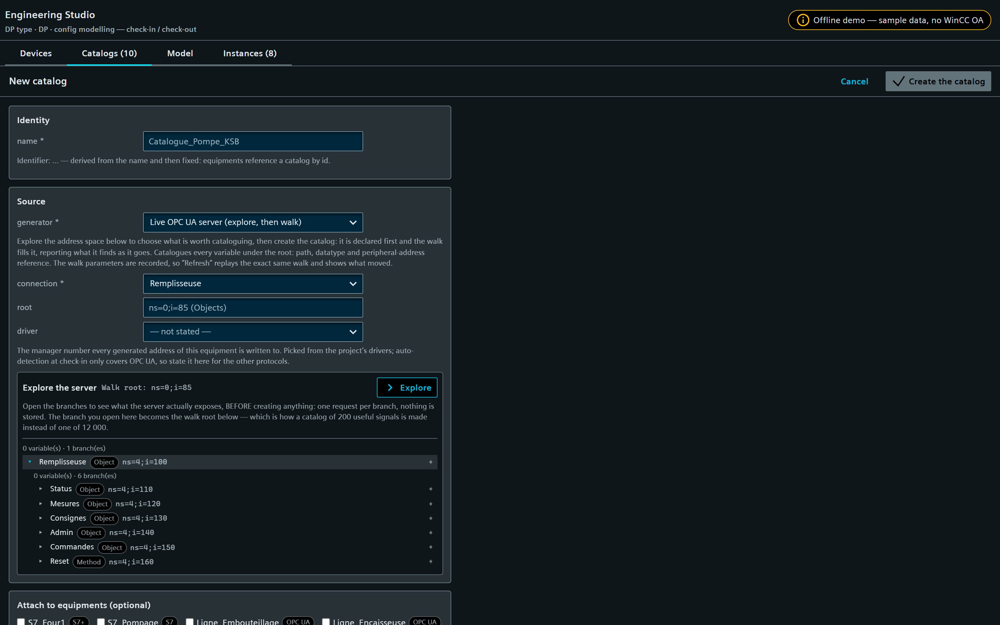

**Then declare, then walk.** "Créer le catalogue" commits the *identity* (id, name,
connection, driver) and the walk fills it afterwards. Two steps rather than one
because of what happens when a walk of a large server is slow: the operator is not
holding a form open, and a walk that is stopped or fails leaves a catalog to run
again rather than nothing at all. A catalog that has been declared but not yet walked
says so, and carries a "Parcourir dans ce catalogue" action — which is also how any
OPC UA catalog is re-walked later.

**With progress, and stoppable.** The walk runs from the page, level by level, over
the same **verified core walker** the backend uses (`opcua/browse.ts`) — the only
difference is where it is driven from. Every browse request reports back: signals so
far, requests so far, depth, and the branch it is waiting on.

Deliberately **no percentage bar**: the size of an address space is not known until it
has been walked, so a bar filling towards an invented total would be a lie. The counts
and the current branch are true, and they are what distinguishes "still working" from
"stuck on one branch". **Arrêter** cancels — the walker unwinds through its own
progress hook — and the stored catalog is left exactly as it was.

#### Hiding signals by hand

A generated catalog contains what the source exposes, which is not always what the
project wants: diagnostics counters, vendor scratch registers, a whole `Admin` branch.
Those can be **hidden** — one row at a time (`⊘`) or in bulk from the checked rows.

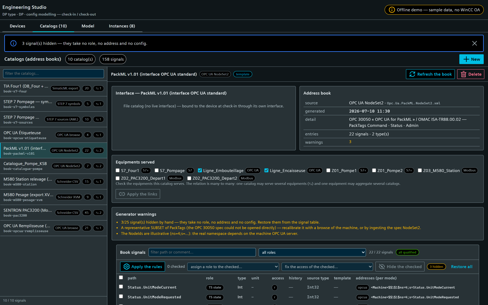

Hidden, not deleted, and that distinction is the whole design:

- a catalog is a *reading* of a source, and the source gets **re-read** (a re-walk, a
  re-ingest). If hiding rewrote the book, the next refresh would bring the signal
  straight back — the operator's judgement lost to a mechanical re-read. So the
  exclusion is stored **beside** the book, exactly like the role and access overrides
  (`books/<id>.excluded.json`), and survives every refresh;
- it is **reversible**: nothing is destroyed, and "Tout restaurer" brings every hidden
  signal back;
- and the catalog **says how many are hidden** — a count in the signal bar and a
  warning on the book itself. A catalog that quietly showed less than the machine has
  would have the next engineer model from an incomplete reading, which is precisely
  the failure this feature could otherwise introduce.

A hidden signal takes no role, no address and no config: it costs nothing downstream.

### 3 · Modèle — the model list, and the selected model's content

**Master–detail.** Left, the **models** of the project — each row showing its name, its
DP type, its description and **the catalogs it reads** — with **Nouveau** and
**Supprimer** above them. Right, the selected model's **content**: its name and
description, its source catalogs (each with a ⧉ button that updates the model from it),
its structure, the mapping of each branch and the deployment policy.

**Every verb is in the header, top-right**: *Nouveau*, *Supprimer*, *Éditer* — and while
editing, *Annuler* / *Enregistrer*. One place to look, whether the action changes which
models exist or what this one contains.

**A model is READ-ONLY until "Éditer".** That is not ceremony: saving a model
**re-applies it to every instance it already produced**, so a stray keystroke in an
always-live form would reach the project's datapoints. Every change lives in page state
until *Enregistrer*; *Annuler* restores the stored record by simply re-reading it.

**Each model says whether it is still what the project holds.** A chip on its row — and
beside its name — reads *synchronisé*, *divergent* or *non créé*, from a structural
comparison between the model and the project's DP type of the same name (the same
fingerprint the check-in diff uses). *Divergent* is the case worth catching: the type was
edited elsewhere (PARA), or the model changed and was never re-applied.

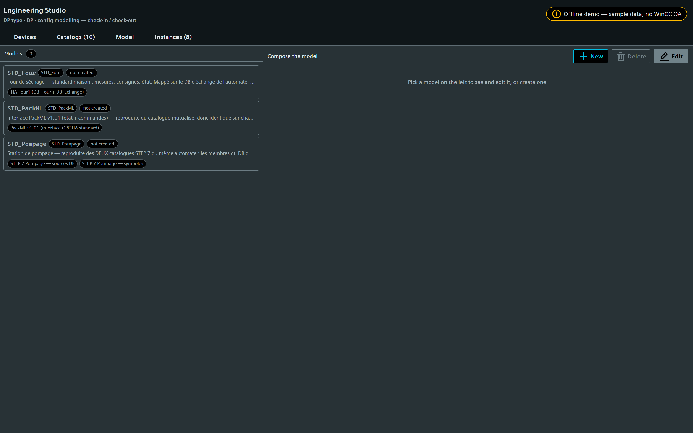

> The split follows what each action changes: "new" and "delete" change *which models
> exist* (left), everything else changes *one model* (right). A single column used to
> stack all of it, which made "which model" and "what is in it" compete for the same
> width. Earlier still there was a third column — the equipment rail and the produced
> signal grid — and it was what made the screen unusable. The rail belongs to the
> Devices panel (no other screen is about picking an equipment) and the grid moved to
> **Instances**, which is the tab about what the models produced.

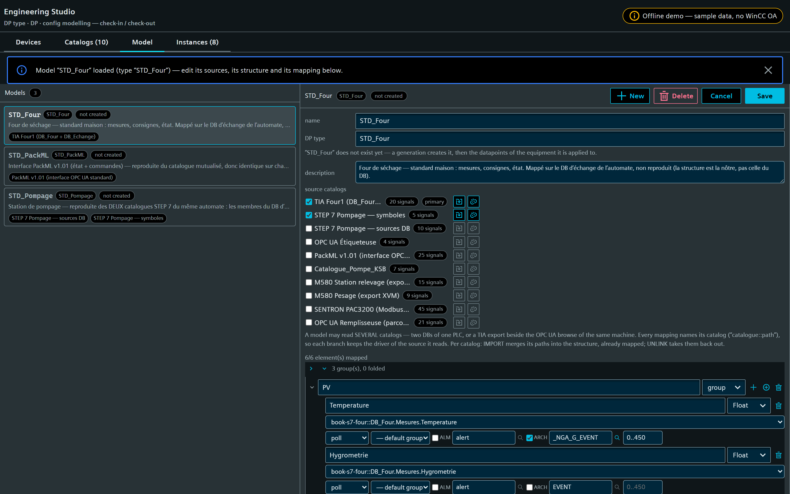

**Applying a model is NOT on this screen.** There is no *"Generate the model from this
book"* block any more: generating produces **instances**, so it lives in the Instances
tab on the model row it instantiates (see [§4](#4--instances--check-in--check-out)). This
tab defines models; that one applies them.

#### Creating one: everything asked at once

**Nouveau** asks for the whole definition in one form: a **name** (the DP type is derived
from it and shown as you type), a **description** in free text, and the **source
catalogs** with, per catalog, whether it **mirrors** its paths into the structure.
"Créer" then stores the model — structure already mirrored from the catalogs marked so —
and selects it.

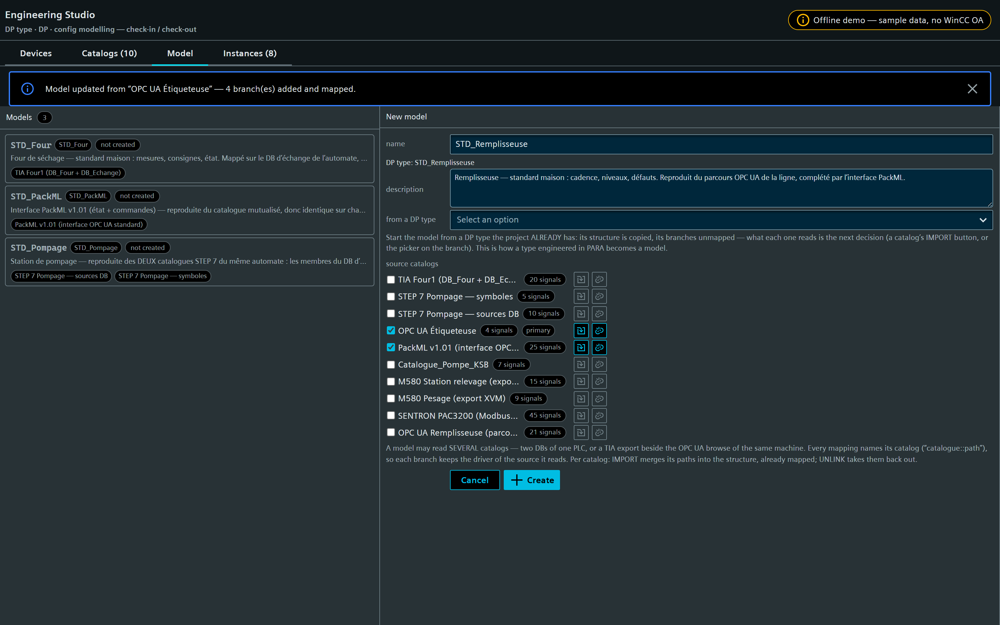

> It was two steps for one release (create empty, then pick the sources on the right) and
> that split one decision across two screens: a model's sources and what shapes it are
> chosen when it is conceived. Nothing is written until *Créer*, so an abandoned form
> leaves no half-model in the list — and the source selection starts blank rather than
> inheriting the catalogs of whichever model was open before.

The description is not decoration: two models of the same machine differ by intent, and
the row shows it beside the catalogs — which is what makes the list readable once a
project holds a dozen house standards.

#### One or several source catalogs, and the ⧉ mirror action

The sources are a **check-list**, not a single choice, because a machine is often
described in more than one place: two TIA DBs of the same PLC, or a TIA export beside
the OPC UA browse of the same equipment. Checking a catalog makes its signals available
to the mapping; the **import button (⟱) beside it updates the model from that catalog** —
its paths are merged into the structure and every branch added arrives **already mapped** to
the signal it came from. That is the automatic mapping: done by construction, not by a
name-matching pass afterwards. The **unlink button** next to it is its counterpart: it takes
that catalog OUT of the model — the branches that read it, their mappings and their
deployment decisions go with it, while a branch you re-mapped onto another catalog stays.
Un-ticking a source alone never did that, which left models bound to a catalog they no
longer read.

**A model may also PARAMETERISE a DP type the project already has.** The creation form lists
them (`GET /api/eng/dptypes`); picking one makes the model **target that type** — it copies
its structure and takes its name as the DP type, branches unmapped. Generating then writes the
**configs of that type's datapoints** and leaves the type itself alone: no second type is
created beside the one you chose. That is the path for a project engineered in PARA before the
studio — the type is already right, only its bindings and its deployment decisions are missing.

> A DP type carries **one** verdict, never two: the plan's chip when it has something pending on
> the type, the comparison with the project otherwise. Showing both let them contradict each
> other — a type nobody had created announced "to update" beside "not created", because a type
> item's `create` was being folded into `update` for display.

> This is also why a model's **name** and its **DP type** are two fields. They were one while
> every model created its own type; a model built on `Equip_Four` has to keep pointing at
> `Equip_Four` whatever you call the model, and the hint under the name says which of the two
> cases you are in ("already exists → this model parameterises it" / "does not exist yet → a
> generation creates it").

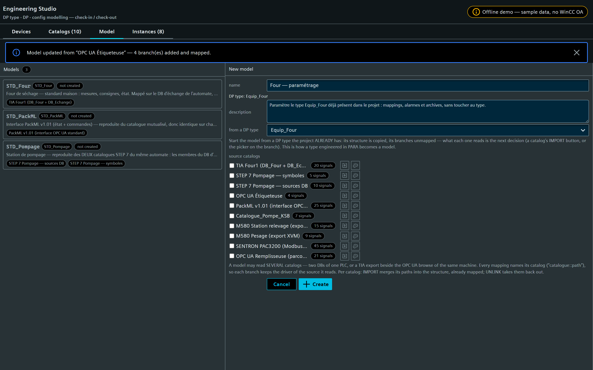

> It was a per-catalog *checkbox* for one release, which made "this model mirrors that
> catalog" look like a permanent property. It is not: the branches can then be renamed,
> re-mapped or deleted by hand. So it is an action, and pressing it again after the catalog
> was re-browsed adds what is new — **what is already in the model wins**, and the
> branches left untouched are counted in the notice rather than silently overwritten.

**Every mapping names its catalog**: `catalogue::chemin`, the first source included. A
branch therefore says which catalog it reads without depending on which source happens to
be first, so re-ordering the sources cannot change what it points at — and **each branch
keeps the driver and connection of the catalog it reads**, which is what lets one type mix
an S7+ branch and an OPC UA branch. (Models saved before this convention hold bare paths;
they are re-qualified when opened, and the core still resolves a bare path against the
model's own catalog either way.)

Mirroring several catalogs into one model is therefore just pressing ⧉ on each: they merge
in order and a branch two of them both claim is **reported, not overwritten**.
`STD_Pompage` in the demo is exactly that — the DB sources and the symbol table of one
S7-300 station, side by side.

The catalogs are deliberately **independent of any equipment**: a house-standard type is
written against a catalog (PackML, a vendor register map), and which equipments it will
serve is a later, separate question — asked in the Instances tab.

#### Reusing a model

"Enregistrer le modèle" — *"Mettre à jour le modèle"* once one is selected — stores the
type's **name, description, source catalogs (with their mirror flags), structure,
mappings and deployment policy**. What a model deliberately does **not** carry is the
target or the equipment names — those are exactly what differs between two applications,
and baking them in would make it single-use.

##### The deployment policy — set once, replayed per instance

Below the structure, **"Déploiement (par mapping)"** gives one row per mapped
leaf: **alarm** (on/off + class), **archive** (on/off + group) and an optional
**range**. This is the "define it once" half of a model: it travels with it, so
generating the model for a second connection replays the same decisions instead of
re-taking them — that is what an *instance* is (same model, another target
equipment; only the address provenance differs).

#### How each element alarms

Beside the ALM checkbox, each leaf says HOW it alarms, and the control follows its type:

- a **BOOL** element chooses its **good range** (`good = FALSE` / `good = TRUE`): which
  value is healthy, so the alert is raised on the other one. It is WinCC OA's
  `_alert_hdl.._ok_range`, and it has to be a choice — half the fault bits of a plant are
  active-low, and deriving it from a direction arms those alarms inverted;
- a **numeric** element takes its **thresholds** (`80, 95` — a comma list) and the alarming
  **side** (*above* / *below*). N thresholds are N+1 ranges, which is what the analog alert
  handling models; with no threshold it stays the plain non-zero alert. The value range of
  the leaf becomes the bounds of the outer ranges.

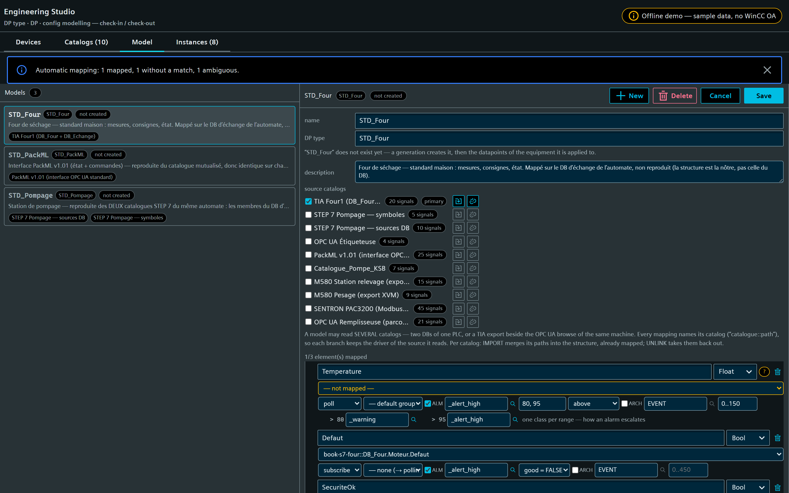

The **alarm class** and the **archive group** are picked from the project's own lists —
the `_AlertClass` datapoints and the usable `_NGA_Group` ones, read by
`GET /api/eng/config-options` (same source as the PARA Alarming tab and the machine-fleet
dialog). Both are datapoint names the runtime resolves, so one typed from memory yields a
config it rejects; the field still accepts **free entry**, which is what keeps a class or
group created after the read usable — and what makes the picker degrade to a plain field
when the project could not be read at all. The **magnifier** beside each of the two fields
opens a search over the project's datapoints (`GET /api/eng/dps`, WinCC OA wildcards): the
lists cannot be exhaustive, so there is a way past them that does not involve typing a name
from memory.

Every cell shows the **default** until you change it, and the defaults never
configure something nobody asked for:

- **alarm** — on only for the **alarme** role (class `alert`);
- **archive** — on only when the catalog's **history** column says the source
  already keeps a history of that signal: the machine's own answer to "is this
  worth keeping?". Everything else starts un-archived;
- **range** — nothing unless you type both bounds (a range is engineering
  knowledge, and a half-range would be a guess).

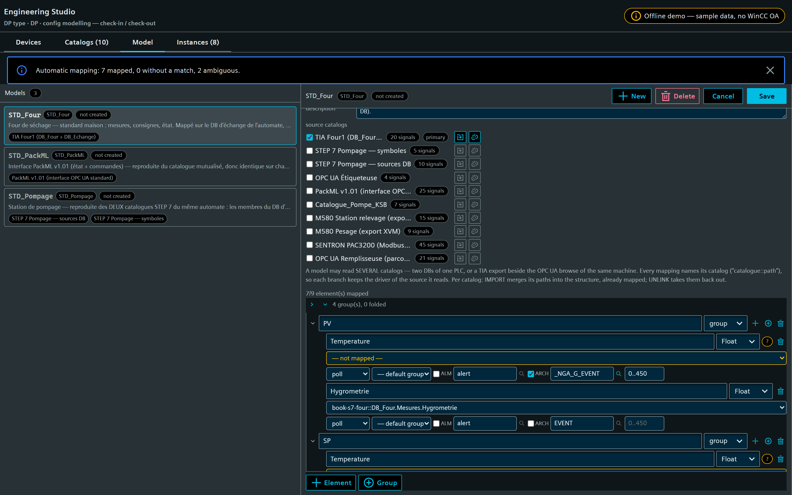

Editing a model against a **different** catalog is allowed, and measured rather than
guessed: its mappings are paths *into* a catalog, so the status line above the tree counts
how many of its branches actually resolve **against the catalogs currently checked**
(`6/6 element(s) mapped`). A model whose sources were re-scoped therefore says so as a
number instead of quietly producing a type full of DPEs with no address and no config.

A mirrored structure is stored like any other, and that is a deliberate change: mirroring
is no longer a *mode* the generation runs in (it was, and a mirrored generation could not
be saved), it is an **action that fills a model's structure** from the catalogs marked
*miroir*. What is stored is therefore always the same thing — a structure with its
mappings — whether it was typed by hand or mirrored, and the mirror flags say which
catalogs it came from so it can be rebuilt when one of them is re-browsed.

#### How each element is ACQUIRED — polling or subscription

The address says *where* a value lives; it does not say *how often the project asks for
it*. That is a second decision, and on OPC UA it is the one that decides whether a plant
of 3 000 tags costs one request per second or one notification per change. So each leaf
also states its **acquisition mode**, right of its address cells:

- **cyclique** — the project *asks*. The direction becomes an `INPUT_POLL` / `IO_POLL`
  one and the leaf names a **poll group**, which is where the rhythm actually lives.
  Three are offered, and they are the ones a plant needs rather than a free number:
  **`_Poll_Fast` 500 ms**, **`_Poll_Normal` 1 s**, **`_Poll_Slow` 10 s`**;
- **souscription** — the server *pushes*. The direction becomes `INPUT_SPONT` /
  `IO_SPONT` and the leaf names an **OPC UA subscription**, listed from the project's own
  `_OPCUASubscription` datapoints (`GET /api/eng/config-options`). The reference gains it
  in its second field — `Connexion$Souscription$1$1$NodeId` — the address format the
  driver reads, with the subscription written **without** the `_` its datapoint carries.
  Publishing interval, sampling and deadband are properties of the subscription
  datapoint, not of the address: they are set once in PARA and every leaf that names it
  inherits them.

The defaults come from the **role**, because the role already says what the signal is
for: **alarme** and **état** are subscribed (an event is worth nothing polled a second
late), everything else is polled on the normal group. **The catalog shows it**: the Books
table has an **acq.** column beside the role, so the whole plan is readable while you
qualify — before any model exists. It is read-only there (the role decides it; the
per-element override lives on the model), it shows a dash for an unqualified signal — no
role means no config at all — and it shows *polling* on a non-OPC UA catalog whatever the
role, because only the OPC UA driver subscribes. Nothing is silent about a
subscription it could not honour — a leaf asking for one on a **non-OPC UA** driver, or
with no subscription named, **falls back to polling** and says so in the generation
warnings rather than producing an address the driver would ignore.

> Only OPC UA carries the subscription field. The other drivers here (S7, S7+, Modbus)
> are polled, and their `_poll_group` is written exactly when the direction is a polled
> one — writing a poll group next to a spontaneous direction is a config the runtime
> keeps and never uses, which is the kind of thing that later reads as a bug.

#### The **Historical** box of the address — the catalog's `H` column, applied

The catalog's **H** chip says the OPC UA server keeps a history of the signal (its
`Historizing` attribute, or the `HistoryRead` / `HistoryWrite` bits of its `AccessLevel`).
That is also a question the WinCC OA address asks, as the **Historical** checkbox of its
OPC UA tab — *"Determines if this address is included in historical queries"* — so the
studio answers it from the catalog instead of leaving it unchecked by default.

An address is generated **Historical** when **both** hold:

- the source declares a history for that signal (**H** in the Books table — an *unknown*
  history, a `—`, is not a yes), **and**
- the **access declared by the catalog makes the address read**: `R` becomes an input
  (**IN**) and `RW` an input/output (**IN/OUT**), and both acquire a value. A `W` signal
  becomes an **OUT**, which acquires nothing — there is no history to query on it, so the
  box stays unchecked whatever the source says.

It is written to `_address.._offset`, and **only on OPC UA**: the same attribute carries a
bit count on Modbus.

**A historical address is generated INACTIVE.** The signal is already historized on the
server, so the project reads that history with a **HistoryRead** request — which fills the
`_archive` of the datapoint elements carrying the address — instead of acquiring the same
value live and archiving it a second time. The address exists with all its attributes; only
the exchange is off. Tick **Actif** in PARA the day a signal needs its live value too.

The model grid shows an **H** beside the direction of every address that got the flag and
dims the reference of every address left inactive, and the generation warnings say how many
— so neither decision has to be discovered in PARA.

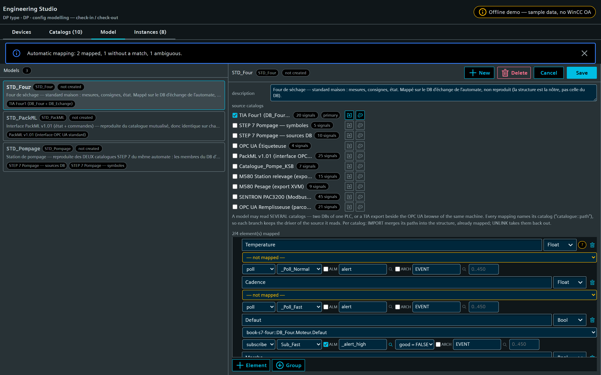

#### The connection of an instance is the instance's

A catalog names the **server it was browsed on**. That is a property of the import, not of
the machine you are deploying on — and the difference is the entire point of **mutualising**
a catalog: browse one machine, deploy the five identical ones beside it.

So at generation the reference is **re-pointed at the target equipment's own connection**:
the connection declared on the device (its `server` parameter — the `_OPCUAServer` datapoint
without its `_`), the catalog's only when the device declares none. Only **field 1** of the
reference changes; the subscription, the node id and the rest stay exactly as the catalog
has them. Each substitution is named in the generation warnings (`Cellule2 → Cellule4`), so
a catalog silently changing server is not something you discover in PARA.

S7, S7+ and Modbus references carry no connection field and are left untouched.

#### Generating the model from the roles — the loop closes here

With the signals qualified, generating a model derives everything from it. It happens in
the **Instances** tab (*Nouvelle instance* on the model's row): the model already answers
"which type, which structure, which mapping, which policy", so the form asks only for the
**equipment list** and the **target equipment**. From there the studio derives

- the **DPType structure** from the entries' dotted paths (nested `Struct`s, names
  sanitised, the fully-shared prefix stripped),
- **one datapoint per equipment**, named after the equipment (sanitised — no zone
  segment; the core still accepts an optional `zone` prefix), with the source
  comments as DPE descriptions,
- and **every config from the role**: address (reference resolved for the device's
  access mode) + direction, archiving, binary alert on the alarms, range when the
  project profile states real bounds.

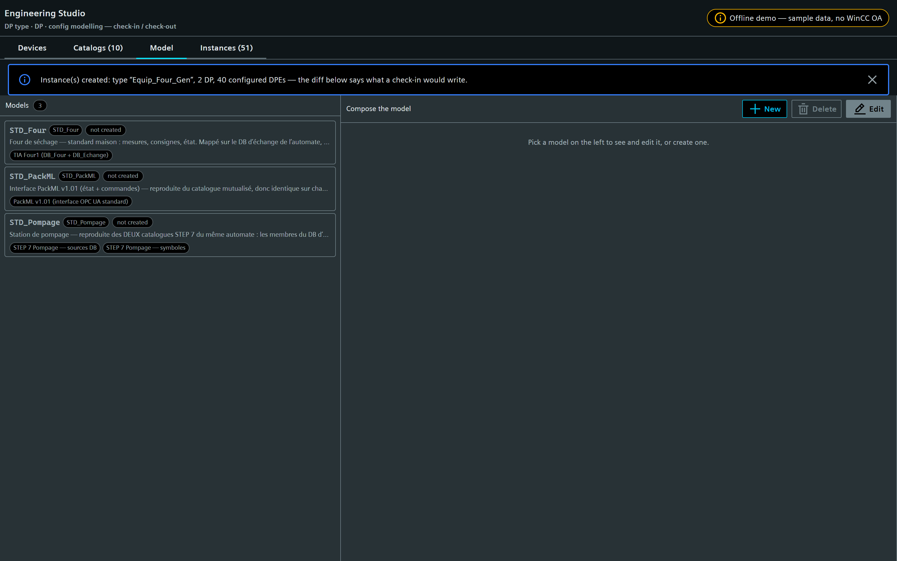

It refuses to invent, and says so: an unqualified signal gets its DPE but **no
config**; a template catalog with no bound connection yields no address; and a
source type the target driver has **no `_datatype` transformation** for gets **no
address at all** rather than a nearby-looking one (a classic S7 driver has no
64-bit float — reading an `LReal` as `FLOAT` would silently halve its precision).
All of it visible under the form above.

> The `_datatype` transformation constants of every driver used here (OPC UA
> 750–768, S7 700–722, S7Plus 1001–1027, Modbus 560–577) come from the WinCC OA
> `_address` appendix, recorded in
> [VENDOR-ADDRESS-TRANSFORMATIONS.md](./VENDOR-ADDRESS-TRANSFORMATIONS.md) and
> asserted code-by-code in the unit tests. **S7 and S7Plus are different drivers
> with disjoint tables** — the access mode, not the family, selects the code.

#### Authoring a HOUSE STANDARD type: the structure tree

The generation above mirrors the book's own paths, which is right when the source is
already shaped like the model. A **house standard** is the other case: one DP type
across machines whose PLCs name and nest things differently. So the structure can be
authored — and it is authored **as a tree**, in PARA's own grammar (an indented row
per element, its name, its element type, add/delete on the right), so an engineer who
knows one editor knows the other.


What the tree adds that PARA has no reason to: **each leaf carries the book signal it
is mapped to**, right in its row. "Associer automatiquement" fills what it can by name
and — importantly — flags what it could not decide rather than picking; both land on
the leaf itself, so what is still unbound is visible in place instead of in a second
flat list you had to read against the tree. Any mapping is then adjustable from the
same row.

The groups **fold**: their chevron is the control, and two buttons above the tree fold or unfold
every group at once (with a count of how many are folded) — a mirrored DB is hundreds of branches
and reading one of them meant scrolling past all the others.

The **outline** text (indentation = nesting, `Name : Type` = leaf) remains the storage
format — readable, diffable, pasteable between projects — but it is no longer a second
view on screen: the tree/text toggle, its help paragraph and the coverage sentence were
five pieces of chrome around the one thing being edited, and they went when the column was
slimmed down. The tree is the editor; the outline is what gets stored.

The edits are pure core functions, and each takes the bindings with it: **renaming a
group re-keys every mapping under it** (without that, renaming a group would leave its
leaves pointing at paths that no longer exist, and the type would generate with no
addresses), deleting a node prunes its own, leaving `Struct` drops the children and
theirs, and a rename that collides with a sibling is refused — two siblings with one
name make a binding key ambiguous. All unit-tested, the re-keying included.

The result lands in the workspace, so the **check-in diff is immediately there**
(49 creates / 2 updates here), each config item detailing what it writes:

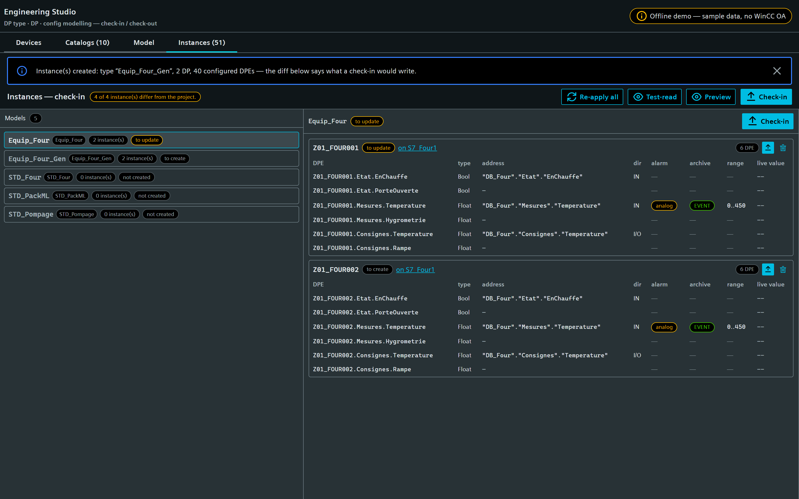

### 4 · Instances — models → their datapoints, and the check-in

**Master–detail, the same shape as the Model tab.** Left, the models — name, **DP type**,
instance count, check-in status, and the same *synchronisé / divergent / non créé* chip
against the project's type. Right, the selected model's **instances**: each datapoint with
its status and the **equipment it reads** (a link straight to that device), and under it the
**DPEs it carries** with their address, alarm, archive, range and live value. A status alone
says "diverged"; those cells say *what* differs. Above both, one line answers the question
this panel exists for: *is everything checked in?*

**The instances are read from the PROJECT, not only from the working copy.** A datapoint of
the model's type that the project has and the model does not describe yet is listed as
**dans le projet**, with a **Paramétrer** button: it opens the instance form on that name, so
generating writes the model's configs *onto* the existing datapoint — which is never
re-created. Without that, a model built on a DP type engineered in PARA showed "no instance"
beside a project full of them.

Updating what the models produced is either **per model** (*Réappliquer*, on the selected
model) or **global** (*Réappliquer tout*, in the header) — the second is the first, run over
every model that has instances, sequentially so each pass builds on the workspace the previous
one produced.

**Checking in is scoped too.** The header's *Check-in* writes the whole plan; the selected
model has its own, and so has **each instance** (the ⬆ on its row) — the wrong grain is what
makes an operator wait for twenty models when one is ready. All three synchronise **without
re-creating**: an existing DP type is changed in place, an existing datapoint keeps its
identity, its configs and its archived values. Only the armed *Recréer* does otherwise.

An instance is **derived from the working copy, never stored**: a datapoint whose DP
type is the model's, plus the device its addresses record. So the tree cannot drift
from what the project actually holds. Each status comes from the same check-in plan
that answers "what would a check-in write?" — `checké in`, `à créer`, `à mettre à
jour`, `conflit` — and the model's own row carries the status of its DP **type**,
which is deliberately not repeated on each instance (one edit, one pending change,
not N).

**Nouvelle instance** is where a model becomes datapoints: name the equipments, pick the
**target equipment** whose connection, access mode and driver the addresses use, and
generate. It reads the STORED model — its sources, structure, mapping and policy — not
whatever happens to be open in the Model tab, so instantiating twice gives the same
result, and a model whose primary catalog has been deleted fails with *that* as the
reason instead of quietly producing a type with no addresses.

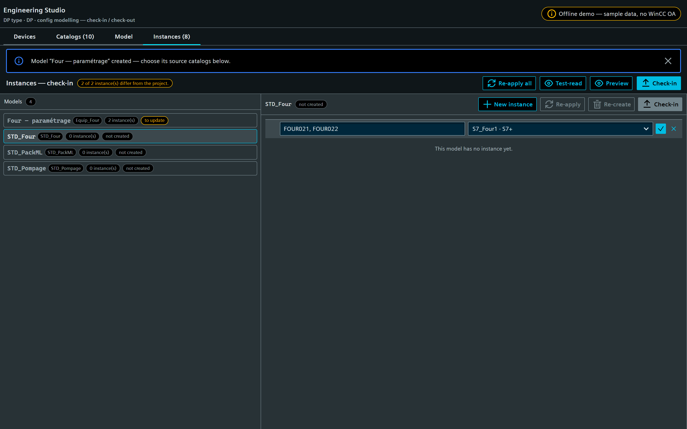

> It is a **row of the tree, not a form**: an instance is a datapoint on an equipment, so
> declaring one asks for exactly that, on the line where the instances live, validated by
> the check on the right. The boxed *"Generate the model from this book"* panel it replaces
> asked for four more things the model already answers — its type, its structure mode, its
> catalog and its policy.

**Réappliquer aux instances** regenerates every instance of a model from its current
structure, mappings and deployment policy — and saving a model does it automatically.
That is what makes a model change *reach* the datapoints it already produced: without
it the model would say one thing while the project held another, with nothing to tell
which is current. It stops at the working copy, so the tree immediately shows the
instances as `à mettre à jour` — the honest state until a check-in.

#### It AMENDS, and only re-creates when asked

A check-in **never re-creates** what already exists: an existing DP type is *changed*
(`dpTypeChange`), and an existing datapoint is left in place with only its configs
(re)written. That is what keeps a running project's datapoints, their configs and their
archived values — and it is what makes "update the model everywhere" a safe operation
rather than a data loss.

The one case that cannot serve is a change the runtime refuses in place, so each model
carries a **Recréer…** button: armed by a first click, it states what it costs, and a second
click deletes the type and its datapoints and re-creates them — history included. It is
scoped to that model's own plan items, never the whole plan.

**Aperçu** previews the exact outcome without writing; **Check-in** applies it with a
per-item report — shown as a **dialog whose list scrolls**, with the counts pinned above it and
**failures sorted first**: a report of a thousand items is read for what went wrong, and it used
to run off the bottom of the screen.

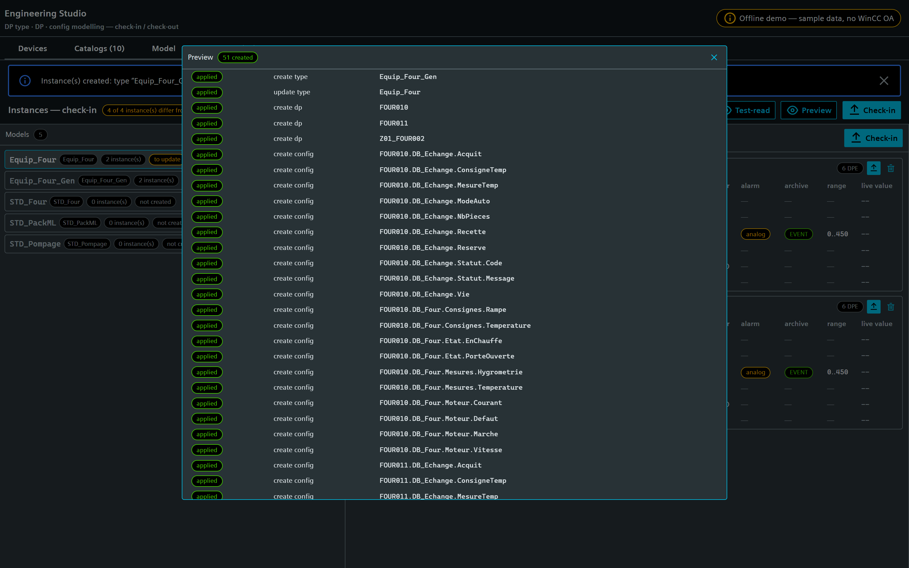 There is no flat plan table any more: the detail pane above already shows,
per instance, the DPEs and the configs a check-in would write — the table repeated those
facts without the grouping that makes them readable. What a check-in DID is still reported,
under the panel.

> **A check-in writes in BULK.** The configs of many DPEs travel in one `dpSetWait` (400
> attribute/value pairs by default), and the driver-manager lookup a peripheral address needs
> is resolved once per check-in instead of once per DPE — two round-trips per element on a
> thousand-element model is what made the button feel broken. A batch that fails is replayed
> item by item, so the report still names the offending DPE; the analog alert handling keeps
> its proven three-step sequence and is never merged.

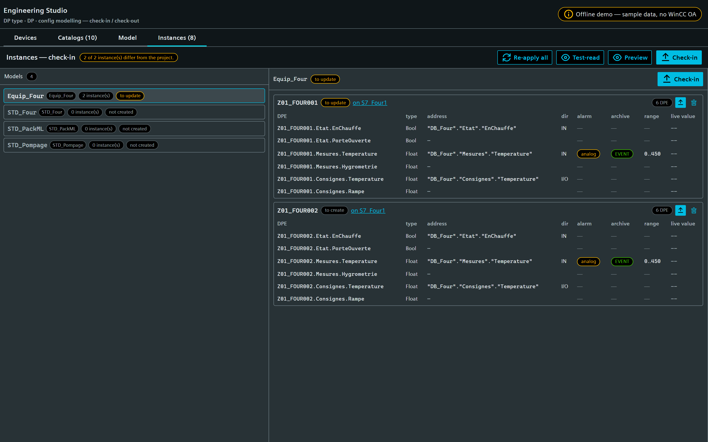

#### Housekeeping: taking things back OUT of the workspace

The studio could put objects into a workspace and never take them out, and that is not a
missing convenience — it is a trap. Delete a model from the library and its generated DP
type and datapoints stay staged: the panel keeps offering to create datapoints of a type
nobody wants, or (when the type went with it) of a type that **does not exist anywhere**,
which fails at check-in one `dpCreate` at a time.

So each instance carries a bin: **remove it from the workspace** — the counterpart of
"generate", on the row where the instance is shown (the core cascades its configs):

- a pending **creation** is cancelled;
- a pending **update** is dropped, leaving the live object exactly as it is;
- a pending **deletion** is called off — that one is a *baseline* entry, so forgetting the
  object means dropping the baseline key. Removing it from the working copy while leaving
  its baseline would turn a pending creation into a pending deletion, the exact opposite
  of cleaning up (see the core's `forgetInWorkspace`).

The notice says how many objects left, cascades included — something an operator must see
rather than discover in the next plan. Nothing here touches the project: that is why it needs
no confirmation step, and why the message says so.

## Try the offline demo (no WinCC OA)

```bash
cd libs/wui-eng-studio/demo
npm install            # optional: the workspace-root install is used as a fallback
npm run dev            # http://127.0.0.1:4310  (?panel=devices|books|model|control)
```

The demo takes `lit` from its own install when it has one and from the workspace root
otherwise (one copy either way — two Lit instances would mean two `ReactiveElement`
registries). The iX design system and `@wincc-oa/wui-shared` always come from the
workspace root, so `npm install` at the repo root is enough to run it.

Regenerate the screenshots above (headless Chromium, no runtime):

```bash
node libs/wui-eng-studio/demo/screenshot.mjs             # → docs/images/eng-studio/*.png (English)
node libs/wui-eng-studio/demo/screenshot.mjs --lang fr   # the same set in another language
```

## Languages (EN / FR / DE)

The page is localised in **English, French and German**. Every string it renders
comes from `src/eng-studio/i18n.ts`, a **self-contained** module: the rest of the
suite localises through `@wincc-oa/wui-i18n-shared`, but this page has to render in
the offline demo and in the screenshot pipeline, where no i18n runtime exists — so it
ships its own `ml(en, fr, de)` table and resolver.

The language is resolved, first match wins: the element's `lang` attribute (an
explicit integration) → **`localStorage['lang']`, the WebUI user-session language**
(the shell's own translation loader boots lit-translate from that key, so the page
follows the user connection without importing any `@wincc-oa/*` package) →
`?lang=` in the URL → `<html lang>` → `navigator.language` → English. WinCC OA
locale identifiers (`en_US.utf8`, `de_AT.utf8`…) are accepted alongside plain
BCP-47 tags.

There is deliberately **no language picker** in the page: in the WinCC OA context
the language comes from the user connection, and a second switch would let the page
disagree with the shell around it. Outside WinCC OA — the offline demo and the
screenshot pipeline — the language is selected with `?lang=`.

| | |
|---|---|
| 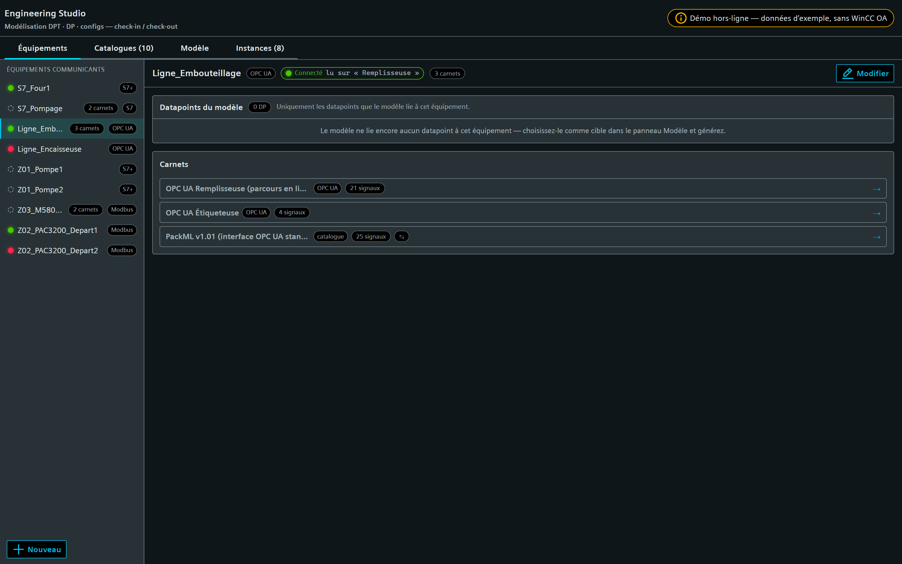 | 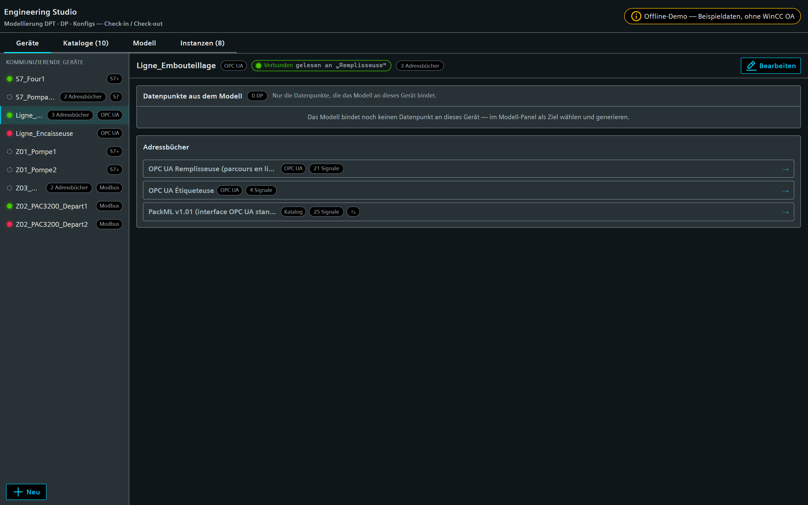 |

> The screenshots in this document are the **English** UI. The engineering core's
> diagnostics are localised too: it emits a stable `code` + an English template +
> params (`EngWarning`), and the page re-templates each code in FR/DE — so the
> generator warnings above read in the operator's language, while tests and logs keep
> one stable English meaning. An untranslated code falls back to its English message
> rather than disappearing. See [NOTES.md](./NOTES.md) "Localisation: structured
> warnings".

## Run the unit tests (no WinCC OA)

```bash
npm install       # repo root, once
npm test          # wui test — among them wui-eng-core's 341 tests: SimaticML parse + S7 offsets, Schneider CSV/XVM, OPC UA
                  # browse walk (+ progress & cancel) + NodeSet2 (root instances,
                  # duplicate paths), file-ingestion routing, connection-state mapping,
                  # roles, modelgen,
                  # structure outline + tree edits + auto-binding + model reuse, diff,
                  # config write builders + read-back, structured warnings,
                  # device declaration (id slug, per-protocol params, normalisation),
                  # S7 / S7Plus / Modbus _datatype transformations (code by code)
npm run typecheck
```

`npm test` also type-checks the backend routes against the REAL core sources (the
webserver packages declared by wui-toolkit).

The translation tables have their own verification (no test runner needed — it
bundles the real modules with esbuild): every entry present in EN/FR/DE, the same
`{placeholders}` in all three, **every core warning code translated** (and no
translation matching a code nobody emits), **every connection parameter of the
device form labelled**, and the WinCC OA locale identifiers resolving:

```bash
node libs/wui-eng-studio/demo/check-i18n.mjs
```

## Architecture

```
libs/wui-eng-core/        PURE domain (no WinCC OA import, unit-tested)
  model.ts                Device · AddressBook · Workspace · Plan (the IR)
  diff.ts                 check-in diff (create/update/delete, conflicts) + liveScopeOf
  apply.ts                plan applier over an injectable EngPort (the only runtime seam)
  configs/builders.ts     atomic config writes (_address/_alert_hdl/_archive/_pv_range)
  configs/read.ts         the read-back: raw dpGet → DpeConfigs, written-vs-provenance
  warnings.ts             EngWarning: stable code + English template + params (i18n)
  devices.ts              device declaration: per-protocol params, validation, normalisation
  structure.ts            authored type outline + auto-binding to the book's signals
  roles/                  rule engine (structural < path < name) + neutral profiles
  modelgen.ts             book + roles → type, DPs and configs (the generation)
  drivers/                address builders — opcua (verified), s7, modbus
  opcua/browse.ts         online browse WALK over an injectable OpcUaBrowsePort
  opcua/nodeset.ts        NodeSet2 (UANodeSet) reader → template catalog
  simaticml/              TIA Openness export parser + standard-block offset computation
  schneider/              Control Expert CSV + XVM readers, Modbus address mapping
  addressbook.ts          refresh diff, access + exclusion overrides, catalog id slug
  naming.ts               {Zone}_{Equipement}_{Signal}
libs/wui-eng-studio/      the page (Siemens iX + lit; renders with no runtime)
  src/eng-studio.ts       the 4-panel studio (chrome, device form, model, control)
  src/eng-studio/ui/      eng-books.ts       the Catalogues panel (list + detail)
                          eng-book-form.ts   the creation form + the server explorer
                          eng-driver-select.ts  the shared driver picker
  src/eng-studio/data/    EngGateway: HttpEngGateway (/api/eng) | DemoEngGateway (offline)
                          + walk.ts: the client-driven walk (progress + cancel), shared
                          + demo-opcua-server.ts: a FAKE OPC UA server (drifts, for the delta)
  demo/                   standalone demo harness (docs + screenshots)
                          + ix-bootstrap.ts: registers iX (elements, icons, theme)
libs/wui-eng-studio/backend/  thin runtime seam, fail-closed
  engRoute.ts             the endpoint table + role gating
  engController.ts        EngPort over WsjServerGlobal.winccoa, read-back, handlers
  engStore.ts             JSON file store (devices · books · roles · workspaces)
  engOpcuaBrowse.ts       one browse level over _<conn>.Browse.GetBranch (ported, queued)
```

See [INTEGRATION.md](./INTEGRATION.md) for deployment/roles and the **inputs still
needed** (real SimaticML exports), and [NOTES.md](./NOTES.md) for design decisions,
the decoupling contract and what is verified vs pending.
