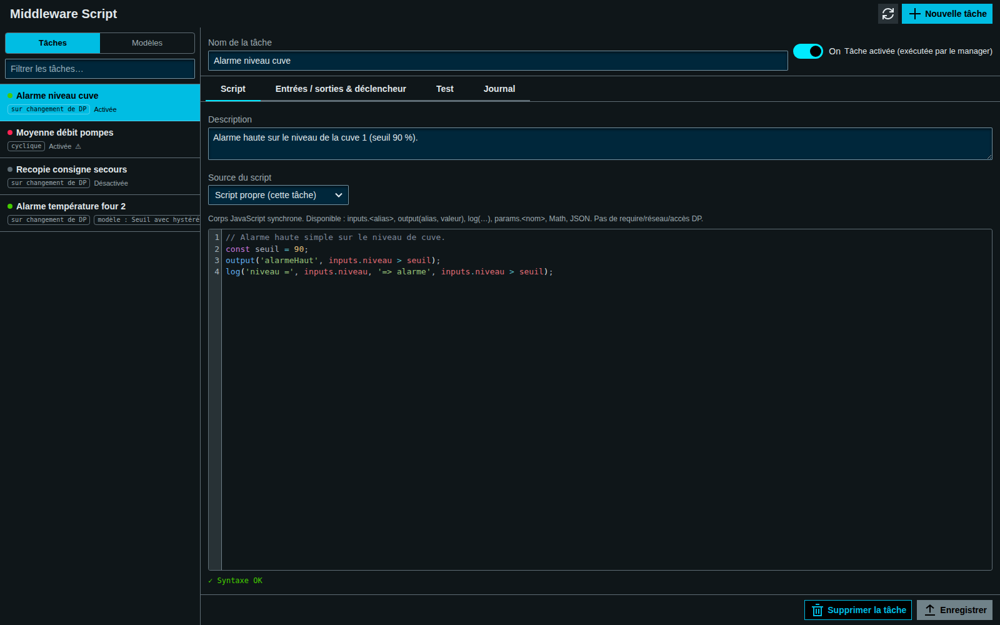

<!-- SPDX-FileCopyrightText: 2026 VISUEL CONCEPT -->
<!-- SPDX-License-Identifier: AGPL-3.0-only -->

# @visuelconcept/wui-middleware-script — sandboxed logic between datapoints

Standalone WebUI page (`/middleware-script`, Tier 3) to author small
**JavaScript tasks that implement logic between datapoints** — thresholds,
recomputations, copies, interlocks — executed server-side by the dedicated
**`middlewareScript`** JS manager in a **worker sandbox**, with in-UI dry-run
testing before enabling anything.



> The screenshot is generated (live, logged in) by
> [`tools/screenshot-pages.mjs`](../../tools/screenshot-pages.mjs) into
> `docs/images/manual/` — run it against a WinCC OA project with this module
> deployed to (re)produce them (see "Screenshots" in the root `CLAUDE.md`).

## What a task is

| Piece | Meaning |
| --- | --- |
| **Inputs** | declared `alias → DPE` bindings, read before each run; the script sees `inputs.<alias>` |
| **Outputs** | declared `alias → DPE` bindings; the script writes ONLY via `output(alias, value)` — no arbitrary dpSet |
| **Trigger** | `dpe` (any declared-input change, debounced) or `cyclic` (fixed period) |
| **Script** | synchronous JS body run as `(inputs, output, log) => { … }`, per-task timeout |
| **Enabled** | only enabled tasks run on the manager; the rest just persist |

Example — level alarm:

```js
// inputs: level -> System1:Tank1.level    outputs: alarm -> System1:Tank1.highAlarm
output('alarm', inputs.level > 90);
log('level', inputs.level);
```

## How it fits together

```
[page /middleware-script] ── CRUD ──► MiddlewareScript_Task_<id> DPs (.json config)
        │  POST /api/middleware-script/test                ▲          │ .status (live badges)
        ▼                                                  │          ▼
  [webserver bridge] ──── MSA vRPC "MiddlewareScript" ──► [middlewareScript manager]
                                                           triggers + worker sandbox + dpSet outputs
```

- **Persistence**: kit `DpJsonStore` over the shared `/api/para` API — one DP
  per task, `.json` written by the page, `.status` written only by the manager
  (GxP audit rows into `AuditTrail_MiddlewareScript`).
- **Execution**: the manager hot-reloads saved tasks (~10 s), wires the
  triggers, runs each script in a `worker_threads` + `node:vm` sandbox (no
  require/process/network/DP API; declared-outputs-only writes; hard timeout).
- **Test**: the *Test* tab dry-runs the CURRENT draft in the same sandbox via
  `/api/middleware-script/test` — outputs, logs and duration come back, **no
  output datapoint is written**. Input values are editable or loaded live.
- **Degradation**: without the manager, editing still works — Test answers 503
  and the status dots stay grey.

## Application-Security roles

`view`, `edit` (fields + save/delete), `test` (dry-run — also enforced
server-side on `/test`), `control` (enable/disable). Open until an admin
assigns groups in `/app-security`.

## Install

Standard page-module flow (see `INTEGRATION.md`): deploy the page, deploy the
backend module (`/api/middleware-script`), register the **`middlewareScript`**
manager in `config/progs` (e.g. `node | always | 30 | 2 | 2 |middlewareScript/index.js`)
and restart the webserver. **Prerequisite**: the `wui-para` backend
(`/api/para`) — it persists the task DPs, like every DP-JSON-store page.

## Contents

```
libs/wui-middleware-script/            page source (entry: src/middleware-script.ts)
  src/middleware-script/
    types.ts                             task model + validation (+ parse-only syntax probe)
    store.ts                             DpJsonStore wrapper (3-element type, live .status)
    ms-task-list.ts / ms-editor.ts       master list / tabbed editor (Script · IO & trigger · Test)
    ms-script-editor.ts                  dependency-free code editor (gutter, Tab, syntax check)
    ms-test-panel.ts                     dry-run panel
backend/routes/middlewareScript*.ts    /api/middleware-script bridge (health, test)
backend/managers/middlewareScript/     the executing manager + sandbox-worker.js
```
