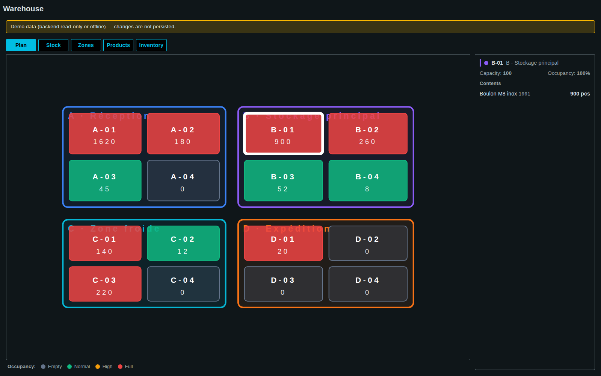
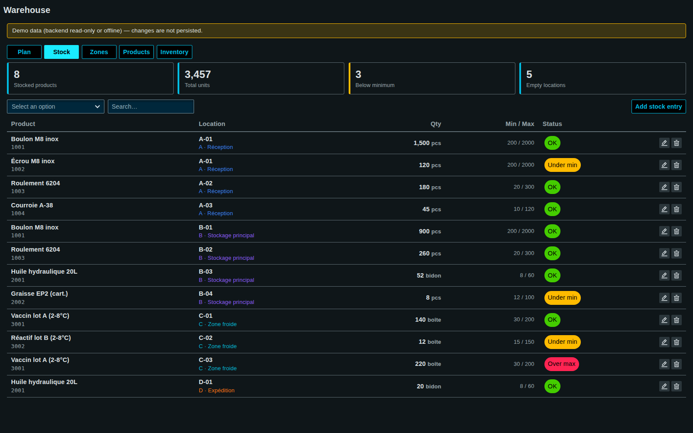
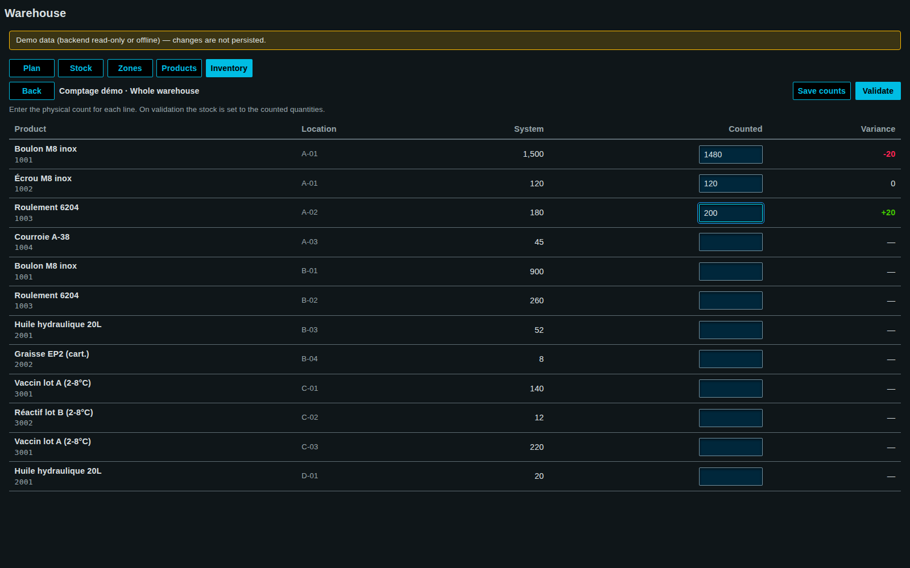

<!-- SPDX-FileCopyrightText: 2026 VISUEL CONCEPT -->
<!-- SPDX-License-Identifier: AGPL-3.0-only -->

# Warehouse (`wui-warehouse`)

Standalone WinCC OA WebUI page (`/warehouse`) — a small Warehouse Management
System: configure storage **zones** and **locations**, maintain a **product
catalog**, visualise **stock** on a 2D plan and in tables, and run stock-count
**inventory campaigns** whose validation writes the counted quantities back to
stock.



## Tabs

| Tab           | What it does                                                                                                                                             |
| ------------- | -------------------------------------------------------------------------------------------------------------------------------------------------------- |
| **Plan**      | 2D SVG map of zones/locations coloured by occupancy (grey empty → green → amber → red full). Click a location to inspect its contents in the side panel. |
| **Stock**     | KPI tiles (stocked SKUs · total units · below minimum · empty locations), zone filter + text search, stock table with add / adjust / remove.             |
| **Zones**     | CRUD of zones and their locations, including each rectangle on the plan (grid units) and the location capacity.                                          |
| **Products**  | CRUD of the catalog: reference, name, category, unit, min/max thresholds. Aggregated "in stock" per product, flagged when under min.                     |
| **Inventory** | Stock-count campaigns: snapshot the stock of a zone (or the whole warehouse), enter physical counts, review the variance, then **validate** — counts are written back to stock and the campaign closes. |

| Stock                                              | Inventory count sheet                                              |
| -------------------------------------------------- | ------------------------------------------------------------------ |
|  |      |

## Data model & persistence

Everything lives in WinCC OA datapoints, provisioned on first use through the
PARA REST API (`/api/para/*` — the `para` backend module is a prerequisite, as
for every JSON-store page). The granularity is **hybrid by design**:

- **Configuration & records** — one JSON-in-DP datapoint per entity via the kit
  `DpJsonStore` (Struct type with `name` + `json` String leaves):
  `WMS_Zone_*`, `WMS_Location_*` (layout rectangle relative to its zone),
  `WMS_Product_*`, `WMS_Inventory_*` (campaigns embed their count lines).
- **Stock quantities** — a dedicated **`WMS_Stock`** datapoint type, one DP per
  product×location (`WMS_Stock_<location>__<product>`), so each quantity is a
  real DPE that can be archived, trended and alarmed on its `minQty`/`maxQty`:
  `{ quantity:Float, product:String, location:String, minQty:Float, maxQty:Float }`.

### Offline / demo fallback (no WinCC OA needed)

When the backend is unreachable or read-only, every store transparently falls
back to an in-memory **demo dataset** (4 zones, 16 locations, 8 products, 12
stock cells incl. under-min / over-max seeds) and the page shows a banner — the
UI stays fully usable, changes just aren't persisted. On a writable empty
project the same dataset is seeded once. The offline stores return their live
in-memory arrays, so the page copies every list on reload to keep Lit's
change detection working (see `reload()` in `src/warehouse.ts`).

## Application Security (module id `warehouse`)

`view` (open the page) · `edit-config` (zones/locations/products CRUD) ·
`adjust-stock` (stock add/adjust/remove) · `inventory` (campaigns + validate).
Declared in `src/app-security.roles.json`, self-registered by the page,
affordances gated with `hasRole$`. Roles are open until an admin assigns
groups in `/app-security`.

## Tests — run the component without WinCC OA

The unit suite exercises exactly the no-backend situation (no PARA REST, no
`OaRxJsApi` registered): domain helpers, demo-dataset integrity, and the
offline CRUD fallback of both store kinds.

```bash
npx nx test wui-warehouse        # 4 spec files, 34 tests (vitest + jsdom)
```

- `src/warehouse/model.spec.ts` — pure helpers (ids, occupancy, thresholds,
  variance) + demo dataset integrity (cross-references, DP-safe ids, seeded
  under/over cells, plan geometry).
- `src/warehouse/data/stores.offline.spec.ts` — `DpJsonStore` demo fallback:
  list/create/save/remove in memory, seed idempotence.
- `src/warehouse/data/stock-store.offline.spec.ts` — `StockStore` fallback:
  upsert/remove/seed-merge.
- `src/warehouse/forms.spec.ts` — dialog field-schema builders.

To *see* the page without a backend, `tools/screenshot-warehouse-demo.mjs`
starts the dev server against a dead `BASE_URL` (deterministic offline mode),
mounts `<wui-warehouse>` through a minimal harness (no shell, no login) and
captures every tab plus the inventory flow into `docs/images/manual/`:

```bash
node tools/screenshot-warehouse-demo.mjs
```

## File layout

```
libs/wui-warehouse/
  menu.fragment.jsonc            # nav entry (auto-merged)
  vitest.config.ts               # unit tests (offline / demo mode)
  src/
    warehouse.ts                 # page entry (wui-warehouse) — tabs + orchestration
    app-security.roles.json      # role declaration (auto-merged + self-registered)
    warehouse/
      types.ts  i18n.ts  model.ts  forms.ts
      data/   stores.ts  stock-store.ts
      ui/     wh-entity-dialog.ts  wh-plan.ts  wh-stock.ts
              wh-zones.ts  wh-products.ts  wh-inventory.ts
```
