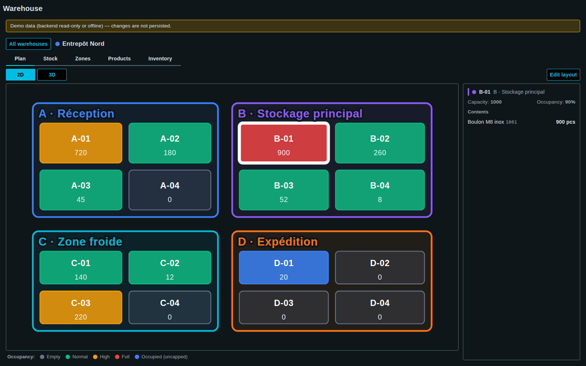
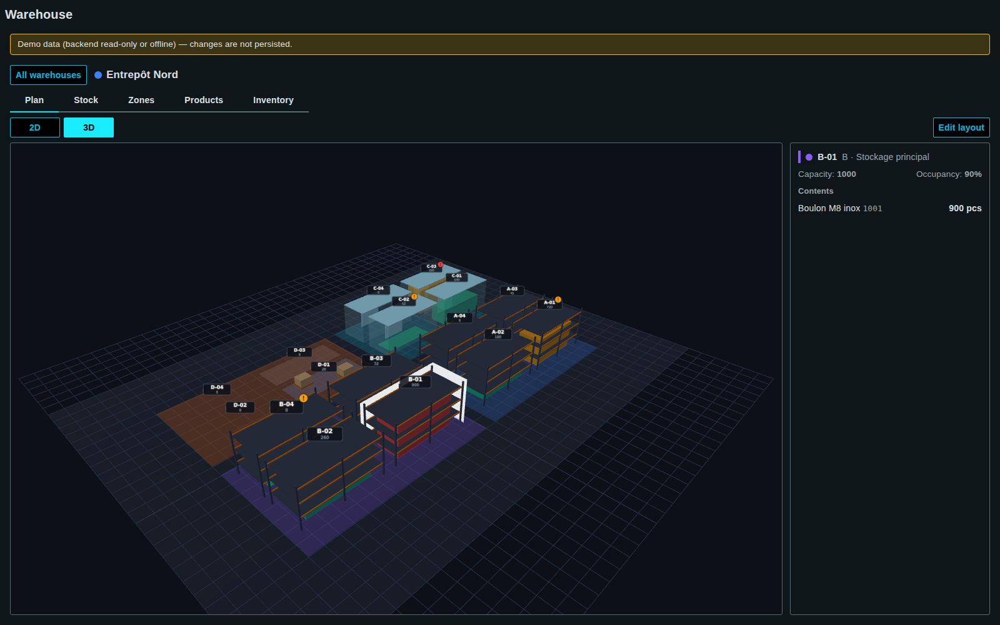
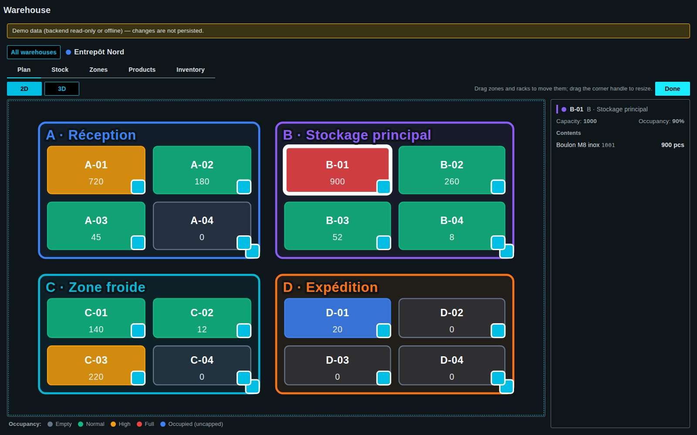

<!-- SPDX-FileCopyrightText: 2026 VISUEL CONCEPT -->
<!-- SPDX-License-Identifier: AGPL-3.0-only -->

# Warehouse (`wui-warehouse`)

Standalone WinCC OA WebUI page — a small Warehouse Management System for
**multiple warehouses** (sites): configure storage **zones** and **locations**,
maintain a **product catalog**, visualise **stock** on a 2D plan or a 3D scene,
lay out zones and racks graphically, and run stock-count **inventory campaigns**
whose validation writes the counted quantities back to stock.

Master/detail routing like `machine-fleet-3d`: `/warehouse` lists the
warehouses as cards (create / edit / delete), `/warehouse/:warehouseid` opens
one site. Navigation uses `RouterEvent`; the detail route is declared as a
hidden `menu.fragment.jsonc` entry (`routeId: warehouse-detail`).


## Tabs (per warehouse)

| Tab           | What it does                                                                                                                                                 |
| ------------- | ------------------------------------------------------------------------------------------------------------------------------------------------------------ |
| **Plan**      | **2D** SVG plan or **3D** three.js scene, coloured by occupancy (grey empty · green · amber ≥70% · red ≥90% · blue = occupied uncapped floor). In 3D each location is a procedural structure per type (pallet rack, shelving, cubby block, cold room, floor marking with pallets) with a fill gauge, a code+units label, an under-min/over-max alert badge and hover/selection outlines. Click a location to inspect its contents. **Edit layout** (role `edit-config`) lets the operator drag zones/racks and resize them with the corner handle (2D), or drag racks on the floor plane (3D) — grid-snapped, persisted immediately. |
| **Stock**     | KPI tiles (stocked SKUs · overall occupancy % · below minimum · empty locations), zone filter + text search, stock table with add / adjust / remove.          |
| **Zones**     | CRUD of zones and their locations. Over-filled locations show their real, unclamped percentage (e.g. 162%) in alarm colour.                                   |
| **Products**  | CRUD of the catalog (shared across warehouses): reference, name, category, unit, min/max thresholds.                                                          |
| **Inventory** | Stock-count campaigns scoped to the open warehouse: snapshot, enter physical counts, review the variance, then **validate** — counts are written back to stock. |

| Plan 2D                                              | Plan 3D                                                  |
| ---------------------------------------------------- | -------------------------------------------------------- |
|       |          |

| Layout edit (2D)                                          | Stock                                               |
| ---------------------------------------------------------- | ---------------------------------------------------- |
|    |    |

## Data model & persistence

Everything lives in WinCC OA datapoints, provisioned on first use through the
PARA REST API (`/api/para/*` — the `para` backend module is a prerequisite, as
for every JSON-store page). The granularity is **hybrid by design**:

- **Configuration & records** — one JSON-in-DP datapoint per entity via the kit
  `DpJsonStore` (Struct type with `name` + `json` String leaves):
  `WMS_Warehouse_*` (sites), `WMS_Zone_*` (with `warehouseId`), `WMS_Location_*`
  (layout rectangle relative to its zone, below the reserved label band),
  `WMS_Product_*`, `WMS_Inventory_*` (campaigns embed their count lines and
  carry `warehouseId`).
- **Stock quantities** — a dedicated **`WMS_Stock`** datapoint type, one DP per
  product×location (`WMS_Stock_<location>__<product>`), so each quantity is a
  real DPE that can be archived, trended and alarmed on its `minQty`/`maxQty`:
  `{ quantity:Float, product:String, location:String, minQty:Float, maxQty:Float }`.

**Legacy migration**: zones/campaigns persisted before multi-warehouse have no
`warehouseId`; an `afterRead` hook backfills them into `DEFAULT_WAREHOUSE_ID`
(`wh-nord`) so existing deployments keep working unchanged.

### Offline / demo fallback (no WinCC OA needed)

When the backend is unreachable or read-only, every store transparently falls
back to an in-memory **demo dataset** (2 warehouses, 6 zones, 24 locations,
8 products, 16 stock cells — quantities coherent with the per-type capacities
rack 1000 · shelf 400 · cold 250 · bin 200 · floor uncapped, exercising every
plan colour plus under-min / over-max product states) and the page shows a
banner — the UI stays fully usable, changes just aren't persisted. On a
writable empty project the same dataset is seeded once.

## Application Security (module id `warehouse`)

`view` (open the page) · `edit-config` (warehouses/zones/locations/products
CRUD + graphical layout editing) · `adjust-stock` (stock add/adjust/remove) ·
`inventory` (campaigns + validate). Declared in `src/app-security.roles.json`,
self-registered by the page, affordances gated with `hasRole$`. Roles are open
until an admin assigns groups in `/app-security`.

## Tests — run the component without WinCC OA

The unit suite exercises exactly the no-backend situation (no PARA REST, no
`OaRxJsApi` registered): domain helpers, demo-dataset integrity (including
capacity coherence and warehouse cross-references), and the offline CRUD
fallback of both store kinds.

```bash
npx nx test wui-warehouse        # 4 spec files, 41 tests (vitest + jsdom)
```

To *see* the page without a backend, `tools/screenshot-warehouse-demo.mjs`
starts the dev server against a dead `BASE_URL` (deterministic offline mode),
mounts `<wui-warehouse>` through a minimal harness (no shell, no login — a tiny
`navigateTo` shim emulates the router for master/detail) and captures the
overview, every tab, both plan views, the layout-edit mode and the inventory
flow into `docs/images/manual/`:

```bash
node tools/screenshot-warehouse-demo.mjs
```

## File layout

```
libs/wui-warehouse/
  menu.fragment.jsonc            # nav entry + hidden /warehouse/:warehouseid detail route
  vitest.config.ts               # unit tests (offline / demo mode)
  src/
    warehouse.ts                 # shell (wui-warehouse) — overview/detail, tabs, orchestration
    app-security.roles.json      # role declaration (auto-merged + self-registered)
    warehouse/
      types.ts  i18n.ts  model.ts  forms.ts
      data/   stores.ts  stock-store.ts
      ui/     wh-overview.ts  wh-entity-dialog.ts  wh-plan.ts  wh-plan3d.ts
              wh-stock.ts  wh-zones.ts  wh-products.ts  wh-inventory.ts
```

`three` (same `^0.169.0` as `machine-fleet-3d`, from
`tools/external-dependencies.mjs`) is bundled into the page at build time — no
CDN, no shared-bundle entry. For a clean `tsc` type-check in a dev workspace,
install `@types/three` (dev-only; esbuild/Vite does not need it).
